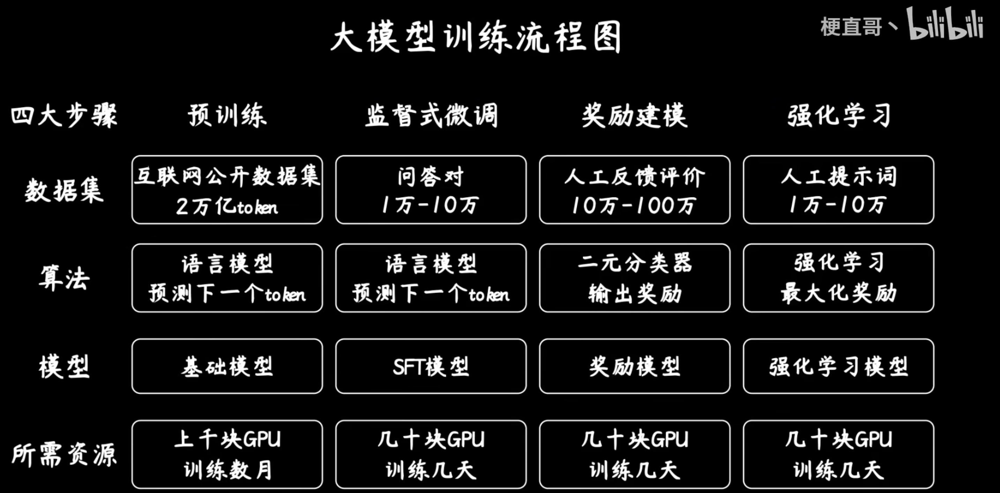
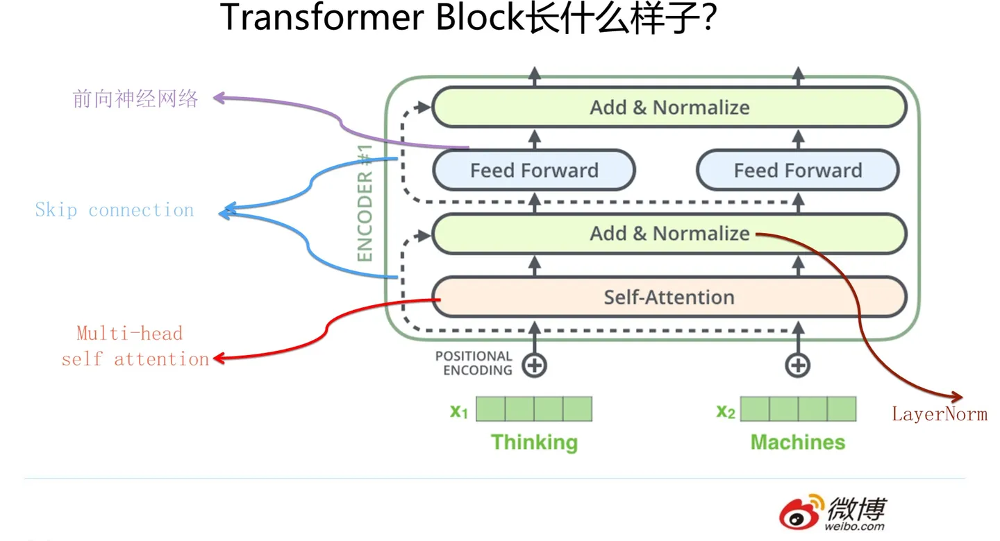
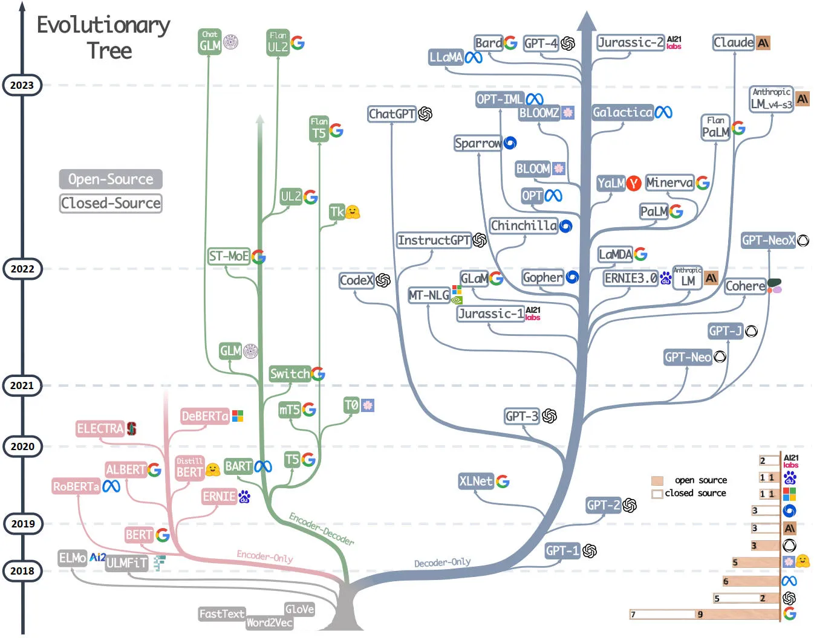
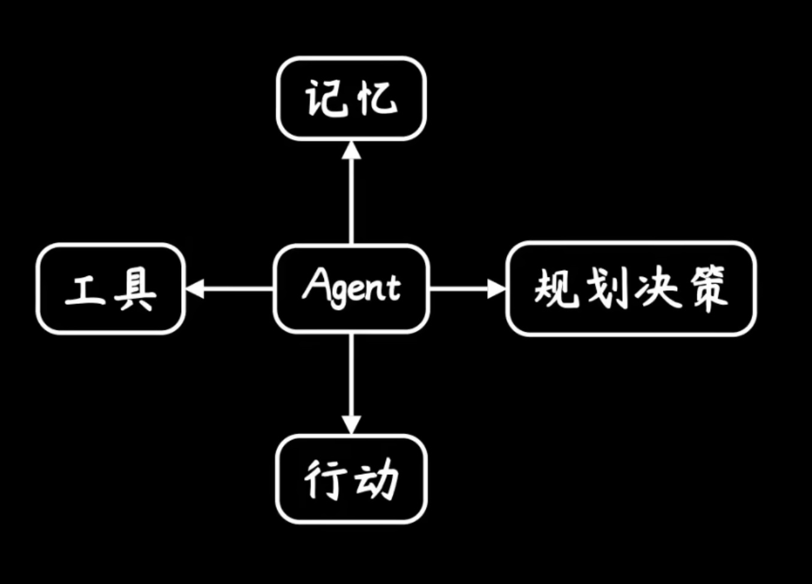

## Before
总结一下学习大语言模型过程中遇到的一些知识点。列了很多，能看出来近几年的一个发展过程。

## 机器学习
机器学习是实现人工智能的一个核心技术。它使得计算机可以在训练数据中进行”自学“，来做出自己的预测，而不需要人类进行显示的编程。  

从图上可以看出机器学习基本分成有监督学习和无监督学习两大类，以及强化学习。  
有无监督的区别在于用于训练的数据是否有标注。准备好了输入且有正确输出的标准进行训练，那就是有监督学习；
给一堆数据让模型自己去学习，那就是无监督学习。这两种方式显然有各自擅长的任务。  
有监督学习适合分类、回归等任务，无监督学习适合聚类、降维等任务。  

而对于自然语言理解任务，在需要大量的数据，但是标注数据又很稀缺的情况下，提出了半监督学习，
Semi-supervised Learning，即先以无监督的方式在大量无标注的文本上做 Pre-training，再以有监督的方式在少量有标注的文本上做 Fine-tuning。
GPT就是通过这种方式训练出的生成式语言模型。  

强化学习(RL)则是指不预先给定数据，而是让模型根据反馈来进行学习。
强化学习系统通常由智能体（Agent）、状态（State）、奖赏（Reward）、动作（Action）和环境（Environment）五部分组成。  
像chatGPT就经过了基于人类反馈的强化学习(RLHF)进行指令微调，它能够给出详实的回答、能够拒绝回答不当的或者它不知道的问题等这些能力都是通过RLHF触发的。  

而最近(03/04/24)发布的claude3更是提出了基于AI反馈的强化学习(<a target="_blank" href="https://arxiv.org/pdf/2309.00267.pdf">RLAIF</a>)。  
它使用LLM替代人类来标记偏好，因为收集高质量的人类偏好标签显然是比较困难的，它是扩大RLHF规模的障碍。
而一旦训练出一个与人类偏好判断高度一致的模型，再用它来微调大预言模型，便是一劳永逸。

## 深度学习
深度学习是机器学习的一个分支。它是一种以人工神经网络为基础的机器学习方法。  
机器学习适用于解决计算机可以精确描述的问题，它的输入数据通常是结构化的数值数据，且规模较小。
而深度学习则更适合于解决人类可以观察到的复杂的问题，它的输入数据则可以是文本、图像、语音等非结构化的以及规模较大的数据。  
### 人工神经网络
深度学习的核心是人工神经网络。它是一种模拟人脑神经元网络的计算模型(说模拟人脑神经元比较高大上，其实可以把它理解为一个函数，只是这个函数有非常非常多的参数)。    
人工神经网络由多个节点组成，这些节点构成多隔层，曾与层之间的节点通过权重相连接，每一层的输入是上一层的数据，最后一层的输出就是整个神经网络的输出。  
  
上图就是一个最基本的神经网络，从左至右分别是输入(Input)层、隐含(Hidden)层、输出(Output)层。层与层之间通过权重(Weight)以及偏置(Bias)连接。  
有多少个输入就在输入层设置多少个节点，同样的有多少个输出就在输出层设置多少个节点。  

而隐含层的层数以及每层的节点数则需要根据具体的任务进行设置，通常层数越多、节点数越多，那么模型的表达能力就越强。这也很好理解，因为参数越多，模型就越能够拟合复杂的数据。  
可以把神经网络看做一个有大量参数的函数，只要参数足够多，它就能拟合任意的函数。  

(Ps: 理论上只要节点够多，一层的神经网络也能够达成需求，但是现在的做法往往都是加深层数，所以叫“深度”学习，这是什么原因呢？
因为对于拟合任何一个函数，在一层需要增加的节点数比之多层增加的节点数之和要多上许多，也就是说对于同一任务，深层的神经网络比单层的神经网络需要的参数量更少。
参数量少就意味着更快速的训练，且更加不容易过拟合。)  

这些年各种神经网络模型也是层出不穷。  
像是在图像领域所向披靡的卷积神经网络(CNN)，
在NLP领域红了多年循环神经网络(RNN)，以及目前在NLP领域稳操胜券的Transformer等等。

## LLM
Large Language Model，大型语言模型。是用来做自然语言处理相关任务的深度学习模型。  
训练一个大语言模型，首先需要一个语言模型，像GPT(以及现在大部分LLM)就是基于Transformer的。这个语言模型设置有非常多的参数，像GPT-3有1750亿参数。

接着就是对模型进行大规模的预训练，还是看GPT-3，它是用3000亿单词的训练语料库(包括爬取的公共网页数据、书籍、Wikipedia等)进行预训练的。  
这些语料在训练中被参数吸收，这就相当于将大量的信息压缩进了这1750亿的参数中。
这是一种有损压缩，用过chatGPT等等基于LLM的工具就会发现，生成的内容并非是直接复制它们的训练资料，更像是理解了很多资料后自己做的总结。
这也是大模型会有幻觉，能进行创作的原因。  
此时模型就具备了语言生成的能力，实质上它做的事情就是预测并生成下一个<a target="_blank" href="https://platform.openai.com/tokenizer">token</a>(通常一个汉字是1-2个token，一个英文单词是1-3个token)。  
然而仅仅是词语接龙并不能够达到人类想要的效果，它还需要有响应人类指令的能力。

所以接下来就需要进行指令微调，通过大量的\<指令，输出>数据对(比预训练的数据要少多个数量级)进行有监督指令微调(Supervised Fine-Tuning SFT)。
使得模型的生成更加符合人类的期望。至此就得到了一个能够遵循人类指令的大语言模型。

但是能遵循指令还不够，还需要在很多方面跟人类对齐，比如说需要能够拒绝回答一些不正当的问题等，这就需要用到强化学习了。  
这里可以分成两个步骤，首先需要人类标注员对模型的回答进行打分，基于这些数据训练一个奖励模型(RM)。用这个模型来对上一步得到模型的回答进行打分，
已评分作为反馈进行强化学习训练。

经过预训练得到的模型又称基座模型，这个阶段是最耗时耗算力的，模型的基础能力也在这个阶段全部生成，而后续的微调可以激活或者增强某些能力。  
目前已经有了许多优秀的开源基座模型，像LLAMA、GLM、T5等等，各种各样的微调模型也在此基础上不断萌发。

## NLP
Nature Language Processing，自然语言处理。它有很多的子领域，比如文本分类、文本生成、文本摘要、机器翻译、语音识别等等。  
在早期要实现上述这些任务，还需要经过一些中间任务，像是词性标注、NER(命名实体识别)、句法分析、语义分析等等。每个任务都有自己的模型、框架和专家。  

在早些时候，NLP领域流行的深度学习模型主要是大量改进的LSTM(Long Short-Term Memory)模型以及改良的CNN模型。然而这两个模型作为特征提取器表达能力不强，
再多的数据也无法有效地转化成知识。

而Bert/GPT这两个预训练的出现带来了NLP领域一次技术飞跃，同时也带来了整个领域一次研究范式的转变。  
中间任务没有单独训练的必要，都可以在预训练中吸收进Transformer的参数中。  
特征提取器也从LSTM和CNN统一到了Transformer。  
NLP的研发模式也收敛到了预训练+Fine-tuning或者zero/few shot prompt的模式中。
一种是以Bert为代表的双向语言预训练模型+Fine-tuning，另一种是以GPT为代表的自回归语言模型+zero/few shot prompt。
而那个时候大部分都聚焦在了Bert这个模式上，直到chatGPT的出现。  
时至今日，规模最大的模型基本都是GPT这种自回归语言模型(Autoregressive Model)+zero/few shot prompt的模式。

## Transformer
早些时候循环神经网络(RNN)是NLP领域的主流模型。RNN模型结构天然就适配解决NLP问题，
因为RNN模型的输入往往是不定长的线性序列句子，而自然语言就是这样的数据。后续又引入LSTM解决了长距离特征捕获的问题，所以火了很多年。  
然而RNN结构本身存在很大的问题，它的并行计算能力很差，因为它在某时刻的计算需要依赖上一时刻的输出，这种序列依赖对于大规模并行计算非常不友好。  

听过CNN模型的应该都知道它在图像处理领域有着非常好的表现，而它也被引入了NLP领域。将输入的字/词通过word embedding进行表达，
这样本来一维的输入就变成了二维结构。当然进入NLP的CNN经过了种种进化，主要还是通过加深深度来解决问题。CNN模型天然就具备很强的并行计算能力，
这也是它能在RNN纵横的NLP领域生存下来的主要原因。

然后Transformer的出现颠覆了这一切。17年谷歌发表了论文<a target="_blank" href="https://arxiv.org/abs/1706.03762">Attention is all you need</a>，
在其中提出了Transformer模型，是一种Encoder-Decoder框架。它的编解码器中都有一层自注意力(Self-Attention)层。

它会关注输入序列中的所有单词并计算每个单词与其它所有单词的相关度。所以它的长距离特征捕获能力很强。  
Transformer会为每个输入词嵌入一个向量，用来确定这个词的位置信息，所以它的并行计算能力也非常强大。

Transformer又分化出了不同的框架，衍生出了众多模型：

使用完整encoder-decoder框架的例如 T5、BART，也称序列到序列模型，擅长将一个序列转化成另一个序列，比如翻译、总结等任务。

只使用了编码器部分的encoder-only框架像 BERT，擅长分析理解，把高维数据压缩到低维空间。

只使用解码器部分的decoder-only框架像 GPT，擅长讲故事，给点提示就能够自说自话。  

图中可以看到在21年前以BERT为首的encoder-only这支发展地十分壮大，而22之后则是以GPT为首的decoder-only分支如火如荼。

## Word Embedding
词嵌入是NLP中使用的一种技术，因为计算机只能理解数字，所以通常需要将文本空间中的词映射到另一个数值空间中，然后再作为模型的输入。  
在文本空间中每个词都是一个单独的维度，而经过词嵌入后，就实现了向低维度空间的映射。映射成低维向量后，计算就变得很方便。
比如要计算两个词的相似性，只需要计算两个向量之间的距离即可。如此，机器也就能够“理解”文本了。

Word Embedding其实也是一种预训练技术，它对很多下游的NLP任务都有帮助，但帮助效果没有GPT和Bert那么耀眼。

## Fine-tuning
Fine-tuning即微调是NLP中使用的一种技术，它跟着Bert一起流行起来。将预训练得到的模型与少量(和预训练时的数据相比)数据一起进行训练来解决下游任务。  
这个过程会去更新预训练模型的参数，就需要部署模型，准备数据，进行训练。

## Prompt
Prompt即提示词，GPT模式采用zero/few shot prompt的方式来解决下游任务。即通过调整提示词或者给出示例的方式来调整模型的回答。  
这个过程不会去更新预训练模型，任何机构或者人都有能力去做。

Prompt Engineer是未来最好的职业？在目前阶段来看，写Prompt的能力确实是产品中最重要的能力。能写出好的Prompt就能解决各种问题。

## 多模态
多模态即多种模态的信息，包括文本、图像、音频以及视频等。目前的大模型也都在朝着多模态大模型的方向发展。  
GPT4支持文本、图像的输入输出，Google最新发布的Gemini(12/06/23)更是原生支持多模态，能够输入文本、图像、音视频。  

传统多模态的实现通常采用串联架构，文本、图像、语音用不同的模型单独训练，然后再以文本为主线串联起来，进行不同模态之间的转化。  
而Gemini则是原生多模态架构，它采用混联模式，文本、图像、语音、视频等多模态数据都喂给一个模型，再根据不同任务的需求，选择性输出。

## AI Agent
AI Agent可以理解为某种能自主理解、规划决策、执行复杂任务的智能体。也就不再是Copilot而是Pilot。  
它拥有大脑，能够感知环境，能够使用工具，进行自主规划，最后做出行动。

## Reference
[1. 「破晓 · 知乎 AI 先行者沙龙」全程实录回放](https://www.zhihu.com/zvideo/1727336365778534400)  
[2. 通向AGI之路：大型语言模型（LLM）技术精要](https://zhuanlan.zhihu.com/p/597586623)  
[3. Attention is all you need](https://arxiv.org/pdf/1706.03762.pdf)  
[4. 放弃幻想，全面拥抱Transformer：自然语言处理三大特征抽取器（CNN/RNN/TF）比较](https://zhuanlan.zhihu.com/p/54743941)  
[5. RLHF: Reinforcement Learning from Human Feedback](https://huyenchip.com/2023/05/02/rlhf.html)  
[6. 从Word Embedding到Bert模型—自然语言处理中的预训练技术发展史](https://zhuanlan.zhihu.com/p/49271699)  
[7. 【Gemini】动画科普谷歌大模型，为何你要特别关注多模态、AI推理和强化学习](https://www.bilibili.com/video/BV1NN4y1Y7uj/?spm_id_from=333.999.0.0)  
[8. 为忙碌人士准备的大语言模型（LLM）速览 [译]](https://baoyu.io/translations/llm/introduction-to-large-language-models-llms)  
