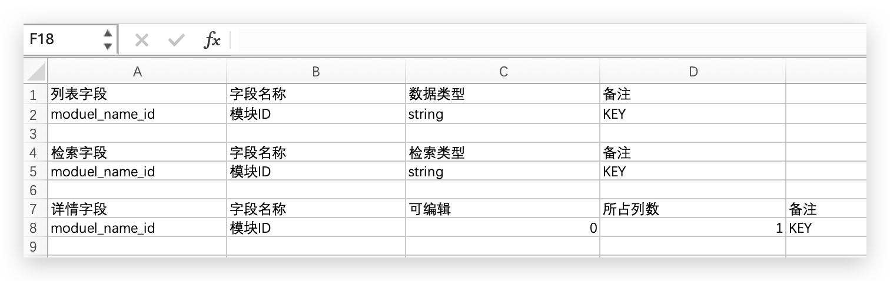

## Before

## 背景
数据管理系统开发，需要大量的CRUD页面，各模块页面结构、功能高度相似，只是字段不同。  
每个模块页面功能基本可分为检索、列表、详情三部分。  
在开发中，一部分工作就是把字段从PRD拷贝到代码中，且大部分框架代码是重复的。这两部分代码均可以通过大语言模型进行生成。

## 实现方式
基于上述背景知识，这个应用对于最终生成的内容是有特定预期的，期望当输入相同时，最终的输出始终是稳定一致的。  
它不需要模型有很高的创造力，只需要严格遵循指令即可。
### 数据准备
对PRD提供的表格进行整理，得到检索、列表、详情三份表格。  
每个表格包括展示字段、字段名称两个基本列，以及数据类型、是否可编辑、备注等其他列(每个字段不同的功能可以通过增加列配置不同值来实现)。



准备好基础数据之后，还需要模块名称。此外，因为希望能够直接将生成的代码放入项目中，还需要添加目录。
剩下的就是写prompt让大语言模型来生成代码了，当然还需要选择大语言模型，并且准备好key。


### prompt编写
最终会生成22个新文件，理论上需要调用大语言模型22次，但是存在文件需要多个表格的数据，这会导致prompt很长，对于这种文件，
将需要不同表格生成的内容拆分，逐个调用大语言模型生成代码，最后再进行拼接。  
每个prompt的整体框架是类似的，都是让大模型基于给出的表格信息、变量信息以及模版代码来生成代码。将通用的部分提取出来，便于复用，也有利于后期优化prompt。  
尝试使用像Let's think step by step这样的提示，来优化生成的代码(与其说是优化，不如说是降低错误率，因为需要生成的代码内容是确定的)。

### 生成枚举文件
举生成枚举文件这个例子。这个文件中需要生成三个枚举值，分别是通过检索表格、列表表格和详情表格生成的。三个枚举值相互独立，很容易能够进行拆分。  
```ts:title=enum.ts
/* -------------------- 检索 -------------------- */
export const enum E_MODULE_NAME_SEARCH_PARAMS {
    MODULE_NAME_ID = 'MODULE_NAME_ID',
}
/* -------------------- 列表 -------------------- */
export const enum E_MODULE_NAME_LIST_COLUMNS {
    MODULE_NAME_ID = 'MODULE_NAME_ID',
}
/* -------------------- 详情 -------------------- */
export const enum E_MODULE_NAME_DOC_ITEMS {
    MODULE_NAME_ID = 'MODULE_NAME_ID',
}
```
针对每个enum，写prompt进行生成，最后拼接。prompt如下：

>根据下面表格、示例代码、变量生成一段ts代码，所有显示声明的ts类型都需要保留，模板代码中的常量内容不做任何变更，要求如下：  
enum名称为E_\{转下划线大写(name)}_LIST_COLUMNS。  
enum中的每个枚举成员为下表中的\[转为大写(列表字段)]。  
enum中的每个枚举成员的值为下表中的\[转为大写(列表字段)]。  
在每个字段上方一行加/** 注释 \*/格式的注释，内容为该字段在下表中对应的字段名称。  
模板代码：  
export const enum E_XXX_LIST_COLUMNS \{  
/** 字段名称 */  
XX_XX = 'XX_XX';  
}  
不生成任何import语句。  
请逐步思考，给出完整的正确的代码。  
name=ModuleName  
| 列表字段           | 字段名称 | 数据类型   | 备注  |  
|----------------|------|--------|-----|  
| module_name_id | 模块ID | string | KEY |  

可以使用chatGPT或者其他大语言模型工具测试一下，输出内容基本能稳定如下(只截取代码部分)：
```ts
export const enum E_MODULE_NAME_LIST_COLUMNS {
    /** 模块ID */
    MODULE_NAME_ID = 'MODULE_NAME_ID'
}
```

## 实现效果

### version 1
- 生成的内容可能存在代码以外的文本
- import语句的生成不遵循指令
- 某些遍历列表行生成的内容存在错漏
- 有拼写错误(patsnap --> patsna)
- 自动增加ts显示类型，且不正确(受上下文影响)
- 遍历列表行且需要根据多列数据生成内容，容易受不同列内容的影响，不遵循指令

解决方案：

### version 2
对生成的内容进行某些校验，不通过则自动重新生成，如：
代码的完整性、某些生成内容的完整性、拼写错误？？

### version 3
实现列表和表单的自动生成

## 使用英文prompt

## 各个模型比较

## 提示工程
https://zhuanlan.zhihu.com/p/660369244 Effective Prompt: 编写高质量Prompt的14个有效方法
https://www.jiqizhixin.com/articles/2024-03-18-6 大模型能自己优化Prompt了，曾经那么火的提示工程要死了吗？
避免使用语法结构过于复杂、语义模糊不清、逻辑混乱的语言。
避免任何歧义、语病、拼写/标点错误的存在。
正面描述任务的具体要求，尽量避免使用否定句。

### 遇到的问题
import语句引入
表格没有使用的字段会影响输出

## 存在的问题

## 未来展望

## 使用工具

## Reference