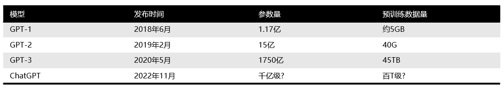

## Before
不知道有多少小伙伴跟我一样，是chatGPT火了之后才第一次知道LLM这个概念的，第一次听到这个词，然后去问chatGPT:
LLM的全称是什么，chatGPT回答我LLM的全称是Master of laws，法律硕士。LOL。。。  
LLM火出圈了，之前大家都没想到LLM的效果能这么好，毕竟能做得起这个的公司有限，愿意不顾沉没成本一直做下去的更有限，现在看来也只有openAI。  
作为一个将来有可能被它取而代之的程序员，还是想先了解一下这是个什么东西，然后再失业，哈哈哈～～  
本文主要希望能回答以下五个问题：什么是LLM，LLM能用来做什么、NLP的发展过程、gpt3.5都有哪些能力以及chatGPT是怎么来的。  
文章取名101，但应该算不上入了门，旨在能对LLM以及chatGPT建立起一个更理性一些的认知。

## 什么是LLM
> A large language model (LLM) is a neural network with billions of parameters that has been trained 
> to predict the next word using large quantities of unlabeled text data.

LLM，large language model，大型语言模型，顾名思义，是个模型，是个语言模型，然后非常大。  
首先为什么叫大型，是它用来预训练的数据量非常大，像GPT3，用了45TB的数据(包括大量网络文本、书籍以及Wikipedia)进行训练。  
训练出来的模型参数非常多，在10亿以上，现在其实动不动就是千亿级别了(GPT-3是1750亿)。   

与之相对的是特定语言模型，对一个特定的目标训练一个模型，对另一个目标再训练一个模型，把这些小模型进行组合去实现一个功能。
这个组合就只能完成特定的功能，但是openAI做的这个就很特别，它不指定目标，就做一件事就是给它一段话，让它去做补全。
然后它就用上面说的那么多的数据喂进去，建了这么一个千亿参数的大模型，有点大力出奇迹那种感觉。

什么是模型，模型其实是一个比较抽象的概念，一直以来也都很confuse我，其实它就是一个带有未知参数的函数，给它一个输入，它就会给你一个输出，只是这个函数非常之复杂。
这个输出是由输入和模型参数共同决定的。在训练这个模型的过程中，不停地调整参数，让输出尽可能地接近我们期望的输出。  
这让我想起大学时期做的一个电路板，需要调参控制输出电压，三个参数调得人欲仙欲死，千亿真的很难想象。

最后为什么叫语言模型，因为它主要就是用来处理自然语言的嘛，输入和输出都是文本。  

这里还要介绍几个概念方便后文理解。  
首先是基础语言模型(Basic Language Model)，是指那些只在大规模语料文本中进行了预训练， 但没有经过任何指令微调或者强化学习的模型。比如GPT-3、LaMDA、T5(开源)等等。    
第二个概念是指令微调，这是指使用自然语言对任务进行描述(告诉模型如何进行特定任务的处理)，使用这样的指令数据对模型进行微调。    
还有一个概念叫RLHF，基于人类反馈的强化学习。RLHF是让模型为一个问题生成多个答案，然后让标注人员为这些答案进行排序，然后通过这些评价训练出一个奖励模型(RM)。
最后再用这个奖励模型来训练LLM，让LLM生成更符合人类(标注人员)期望的答案。

## LLM能用来做什么
上面其实回答了这个问题，LLM是用来做自然语言处理(NLP)的。   
在GPT展露头脚之前的很长一段时间，NLP基本上是在各自领域做预训练+fine tuning(指令微调)去完成下游任务，而每个领域建模可能都需要一定的领域知识才能把模型建好。  
在chatGPT出现之后，我们会发现它在很多领域都做得很不错，或许只要知识数据足够多，LLM就能cover全领域，然后NLP就跟领域无关了。  
LLM也不只局限于NLP，首先代码问题chatGPT就能处理得非常好，此外还有图像处理等多模态的任务，LLM可能真的是通往AGI(通用人工智能)的路也说不定。

## NLP的发展过程
在LLM之前，近10年这个阶段，NLP的发展主要是从一开始的深度学习模型，到bert/gpt的预训练模型。
前者是用LSTM/CNN来做特征提取，后来google出了个transformer，通过大量数据做预训练，然后直接去解决终端任务就可以了，省去了中间步骤，
在那之后，NLP任务就基本都收敛到两种预训练模型框架里面。  
一个是以bert为代表的 双向语言模型预训练+应用Fine-tuning，主要用来做语言理解类的任务。  
另一种就是以gpt为代表的，自回归语言模型（即从左到右单向语言模型）+Zero /Few Shot Prompt，主要用来做语言生成类的任务。  
其实自然语言处理任务粗分的话就是两大类，语言理解和语言生成。当时基本都是看好bert，因为bert表现好嘛，谁也不知道gpt最后能做成什么样(GPT-2的效果就比较糟糕)。
但是目前来看显然是gpt做得更好，chatGPT说明了一切。而且目前规模最大的模型基本都是自回归语言模型+Prompting模式的。  
这种模式好在哪里，首先我们发现语言生成任务可以兼容语言理解任务，但是反过来不行。  
第二就是如果想用prompting这种方式来做任务，必须使用gpt这种模式，bert如果使用prompting来处理下游任务，效果远不如gpt。  
为啥想用prompting很好理解，通过fine tune修正模型参数这种方式耗时成本高，而prompting就是用人类习惯的方式(自然语言)让LLM处理问题，这显然更加高效友好。
当然了解过prompt的小伙伴应该知道目前有zero shot,one shot,few shot,还有chain of thought, self-consistency各种prompting方式，
来让模型的输出更加符合我们的期望。chatGPT其实已经做得不错，基本上zero shot可以cover大多数场景，
但当场景比较复杂时，还是需要用上各种prompt技巧来获取高质量的回答。

## GPT 3.5
GPT全称Generative Pretrained Transformer，Generative表示可以生成下一个单词，Pretrained表示用大量文本进行预训练，Transformer表示底层神经网络使用Transformer架构。
GPT3.5其实是一系列有细微差别的模型的总称，像gpt-3.5-turbo(官方推荐使用，比较便宜)、code-davinci-002、text-davinci-002、text-davinci-003等等，
它们经过不同的训练，各有所长。接着来说说GPT3.5这个LLM的能力。  
首先是它的基础模型也就是GPT-3拥有的一些能力，包括：
最直观的文本生成，通过输入的prompt，去做completion补全(通过前面的词来预测下一个词)。这个功能其实是模型建模的训练目标。  
先前说到这个模型是通过大量数据预训练得到的，这部分数据其实可以粗略分成两类，一类是语言类知识，一类是世界知识。
人类学习是先学说话，然后去学校学知识。学说话可能几年就ok了，但是知识得学一辈子。
LLM也是，它学语言可能通过1亿个单词左右的语料就学会了，剩下千亿的语料都是在学习世界知识，这些知识都存在transformer模型的参数中，
但是这一部分是在不断变化，不断迭代的，像chatGPT它的数据就只到2021年，
21年之后的世界知识它都不知道，但它还是会回答你，因为它的任务就是做文本补全，所以会出现illusion现象。

有了语言和世界知识，能做补全，但这还并不代表能够回答问题，更大可能性是输出一些与prompt相关相似的文本。你问它什么是苹果，它可能回答你什么是香蕉，
你让他翻译，他可能做续写，正确响应人类的指令要通过指令微调来实现。  
指令微调并不会为模型注入新的能力，因为指令微调的数据量跟预训练时的数据量差了好几个数量级，显然这些能力是已经存在的，指令微调的作用就是解锁这些能力。  
不同的指令微调能产生不同擅长的模型，比如text-davinci-003更擅长in-context learning，chatGPT更擅长对话。  
当指令的规模达到一定程度时，模型在没有见过的新指令上也能生成有效的响应。  
它还有生成代码和代码理解的能力，以及上面提到过chain of thought思维链，它能通过思维链进行复杂的推理，这些能力很可能是因为代码训练而产生的。

## chatGPT
最后来说说chatGPT，我最初使用的感觉就是震惊，然后还有震惊。很难想象有个AI能理解我所有的问题，给出答案，能跟我对话，能有语气，还能推理。  
虽然也有说它的种种缺陷，数学不好，历史不好，还经常出现各种幻觉，但这些都无法掩盖它的强大。  
其实在chatGPT发布之前，GPT3.0以及InstructGPT的能力也已经很惊人了，但是chatGPT它的对话能力，把GPT带到了大众的视线中，
让更多领域的人们发现原来LLM已经可以做到这种程度了。  
chatGPT是在GPT3.0的基础上用对话作为训练数据，通过RLHF来进行训练。得到了这么一个有对话能力，回答很翔实(话多)，比较公正，
会拒绝不正当问题的产品。  
但是它没有公开的API可以调用，也不知道具体的参数是怎么样的，所以一些简单日常的问题可以询问chatGPT，但是如果是比较复杂的问题，或者想要工程化，还是需要自己去调用API进行调试。

## 胡思乱想
首先chatGPT带来的工作效率的提升是显而易见的，一些带有明显规律的重复性的工作完全都可以交给GPT来做。没时间细看的文章可以让它总结，没思路的文章可以让它给你开头，
写代码写博客的时候带着copilot，好多情况下它的提示真的让我禁不住感叹，你怎么知道我要写这个！！  
很多人会担心被AI取代，虽然现在它看起来还没有那么智能，面对很多复杂问题也是束手无策，但架不住它学得快啊，
我丝毫不怀疑某一天它能分分钟解决那些我需要查资料+看源码+推理+揣测+运气才能解决的问题。  
但其实担心是没有意义的，现在最重要的还是要利用好AI，让自己变得更强大，更高效。  
最后是关于这个模型到底有没有意识这个问题，就原理来看，GPT就是做个文字接龙，根据你的输入对一堆有可能是下一个字的字做采样，一直到下一个字是结束符。
这样的模式其实很难让人相信模型真的学会了知识，更不要说具有意识了。但其实人类自己也还并不能够解释意识，就像现在无法解释大模型的很多能力一样。
在这种情况下大模型的行为跟人类的行为的相似，是否就可以说模型具有意识呢？

## Reference
[1. 通向AGI之路：大型语言模型（LLM）技术精要](https://zhuanlan.zhihu.com/p/597586623)  
[2. 拆解追溯 GPT-3.5 各项能力的起源](https://yaofu.notion.site/GPT-3-5-360081d91ec245f29029d37b54573756)  
[3. History of LLM](https://www.notion.so/History-of-LLM-6abfb803864746b8bbb7867082a070ce)  
[4. 大白话聊 ChatGPT](https://d58hixvcd6.feishu.cn/docx/HfMEds7Z1ov37wxqM19czTBinWg)  
[5. 动画版GPT4之路：别再说技术原理你看不懂！](https://www.bilibili.com/video/BV1GL411k74t/?spm_id_from=333.999.0.0&vd_source=a0d4c30f37c92adbf6483ef06ed749ba)  

