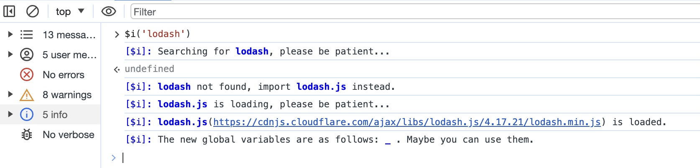
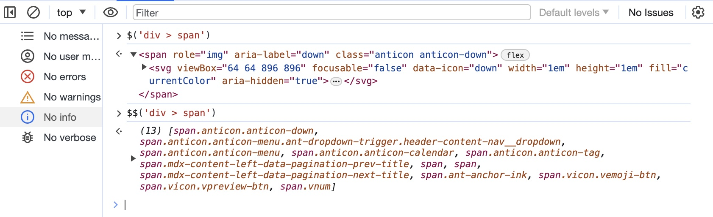
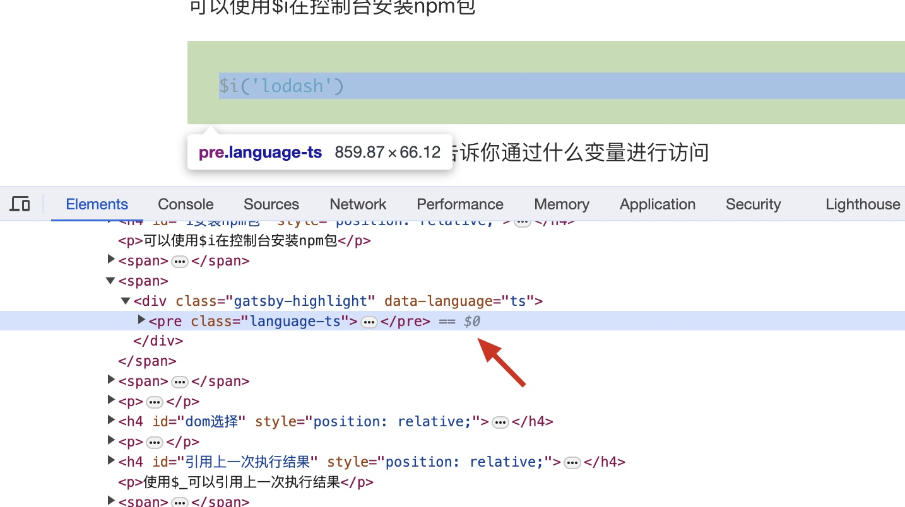
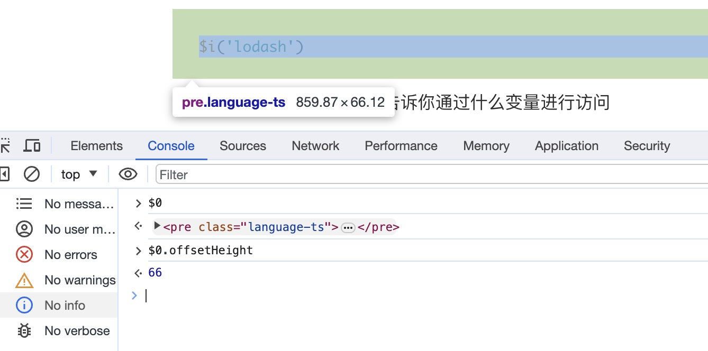
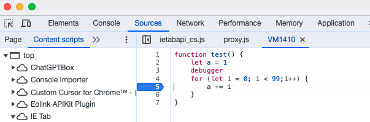
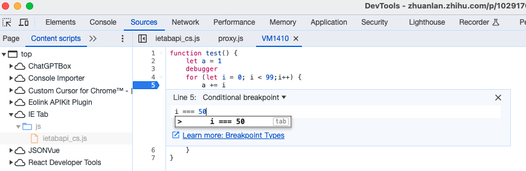
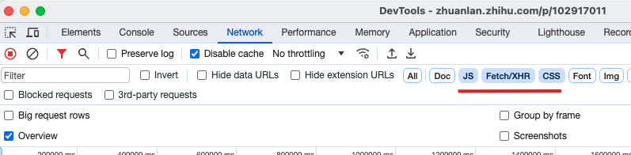
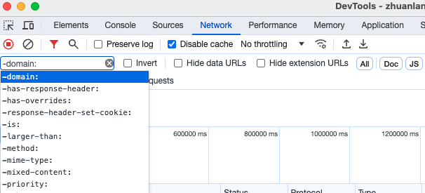
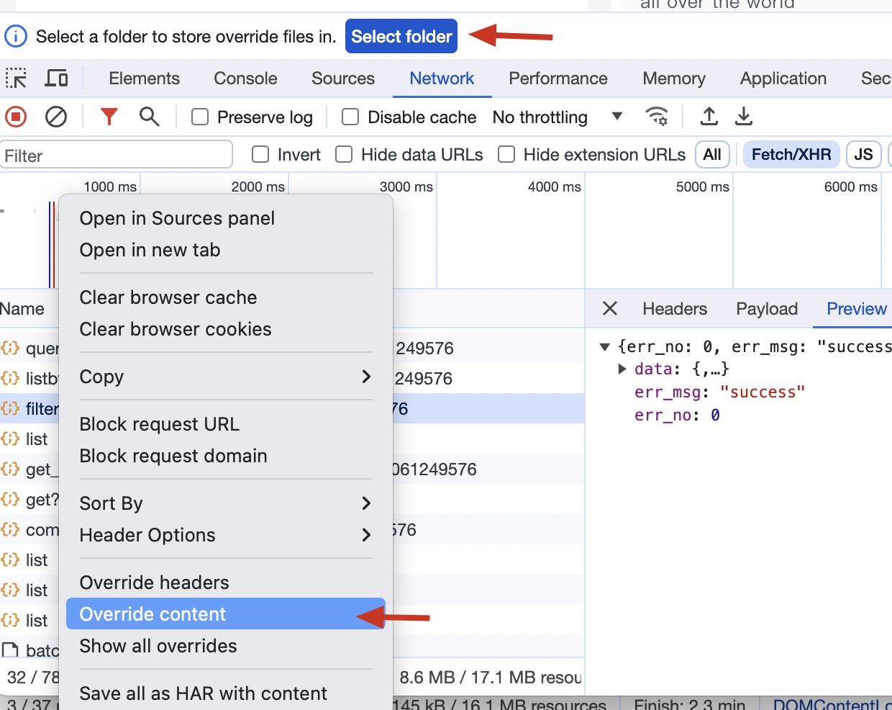

## Before
前一阵子买了个伪苹果键盘，因为机械键盘给我手心搞了个茧子(让我研究了一下我的打字手势)，决定换回苹果键盘。然而买的这个它竟然不支持你设置
*将F1、F2等键用作标准功能键*，也就是说我每次打开控制台都得按Fn+F12。这就导致一上午我就在  
想打开控制台 --> F12(打开音量) -->
哦，忘了 --> Fn+F12 --> 听见钉钉的消息提示音 --> 气死 --> F12(关闭音量) --> 想打开控制台 --> F12(打开音量)的循环中度过。  
F12是不是前端最高频按键啊。

## Elements

### Scroll into view
当你在Elements中选中一个dom节点，这个节点在界面上会有高亮，
如果它不在视口内，可在该节点上右键 --> Scroll into view，该节点就会滚动到视口内。

## Console
打开控制台后按command+shift+p，有很多指令可以探索。

### 全屏截图
打开控制台后按下command+shift+p，输入capture full size screenshot，就可以全屏截图了。  
但是滚动条需要在最外层，若是内部有滚动条，那么内部隐藏部分的内容是不会出现在截图里面的。

### 主题切换
打开控制台后按下command+shift+p，输入Switch to dark theme或者Switch to light theme进行主题切换。

### $i安装npm包
可以使用$i在控制台安装npm包
```ts
$i('lodash')
```
控制台会有安装提示，并且告诉你通过什么变量进行访问


### dom选择
可以使用$和$$替代document.querySelector和document.querySelectorAll进行元素的选择


### 引用上一次执行结果
使用$_可以引用上一次执行结果
```ts
18*15
// 270
$_+10
// 280 
```

### $0
如何快速获取想要的dom元素？  
在Elements界面选中你想要的元素，到Console界面输入$0，就可以获取到这个元素的引用了。


如果是vue框架，还可以通过$0.__vue__获取到vue实例。

### 展示Console面板
在Elements、Network等面板时，如果想同时看Console面板，可以在DevTools获取焦点时，按下Esc。

## Sources

### 条件断点
场景：1-100进行for循环，我只想看当循环到90之后的情况，如果直接在for循环内打断点，就得一步一步的往下走个90次，
通常会在for里面加个if (i > 90) \{ debugger }的代码，这样就可以直接跳到90了。  
但其实并不需要改你的代码，用条件断点就可以实现这个功能。


在断点上右键 --> Edit breakpoint --> 输入条件


这样就只会在i等于50的时候进入断点啦。

## network

### 请求过滤
按住command可以选择多个类型



在filter框中输入-，就会出现字段提示，输入后记得把-删除，或者勾上后面的invert，都是反选的意思。



```
-status-code:200
```
如果需要输入多个条件可以通过空格隔开
```
url:ws -status-code:200
```
表示筛选url中含有ws，且status code不为200的接口。

### 接口调试
在接口上右键 --> 
Reply XHR，可以重新发送请求;  

Copy --> Copy as fetch 可以赋值为fetch代码，粘贴到控制台修改再次请求；  

Override Content可以修改接口返回结果，第一次设置是需要选择一个本地文件夹来存储你覆写的内容。如果不想覆写了，把对应的文件删除即可
(存在被覆写的接口时，Network边上会有一个黄色的warning icon)；


## 快捷键
command+shift+D: 切换devtools窗口布局
command+shift+C: 快速选择元素
command+option+i: 打开devtools(可以给devtools打开devtools)
设置px时数值递增/减：
option+上下箭头：0.1
shift+上下箭头：10
command+上下箭头：100


## Reference
[1. 11+ chrome高级调试技巧，学会效率直接提升666%](https://juejin.cn/post/7085135692568723492#heading-10)  
[2. Chrome DevTools 的 Network 还能这么用？](https://cloud.tencent.com/developer/article/2159907)
[3. 你可能不知道的chrome调试技巧](https://zhuanlan.zhihu.com/p/102917011)