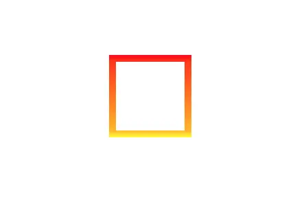
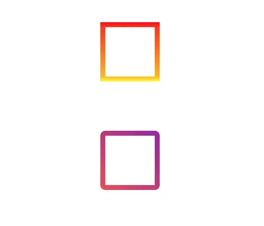

## Before
渐变色是一种很常见的装饰效果，经常遇见需要给背景设置一个渐变色，但是你有没有遇到过需要给边框设置渐变色的需求呢？

## 1. 先说几个概念

### 1.1. border-image
>指定作为div元素周围边框的图像
>
```css
#border-img { 
    -webkit-border-image: url(border.png) 30 round; /* Safari 3.1-5 */
    -o-border-image: url(border.png) 30 round; /* Opera 11-12.1 */
    border-image: url(border.png) 30 round;
}
```

### 1.2. linear-gradient() 函数
>linear-gradient() 函数用于创建一个表示两种或多种颜色线性渐变的图片。

创建一个线性渐变，需要指定两种颜色，还可以实现不同方向（指定为一个角度）的渐变效果，如果不指定方向，默认从上到下渐变。  
推荐一个可以尝试各种渐变的网站<a target="_blank" href="https://www.joshwcomeau.com/gradient-generator/">Gradient Generator</a>

``` css
/* 从上到下，蓝色渐变到红色 */
linear-gradient(blue, red);
 
/* 渐变轴为45度，从蓝色渐变到红色 */
linear-gradient(45deg, blue, red);
 
/* 从右下到左上、从蓝色渐变到红色 */
linear-gradient(to left top, blue, red);
 
/* 从下到上，从蓝色开始渐变、到高度40%位置是绿色渐变开始、最后以红色结束 */
linear-gradient(0deg, blue, green 40%, red);
```

## 2. border渐变色
```html
<!DOCTYPE html>
<html>
<head>
	<title>test</title>
</head>
<style>
	.rectangle {
		width: 100px;
		height: 100px;
	}
	.border1 {
		border:10px solid #ddd;
		border-image: linear-gradient(red,yellow) 30 30;
	}
</style>
<body>
	<div class="border1 rectangle"></div>
</body>
</html>
```



大多数情况下边框都会搞个圆角border-radius: 4px;，但是设置了border-image的情况下，border-radius是不生效的。  

## 2.1 border渐变色+圆角
下面的方案是通过background-image来实现的。  
外层div背景色设置渐变，给个padding，设置圆角，内部div设置百分百宽高，背景色白色，就能搞出了border来啦～～  
```html
<!DOCTYPE html>
<html>
<head>
	<title>test</title>
</head>
<style>
	.rectangle {
		width: 100px;
		height: 100px;
	}
	.border1 {
		border:10px solid #ddd;
		border-image: linear-gradient(red,yellow) 30 30;
	}
	.border2 {
		padding: 10px;
		border-radius: 10px;
        background-image: linear-gradient(222deg, rgba(152, 44, 177, 1), rgba(228, 88, 95, 1));
	}
	.border3 {
		height: 100%;
		background-color: #fff;
	}
</style>
<body>
	<div class="border1 rectangle"></div>
	<div class="border2 rectangle">
		<div class="border3 "/>
	</div>
</body>
</html>
```
其实就是通过内层的div遮挡住外层div，以padding作为border。



## Reference
[CSS渐变色边框，解决border设置渐变后，border-radius无效的问题](https://blog.csdn.net/shuiseyangguang/article/details/83618757)