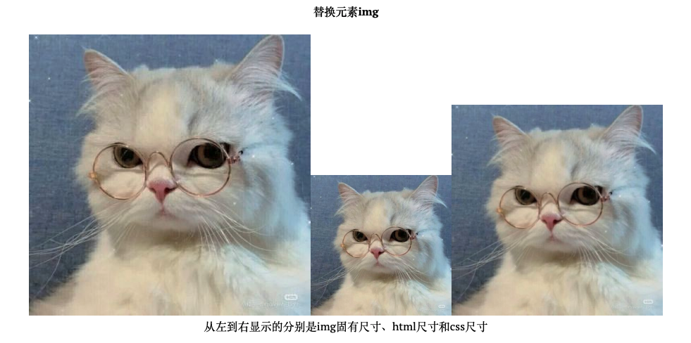

import { Table } from 'antd'
export const dataSource = [{key:1,name1:'后代',name2:'空格'},{key:2,name1:'相邻后代',name2:'>'},{key:3,name1:'兄弟(后面的兄弟)',name2:'～'},{key:4,name1:'相邻兄弟',name2:'+'}]
export const columns = [{title:'选择器',dataIndex:'name1'},{title:'符号',dataIndex:'name2'}]
export const pagination = false

《CSS的世界》不是一本文档书，他更多的是对css的理解认知，但是其中还是出现了很多我没有完全理解或者之前没有听过的名词/概念，这边先把这些概念记录下来。

## 1. 元素
html的标签有很多，像常见的\<div>、\<span>、\<li>等等，通常分成两类：
- 块级元素
- 内联元素  
  
根据内容还可分为
- 替换元素
- 非替换元素

### 1.1. 块级元素
常见的有\<div>、\<li>和\<table> 等。
特征：
- 每个元素独占一行 
- 元素的高度、宽度、行高以及边距都可以设置
- 元素不设置宽度情况下，占父容器100%宽度

值得注意的是，块级元素和display: block不是一个概念，比如上面提到的li它的display值就是list-item，table的display值是table，但是他们都是块级元素。

### 1.2. 内联元素
常见的有\<span>、\<button>、\<input>、\  
特征：
- 和其他元素在同一行
- 元素高度、宽度以及顶部和底部边距不可设置(margin-top、margin-bottom不生效，padding-top和padding-bottom不会影响元素位置，但会在背景色上体现)
- 元素的宽度就是元素所包含内容的宽度，不可设置

浮动元素是内联元素吗？不是的，浮动元素在文档流之外，并不是和文字在一行显示。
### 1.3. 替换元素
顾名思义，内容可以被替换的元素，都是内联元素。
常见的有\<input>, \<textarea>, \, \<radio>, \<object>, \<video>, \<iframe>。  
另外content属性生成的对象称为**匿名替换元素**，所以content属性生成的内容也都是替换元素。  
替换元素除了内容可替换，还有一些特征区别于非替换元素，比如有自己的尺寸



``` html


```

## 2. 盒子
每个元素都有两个盒子：
- 外在盒子  负责元素是一行显示，还是换行显示
- 内在盒子  负责宽高和内容，又称为容器盒子
  
内在盒子又被分成四个盒子：
- content box
- padding box
- border box
- margin box
  
很多时候我们给元素设置宽高，但最终发现真是高度跟设置的可能不一样，就是因为宽高作用在不同盒子上导致的。  
按照一般的思维，设置了30px的宽度，应该是连同border、padding、content一起30px，但如果box-sizing设置为content-box(浏览器默认就是content-box)，那么width就只作用在content上，如果外面还有border、padding，那么实际尺寸肯定会比设定要大。  
我们可以通过宽度分离的方式来解决，也就是把width跟border、padding分开来，给width多一层标签。  
另外就是可以给box-sizing设置border-box，书中评价了\{box-sizing:border-box}这种做法，认为：
1. 这种做法易产生没必要的消耗
2. 这种做法并不能解决所有问题

而下面这两篇文章都表达了对这种写法的支持:  
<a target="_blank" href="https://www.joshwcomeau.com/css/custom-css-reset/">My Custom CSS Reset</a>  
<a target="_blank" href="https://www.paulirish.com/2012/box-sizing-border-box-ftw/">* \{ Box-sizing: Border-box } FTW</a>  
嗯，我觉得他们说的都对!  
哦，顺便提一句：* \{ } doesn't apply to pseudo elements，所以如果要写*, *:before, *:after \{}。

## 3. 关键字：
举几个常见的例子比如transparent，solid等

泛关键字(所有属性都可以使用的关键字)：initial(初始)、inherit(继承)、unset(未设置)、revert(还原)
(all: 表示重设除unicode-bidi和direction之外的所有CSS属性的属性值，取值只能是initial、inherit、unset和revert。)

## 4. 选择器

<Table dataSource={dataSource} columns={columns} pagination={pagination} />

利用+可以实现一些从第二个元素开始生效的样式
``` css
.box {
  + .box {
    margin-top: 20px
  }
}
```

## 5. 块状格式化上下文元素（6.3）
>BFC全称为block formatting context，中文为“块级格式化上下文”。相对应的还有IFC， 也就是inline formatting context，中文为“内联格式化上下”。

这个在上一篇<a target="_blank" href="https://www.whyyy.net/blog/css-flow">文档流</a>中有讲到

## 6. 伪元素
最常见的::after、::before，还有::first-letter、::first-line
用于插入内容，不受文档约束，也不影响文档本身，只影响最终的样式。

## Z. 参考
[1. 张鑫旭．CSS的世界[J]．](https://www.zhangxinxu.com/)  
[2. My Custom CSS Reset](https://www.joshwcomeau.com/css/custom-css-reset/)  
[3. * \{ Box-sizing: Border-box } FTW](https://www.paulirish.com/2012/box-sizing-border-box-ftw/)  
[4. 怎样理解 CSS :after 伪元素的作用？](https://www.zhihu.com/question/20436746)  
[5. 内联元素和块状元素的区别](https://www.cnblogs.com/sunnyas/p/10885982.html)