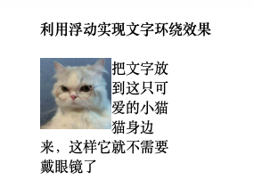
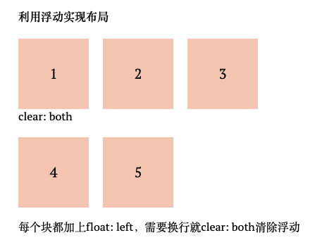
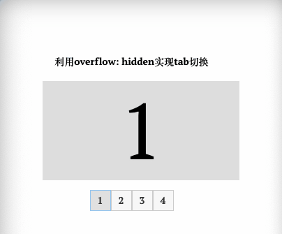
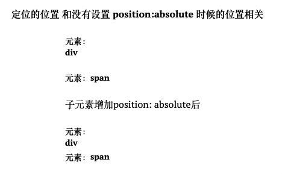
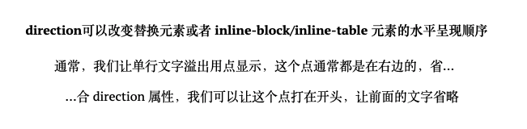

css世界的定位和布局机制叫做**文档流**
它跟现实世界的水流很相似，将一个块级元素(div)放入容器中，它会像水流一样，自动铺满容器，将内联元素(span)放入，它会依次排列下去，一行放不下了就换下一行。如果整体高度超过容器，就会溢出(overflow)。
这种效果可能认识css的头两天就发现了，用多了就变成自然而然顺理成章的事情，从未深思过它的内在思想。
为什么用文档流，为什么能用，能否破坏，它的方向是什么样的，能否改变。

#### 1. 流的破坏

##### 1.1. float
>浮动的本质就是为了实现文字环绕效果

刚入职那两年，float真的用的很多，我印象中经常复制的一段话就是
``` css
<div style="clear:both"/> // 清除浮动
```
现在了解到原来float创造之处就是为了实现文字环绕效果的，仅此而已，那么它是如何实现文字环绕效果的呢？这边涉及到两个特性
- float会让父元素的高度塌陷
- 行框盒子和浮动元素的不可重叠性



图片这个浮动元素塌陷，文字所在的这个块状盒子与图片是完全重叠的，又受到浮动元素的限制，没有任何重叠。

然而想象力和创造力俱佳的程序员们把float的作用在布局上发挥得淋漓尽致，但是布局是不需要父元素塌陷的，这就出现了上面那段清除浮动的代码。



确实，给每个元素定好宽高，给个float: left，一个个元素像搭积木一样堆起来，确实容易好用，又好理解，至少比流要直观简单多了，但是问题也很多。比如在我用这种布局的时候，经常遇到改个宽度高度，整个结构就崩溃的情况，因为它是没有弹性的。
好在有了flex这种弹性盒子布局之后，基本上就再也没用过float了。

##### 1.2. BFC
BFC(block formatting context)，块级格式化上下文。在《CSS的世界》中，它被称为**CSS世界的结界**  🔥，
能实现更健壮更智能的自适应布局。
>如果一个元素具有 BFC，内部子元素再怎么翻江倒海、翻云覆雨，都不会影响外部的元素。

BFC的触发条件：
- \<html>根元素;
- float 的值不为 none;
- overflow 的值为 auto、scroll 或 hidden;
- display 的值为 table-cell、table-caption 和 inline-block 中的任何一个;
- position 的值不为 relative 和 static。

使用这些属性都可以触发BFC，但是他们自身都有一些古怪的特性，能担当布局大任的，总结下来也就所剩不多了：
- overflow:auto/hidden，适用于 IE7 及以上版本浏览器;
- display:inline-block，适用于 IE6 和 IE7;
- display:table-cell，适用于 IE8 及以上版本浏览器。
其中overflow表现最佳。

说实在的我对overflow的印象一直都是，内容太多了，我需要滚动条，oh，来个overflow: auto，从来不知道它的结界特性。
这边还有一个overflow: hidden的小知识:
元素设置了 overflow:hidden 声明，里面内容高度溢出的时候，滚动依然存在，仅仅滚动条不存在。
利用这个特性加上锚点定位可是实现图片切换效果




##### 1.3. position: absolute
position: absolute跟float其实很像，都能破坏正常的文档流，都能BFC，都有包裹性(可以看css(二))，一个div设置了position: absolute后，宽度会缩到刚好包裹住内部所有元素为止。通常我们的header都会用这个属性。
关于position: absolute有一个问题
>一个绝对定位元素，没有任何 left/top/right/bottom 属性设置，并且其祖先元素全部都是非定位元素，其位置在哪里?

答案是还是在当前位置。我一直都有一个错误认知，就是absolute一定是相对于父容器relative的，然后通过left/top来定位，但其实不是的，position: absolute它的样式和行为不依赖其他属性。
当不设置left/top/right/bottom，它的效果就是相对定位(fixed也是)，但不占据css流的尺寸空间。这对于我们实现要在某个块角落加个小图标这种需求就很方便。
虽然说元素 position:absolute 后的 display 计算值都是块状的，但是其定位的位置和没有设置 position:absolute 时候的位置相关。
虽然设置了position: absolute后无论是内联的\<span>还是块状的\<div>，计算值都是 block，但是它们的位置还和没有应用 position:absolute 的时候一样，一个在后面，一个在下面如下图：



当对立方向同时发生定位的时候，position: absolute的元素也会具有流体特性，普通元素流体特性只有一个方向，默认是水平方向，但是绝对定位元素可以让垂直方向和水平方向同时保持流动性。通过下面这段可以实现水平垂直居中
``` css
position: absolute;
left: 0;
top: 0;
bottom: 0;
right: 0;
width: 400px;
height: 300px;
background-color: #b9f2d8;
margin: auto;
```
##### 1.4. position: relative & fixed
设置了position: relative的元素，可将其移至相对于其原来位置的地方，原来的位置遗留空白区域。他是相对于当前位置定位，不脱离文档流(所以好像不应该放在流的破坏下面说嗷)，不会影响文档中的其他元素。
>relative 的定位还有另外两点值得一提:相对定位元素的 left/top/right/bottom 的百分比值是相对于包含块计算的，而不是自身。注意，虽然定位位移是相对自身，但是百分比值的计算值不是

fixed更加强势，可以限制absolute的relative也对他毫无办法，唯一可以限制固定定位元素的就是\<html>根元素。

#### 2. 改变流向

##### 2.1. direction
>direction 属性默认有这么一个特性，即可以改变替换元素或者 inline-block/inline-table 元素的水平呈现顺序。

可以利用这个特性实现下图这种...显示在前面的效果



它还有一个黄金搭档unicode-bidi，能够让所有字符按照设置的方向排列。

##### 2.2. writing-mode
direction改变的是内联元素的顺序，那么writing-mode则可以对块状元素产生影响，改变整个CSS世界的纵横规则，其设计之初是为了图文排版，而creative的程序员们则利用它的特性创造了许多意想不到的效果，
``` css
writing-mode: tb-rl // 从上到下，从右到左
```
这样就可以将页面默认的水平文档流，变成垂直流，很多只有水平方向适用的规则会变成只在垂直方向上适用。比如：
margin: auto实现垂直方向上的居中
text-align: center实现图片垂直居中
icon旋转效果
在垂直方向自适应布局等等