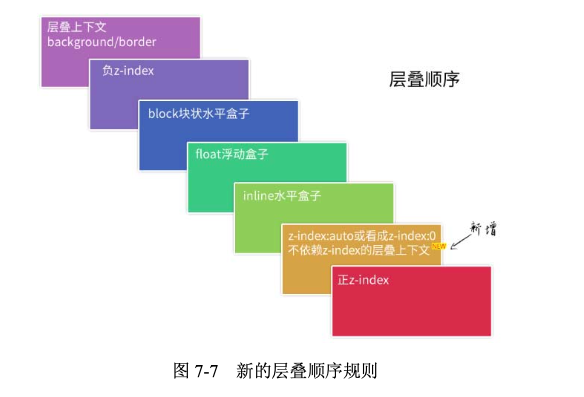

## Before

当某一天有个元素被另一个元素挡住，意识到，啊~~原来web界面是三维的，那个时候知道了z-index这个属性，想让谁在上面，就给谁设置一个相对更大的值就可以了。
又有一天，发现我在header上hover出来的下拉框被下面的某个内容挡住了，我给hover出来的元素设置了很大的z-index，但是它仍旧躲在后面死活不出来。才知道z-index是否能够显示在更上层是受到父元素限制的，如果A元素在B元素上方，哪怕B的子元素z-index设置无穷大，也不会跑到A元素上面。

## 1. 层叠上下文
>层叠上下文，英文称作 stacking context，是 HTML 中的一个三维的概念。如果一个元素含有层叠上下文，我们可以理解为这个元素在 z 轴上就“高人一等”。

层叠上下文元素有如下特性:
- 层叠上下文的层叠水平要比普通元素高。
- 层叠上下文可以阻断元素的混合模式。
- 层叠上下文可以嵌套，内部层叠上下文及其所有子元素均受制于外部的“层叠上下文”。
- 每个层叠上下文和兄弟元素独立，也就是说，当进行层叠变化或渲染的时候，只需要考虑后代元素。
- 每个层叠上下文是自成体系的，当元素发生层叠的时候，整个元素被认为是在父层叠上下文的层叠顺序中。

那么如何创建层叠上下文呢：
- 页面根元素天生具有层叠上下文，称为**根层叠上下文**。
- z-index 值为数值的定位元素的传统**层叠上下文**。
- 其它  
  (1)元素为 flex 布局元素(父元素 display:flex|inline-flex)，同时 z-index 值不是 auto。  
  (2)元素的 opacity 值不是 1。  
  (3)元素的 transform 值不是 none。  
  (4)元素 mix-blend-mode 值不是 normal。  
  (5)元素的 filter 值不是 none。  
  (6)元素的 isolation 值是 isolate。  
  (7)元素的 will-change 属性值为上面 2~6 的任意一个(如 will-change:opacity、will-chang:transform 等)。  
  (8)元素的-webkit-overflow-scrolling 设为 touch。  

## 2. 层叠规则
当元素发生层叠的时候，其覆盖关系遵循下面两条准则：
- 谁大谁上:当具有明显的层叠水平标识的时候，如生效的 z-index 属性值，在同一个层叠上下文领域，层叠水平值大的那一个覆盖小的那一个。
- 后来居上:当元素的层叠水平一致、层叠顺序相同的时候，在 DOM 流中处于后面的元素会覆盖前面的元素。

## 3. 层叠顺序
