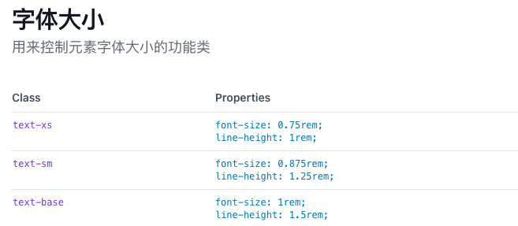
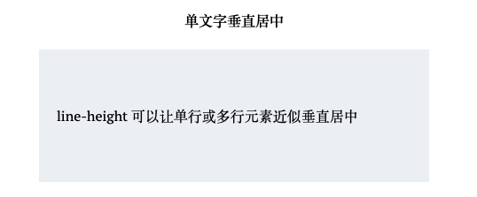
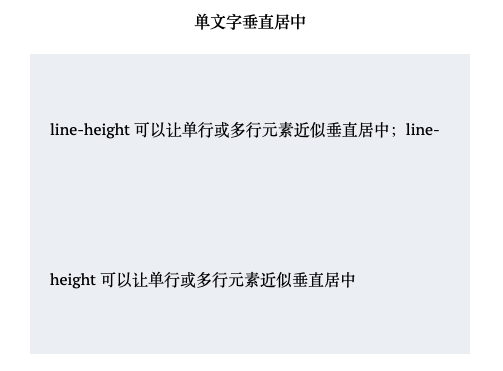
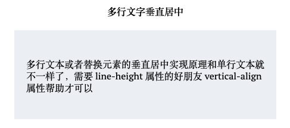

## Before
开篇提到css最开始的设计就是服务于图文信息的，文本处理和展示能力的强大。
不知道大家有没有用过<a target="_blank" href="https://www.tailwindcss.cn/">Tailwind</a> ，它用来控制字体大小的功能类是下图这样的，设置font-size的同时还设置了line-height，第一次用的时候很迷茫，为啥这俩要一块儿写，我就单纯的想设置一下字号呀，但了解之后发现，这俩彼此的关系不一般，



Ps tailwind中的单位都是rem，也就是相对于根结点font-size的大小

## 1. line-height与font-size
>对于非替换元素的纯内联元素，其可视高度完全由 line-height 决定。  
对于块级元素，line-height 对其本身是没有任何作用的，我们平时改变 line-height，块级元素的高度跟着变化实际上是通过改变块级元素里面内联级别元素占据的高度实现的。

在读《CSS的世界》之前，我一直以为，想要文字垂直居中，就设置line-height大小和height一样就可以了。然而事实是，只要写line-height就可以了，我想这也是为什么上图中设置字体大小的类同时还设置了line-height吧，写个text-xs直接就实现垂直居中了。  
line-height翻译过来就是行高，一行占据的高度。  
line-height属性值可以是数值、百分比和长度值，当line-height设置为数值或者百分比值，那么实际的行高就是a * font-size。  
还有一个概念叫做行距，顾名思义就是行与行之间的距离，行距 = 行高 - font-size = a * font-size - font-size  
显然，当a = 1时，行距 = 0  
行高可以实现“垂直居中”原因在于 CSS 中“行距的上下等分机制”  



``` html
<div className="font-align-container">
  <h4>单文字垂直居中</h4>
  <div className="font-align-container-box">line-height 可以让单行或多行元素近似垂直居中</div>
</div>

.font-align-container {
  .font-align-container-box {
    padding: 0 20px;
    width: 400px;
    margin: 0 auto;
    line-height: 150px;
    background-color: #eef0f4;
  }
}
```
行距上下等分，所以第一行上方也是有行距的，不过只有一半，也被称为半行距，所以当line-height不为1的时候，文字部分距离上方的尺寸不只是margin间距，如果设计图上标注的距离是20，我们设置margin就需要20-半行距。

行距上下等分，那么只设置line-height是没有办法实现多行文字垂直居中的，当我增加文字至多行时，行距就体现出来了。



这时候就需要用到vertical-align。

## 2. vertical-align
首先，vertical-align只能应用于内联元素以及 display 值为 table-cell 的元素。  
vertical-align的属性值可以分成四类  
- 线类，如 baseline(默认值)、top、middle、bottom;
- 文本类，如 text-top、text-bottom;
- 上标下标类，如 sub、super;
- 数值百分比类，如 20px、2em、20%等。

那么多行文字垂直居中实现原理是什么呢，先看demo



``` html
<div className="container">
  <h4>多行文字垂直居中</h4>
  <div className="box">
    <div className="content">
      多行文本或者替换元素的垂直居中实现原理和单行文本就不一样了，需要 line-height属性的好朋友 vertical-align 属性帮助才可以
    </div>
  </div>
</div>

.container {
  .box {
    padding: 0 20px;
    width: 400px;
    margin: 0 auto;
    line-height: 150px;
    background-color: #eef0f4;
    .content {
      display: inline-block;
      line-height: 20px;
      text-align: left;
      vertical-align: middle;
    }
  }
}
```
多行文字用一个标签包裹，然后设置display: inline-block，这么做有几点原因：  
1. 如果设置为inline，那么最终生效的高度是由更大的line-height(也就是.box设置的150px)决定的
2. 我们需要一个内联元素，vertical-align才能生效
3. 我们还需要内联元素组成的行框盒子前的**幽灵空白节点**，这样box的line-height就有了作用对象，就相当于在content元素前面撑起一个高度为120px，宽度为0的内联元素。

老实说一开始我没能理解第一点，直到我看了[《CSS世界》读书笔记（十六）](https://blog.csdn.net/weixin_33851177/article/details/94294965)。。。哎，写读书笔记不止要读书，还要读读书笔记，让他来告诉你答案在P125。shame on U。。。

## Reference 
[1. 《CSS世界》读书笔记（十六）](https://blog.csdn.net/weixin_33851177/article/details/94294965)  