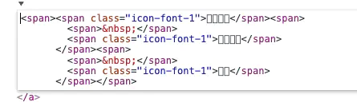
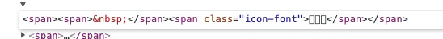
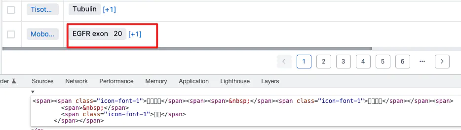
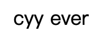

插播一则最新消息：
## 幽灵节点找到啦
<a target="_blank" href="/blog/css">CSS的世界读后感</a>中提到了读《CSS的世界》这本书的契机是一个bug，今天，这个困扰我1023小时又9分钟的问题，终于解决了✌️。
再描述一遍问题：


图上这个空格左右两边多了一部分空白，无法选中，没有border、padding或者margin，就是这么莫名其妙地出现了。
```html
<span>
  <span style={style}>&nbsp;</span>
  {content}
</span>
```
现在回想起来，当时告诉我**幽灵节点**的小哥其实把答案也告诉我了，他说标签之间的空白也会导致幽灵节点的诞生。当时我还试了一下，写成下面这段代码这样，然而没效果，嗯，因为写错地方了🧎，出错的是另一段代码。。。
```html
<span><span style={style}>&nbsp;</span>{content}</span>
```
出现问题的代码是下面这段，大家应该看出来了，这段html是通过模版字符串生成的。
```html
`<span>
  <span style="${style}">&nbsp;</span>
  ${content}
</span>`
```



在控制台右键，edit as html可以发现span与span之间有一大段的空白。



而不是模版字符串生成的html是没有这些空白的。

写成这样问题就解决啦
```html
`<span><span style="${style}">&nbsp;</span>${content}</span>`
```
直接在控制台修改就能很直观的看出来，把前几个span之间的空白删掉后，第一个空格是正常的，第二个空格还是偏大的



正常格式下内联元素之间默认是有间隙的(又是我从来没意识到过的点😳)



```html
<div>
  <span>cyy</span>
  <span>ever</span>
</div>
```
项目中，webpack打包出来的文件，元素标签之前的空白都会被去掉，但是用模版字符串写的代码，空白被保留下来，就产生了上面的bug。

## Reference
[1. vue-cli3 编译后标签之间的空格被移除](https://blog.csdn.net/u013861985/article/details/95793298)  
[2. 带你探索神秘的“幽灵空白节点”](https://zhuanlan.zhihu.com/p/391118319)

