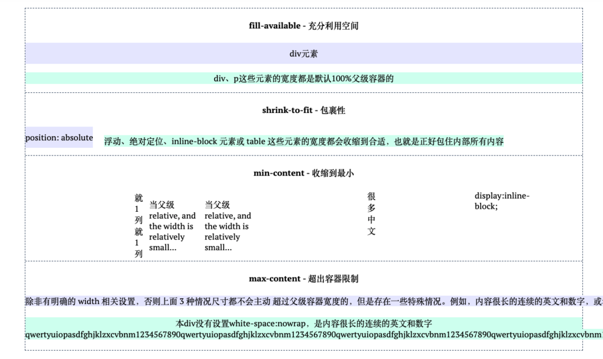
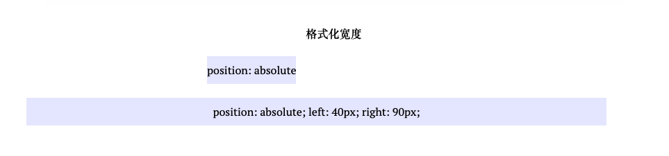
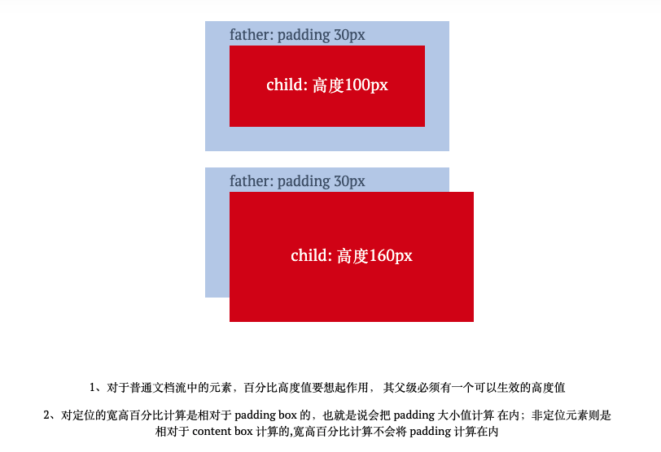

>CSS的默认流是水平方向的，宽度是稀缺的，高度是无限的。因此宽度的分配规则比较复杂，而高度就显得比较随意。
## 1. width
在经年的css使用中，width给人的感觉很复杂，从一开始的写死宽度，到之后使用百分比，到后面尽量不写宽度，让它自己撑开。但更多情况都是不情不愿地给个宽度，然后secretly hate自己，很复杂不好说。。。

### 1.1 width: auto
width的默认值是auto，在不同场景下，他会有不同的表现。
- fill-avaliable：
  100%父级容器  
  block容器都有这种流特性，像水流一样必定会铺满容器一样，所以但凡display: block，都没必要增加width: 100%，不仅没必要，而且会导致容器失去流动性。
- shrink-to-fit：
  正好包裹住内部元素  
  在默认情况下，绝对定位元素的宽度表现是**包裹性**，宽度由内部尺寸决定，这边有一种例外情况，可以看下面的1.3节。  
  还有display 属性值是 inline-block，那么即使其里面内容再多，只要是正常文本，宽度也不会超过容器。
- min-content：
  收缩为最小宽度  
  当外部容器宽度为0时， 内部inline-block 元素宽度就会表现出最小宽度:  
  东亚文字：每个汉字的宽度  
  西方文字：特定的连续的英文字符单元决定，一般止于空格、短横线、问号以及其它非英文字符等  
  如果加上word-break:break-all;那英文字符也是以单个字符作为最小宽度了
- max-content：超出父级容器宽度的**shrink-to-fit**元素设置**white-space:nowrap**后的宽度  
  如果内部没有块级元素或者块级元素没有设定宽度值，则“最大宽度”实际上是最大的连续内联盒子的宽度。

下面是每种情况的一个demo



### 1.2 width: 数值
开头说，从业多年的经验让我不愿意写死宽度，了解了css世界的文档流会发现，一旦给设定了width具体数值，该元素就会丧失流动性，我们的布局就变成了搭积木，是僵硬的，限制的。

### 1.3 绝对定位元素
上面说了，绝对定位元素有一种情况，宽度不是由内部元素决定的，这种情况就是：
当 left/top 或 top/bottom **对立方位**的属性值同时存在的时候，元素的宽度表现为**格式化宽度**，其宽度大小相对于最近的具有定位特性(position的属性值不是static)的祖先元素计算(position属性的默认值是static)。
这种格式化宽度具有流动性，会自动填充满水平空间。



## 2. height
css世界的定位和布局机制是文档流，将一个块级元素放进去，会把父级容器的宽度填充满，但高度默认是0，需要显示地指定高度。

### 2.1. height: auto
height: auto比起width: auto简单了不少，基本上就是有几个元素盒子，把每个的高度加起来，就是最终的高度了。

### 2.2. height: 100%
如何让元素支持height:100%效果(下图中的红框都设置了height:100%):
- 显示设定高度值
- 使用绝对定位  
  绝对定位的宽高百分比计算是相对于 padding box 的，也就是说会把 padding 大小值计算在内；非绝对定位元素则是相对于 content box 计算的，不会将 padding 计算在内
  


第二张图是绝对定位，下面是代码
``` html
<div className="father">
  <div className="father-desc ">father: padding 30px</div>
  <div className="child">child: 高度160px</div>
</div>

.father {
  position: relative;
  height: 100px;
  padding: 30px;
  background-color: #beceeb;
  .child {
    position: absolute;
    width: 100%;
    height: 100%;
    background-color: #cd0000;
  }
}
```
另外提一句图上child上面**文字垂直居中**是这么实现的
``` css
.child::before {
  content: '';
  display: inline-block;
  vertical-align: middle;
  height: 100%;
}
```