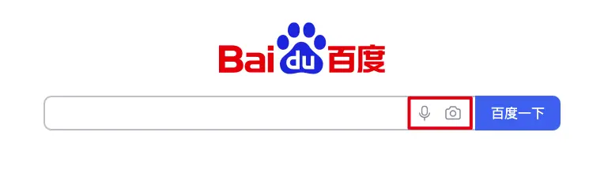
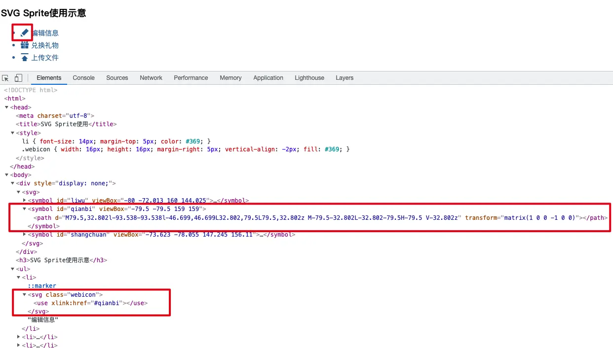
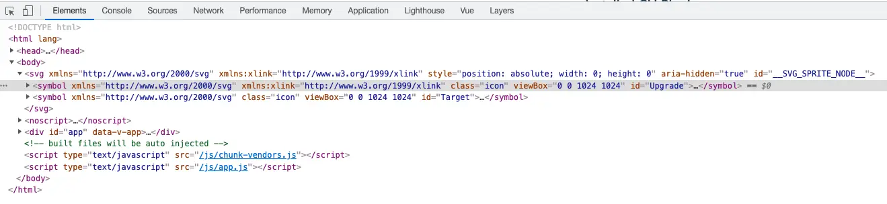

## Before
最近开发的时候被icon烦到了，之前都用的是antd或者ele的图标，就这个写法:
```html
<i class="el-icon-share"></i>
```
或者使用阿里矢量库的图标也基本是这么个用法。
但是这次的新项目不用这些，要用项目封装好的一个组件，我一直没整明白(*然后就都用img，不同颜色就得再下一张图，实在蠢*)，今天抽个时间理一下。东西有点多，我们step by step～

## 几个概念

### 1. use
> use元素在SVG文档内取得目标节点，并在别的地方复制它们。它的效果等同于这些节点被深克隆到一个不可见的DOM中，然后将其粘贴到use元素的位置
> 
### 2. symbol
>`symbol`元素用来定义一个图形模板对象，它可以用一个[`<use>`](https://developer.mozilla.org/zh-CN/docs/Web/SVG/Element/use)元素实例化。
> `symbol`元素对图形的作用是在同一文档中多次使用，添加结构和语义。结构丰富的文档可以更生动地呈现出来，类似讲演稿或盲文，从而提升了可访问性。
> 注意，一个`symbol`元素本身是不呈现的。
> 只有`symbol`元素的实例（亦即，一个引用了`symbol`的 [`<use>`](https://developer.mozilla.org/zh-CN/docs/Web/SVG/Element/use)元素）才能呈现。


### 3. 雪碧图

#### 3.1. CSS sprite

传统的CSS sprite是将多个icon整合到一张图中，然后通过定位获取其中的某个图标。  
优点：减少网络请求  
缺点：无法更改图标的样式，高分辨率下会模糊  
举个例子，百度首页搜索框里的图标就是用雪碧图做的。  
可以看到一共四个小icon，有灰有蓝，蓝的就是hover上去显示的图片，看样式就可以发现，他是通过调整图片位置(background-position)，来显示不同图标的。这样原本四个图，需要4次HTTP请求，现在就只需要一次了。




#### 3.2. SVG sprite

这里就要用到我们开头说的两的标签，\<symbol>+\<use>。  
首先利用symbol定义图形模板对象，然后使用use，找到该对象的引用进行复用，symbol元素有一个id属性，使用use时，给use的href属性'#'+id就可以找到对应的引用。  
下面是一个参考1中的一个例子[SVG Sprite使用示意](https://www.zhangxinxu.com/study/201407/svg-sprite.php)的截图



接下来的问题就是如何将svg图片转成symbol标签整合在一起呢，我们项目是通过svg-sprite-loader来实现的。

#### 3.3. svg-sprite-loader

先安装
```bash
yarn add svg-sprite-loader -D -S
```
在vue.config.js中配置
```javascript
const path = require('path')
const _ = require('lodash')
module.exports = {
    chainWebpack: (config) => {
        addSvgSpriteLoaderConfig(config)
    }
}
function addSvgSpriteLoaderConfig(config) {
    const svgDirs = [
        // 自定义的 svg 文件夹
        path.resolve(__dirname, './src/assets/test/'),
    ]
    /**
     * 根据 svg 相对路径（相对 dirs 中配置的文件夹路径）生成 symbol id
     */
    function symbolId(filePath) {
        const path = svgDirs.reduce((path, dir) => {
            return (path = path.replace(dir, ''))
        }, filePath)
        const name = path.replace('.svg', '')
        const res =  _.upperFirst(_.camelCase(name))
        console.log('res', res)
        return res
    }
    config.module.rule('svg').exclude.add(svgDirs).end()
    config.module
        .rule('icons')
        .test(/\.svg$/)
        .include.add(svgDirs) //处理svg目录
        .end()
        .use('svg-sprite-loader')
        .loader('svg-sprite-loader')
        .options({
            symbolId,
        })
}
```
但是配置完启动之后，发现body下面并没有svg标签，console了一下发现根本没进symbolId方法，但是addSvgSpriteLoaderConfig方法是走了的。
尝试在文件中进行使用，发现出现svg标签了。
```
import '../assets/test/upgrade.svg'
import '../assets/test/target.svg'
...
    <svg>
      <use xlink:href="#Upgrade"></use>
    </svg>
    <svg>
      <use href="#Target"></use>
    </svg>
```



说明只有引入了svg，才会经过svg-sprite-loader。

#### 3.4. 颜色填充

在项目中使用时，只需要在svg标签上设置color，就能改变icon的颜色，这一点一直让我觉得很神奇，理论上需要通过设置fill，才能改变颜色，后来我发现是因为svg上设置了这一句样式：
``` css
svg {
 fill: currentColor
}
```
currentColor就是使用当前该元素所处环境的文字颜色，所以设置color相当于设置了fill。


## Reference
[1. 未来必热：SVG Sprites技术介绍](https://www.zhangxinxu.com/wordpress/2014/07/introduce-svg-sprite-technology/)  
[2. 懒人神器：svg-sprite-loader实现自己的Icon组件](https://segmentfault.com/a/1190000015367490)  
[3. SVG进阶-sprite 雪碧图](https://blog.csdn.net/baidu_38242832/article/details/115220009)  
[4. SVG图标颜色文字般继承与填充](https://blog.csdn.net/auragreen/article/details/52212409)  
[5. Cascading SVG Fill Color](https://css-tricks.com/cascading-svg-fill-color/)  
[6. https://juejin.cn/post/6844903695478439949](https://juejin.cn/post/6844903695478439949)