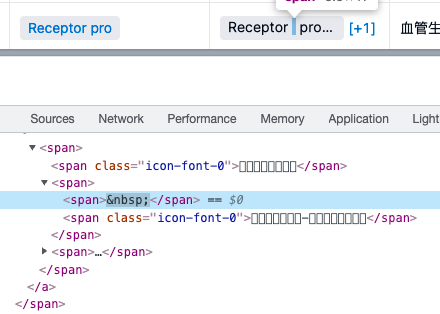

>10 年风雨积累，踏遍 CSS 世界的千山万水，哪里有美景，哪里有秘境，哪里是陷阱，哪里是路径，我全了然于心。

从业快5年了，关于css，好像真的没有系统地学习过，大概是因为它真的是入门非常简单的语言。我学习css的开端就是坐在一位前端小姐姐边上看她调试，后来就开始照葫芦画瓢，一般的UI都能搬到web上，很顺利。  
但随着走的路越来越长，遇到的磕磕绊绊也就越来越多。  
很多时候会出现得不到预期效果，不知道为啥能长成这样的情况。每种情况的原因都各不相同，但归根究底还是因为对css理解不深。  
很多时候解决问题是靠google出一个差不多的属性，然后在控制台把每个属性值都是一遍，选最合适的那个(该说不说，调试是真方便)。这就导致了认知上的欠缺，当某个效果由多个属性共同作用时，就懵圈了。  
看这本书的契机也是遇到了一个无法理解的现象:  
图上这个空格左右两边多了一部分空白，无法选中，没有border、padding或者margin，就是这么莫名其妙地出现了。

询问了同事小哥，得到了一个名词 - **幽灵节点** 以及一本书 - 《CSS的世界》(虽然最后发现幽灵节点在这书里只讲了一页，并且完全没能解决我的问题(<a href="https://www.whyyy.net/blog/strut/" target="_blank">后来解决啦</a>)。  
书本开篇讲了CSS 世界的“世界观”，这是一个我从来没有考虑过的角度。也许学习一门语言，不是从语法开始，而要先去了解这个语言的世界，了解它的身世，它的故事，它诞生的原因，它存在的意义。  
CSS(Cascading Style Sheets) -- 层叠样式表，它的世界就是服务于展示图文信息。
>单靠感性认知而非具体原理理解 CSS 的样式表现很多时候是不靠谱的

书中的这句话是非常真实了，css本身基本没有逻辑，都是具象的表现，通常是看效果了解每个属性以及属性值的作用，都是感性的认知，却从来没有去理解过具体原理。这就容易导致相同的问题重复出现，分析不来问题的根因，只能通过观察每种属性的效果去解决，哪怕画千百个图，知道再多属性，于自身也是毫无进益。

这本书能对我的css有多少提升尚未可知，但至少现在每次遇到问题，我会开始尝试分析原因，每个px都可能包含了我的理论分析，虽然不一定分析得出来，也不一定分析得对，但至少我的css世界已经开始建立了。

下面是本书的读书心得，博客中的demo都可以在我的<a target="_blank" href="https://github.com/yyycc/css">github</a>上找到

[css（一） 文档流](https://www.whyyy.net/blog/css-flow)  
[css（二） 一些基本概念](https://www.whyyy.net/blog/css-basic)  
[插播一则最新消息](https://www.whyyy.net/blog/css-ghost)  
[css（三）width与height](https://www.whyyy.net/blog/css-height-width)  
[css（四）padding、margin、border](https://www.whyyy.net/blog/css-padding-margin-border)  
[css（五）层叠](https://www.jianshu.com/p/4b26f1775eb8)  
[css（六）文本处理](https://www.jianshu.com/p/e59f3fe681b9)  
[css（七）font-size与line-height与vertical-align](https://www.jianshu.com/p/dea77eb43105)  
[css（八）浏览器渲染](https://www.jianshu.com/p/107b23da54ee)  
