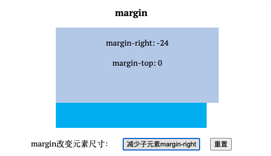

[css（二） 一些基本概念](/blog/css-basic/)提到了盒子，替换元素里讲了一下content，这边我们来聊一聊剩下的三个盒子padding、margin和border

## 1. padding
padding内间距，他是4个盒子中最温和的，基本不会出现什么反认知的现象。
- padding 属性是不支持负值的
- padding 百分比值无论是水平方向还是垂直方向均是**相对于宽度计算**的

说几个比较有意思的使用。
第一个直接用了padding，分隔符高度会比较高，第二个是通过伪元素+padding，可以实现分隔符长短的控制


``` css
.padding-container-content-box {
  + .padding-container-content-box {
    &:before {
      content: '';
      border-left: 1px solid gray;
      margin-left: 8px;
      padding: 12px 4px 1px;
      font-size: 0;
    }
  }
}
```

## 2. margin
margin负责外间距，通常块与块之间都会通过margin来分隔一下，虽然同样都是负责间距，相比于padding，margin就不太温和，特异之处不少。

### 2.1. margin与尺寸
和 padding 属性一样，margin 的百分比值无论是水平方向还是垂直方向都是相对于宽度计算的。  
首先，margin是支持负值的，这其实还是比较好理解的。  
其次，margin在某些情况下是可以改变元素尺寸的，之前说盒子的时候提到过，box-sizing有两种，border-box和content-box，都是不包含margin的，那么margin是如何改变元素尺寸的呢。
如下图增大/缩小margin-left或者margin-right都会使子元素宽度变小/变大。


``` html
<div class="father">
     <div class="son"></div>
</div>
.father { 
  width: 300px; 
} 
.son { 
  margin-right: -24px; 
}
```

### 2.2. margin合并
- 块级元素
- 只发生在垂直方向(严格上来说应该是指发生在和当前文档流方向垂直的方向上)

在开发过程中或多或少应该都有过margin合并的经历，只是当时还不知道是啥原因，也不知道margin合并这个词，这并不是个bug，而是故意这么设计的。margin合并有三种情况：
- 相邻兄弟元素合并
- 父子(第一个子/最后一个子)合并
- 空块级元素的 margin 合并

给子元素设置margin-top时，一开始是没有任何变化的，直到12px时才有变化，但不是子元素离父元素顶部具体增加，而是父元素离上面的margin距离增加。这边就有父子margin合并和相邻兄弟元素margin合并。  


通常会感觉如果给子元素设置margin-top，那么应该是子元素距离父元素更远，但因为父子margin合并，导致效果是父元素具体上面的元素更远。如果不希望合并发生，有几种解决方法(以下是针对父元素和第一个子元素margin-top合并的解决方式，父元素和最后一个子元素margin-bottom合并的解决方式同理)：
- 父元素设置BFC
- 父元素设置border-top
- 父元素设置padding-top
  -父元素和第一个子元素之间添加内联元素进行分隔

相邻兄弟元素合并与父子(第一个子/最后一个子)合并  

父元素设置overflow: hidden，父子的margin合并现象就消失了


空块级元素的 margin 合并：


### 2.3. margin: auto
>我甚至可以这么说：margin 属性的 auto 计算就是为块级元素左中右对齐而设计的，和内联元素使用 text-align 控制左中右对 齐正好遥相呼应

margin:auto 的填充规则如下。
- 如果一侧定值，一侧 auto，则 auto 为剩余空间大小。
- 如果两侧均是 auto，则平分剩余空间。
  
  


绝对定位可以实现水平垂直居中


``` html
<div className="margin-container-box margin-container-absolute">
  <div className="margin-container-absolute-inner" />
</div>

.margin-container-absolute {
  position: relative;
  margin: 20px auto;
  .margin-container-absolute-inner {
    position: absolute;
    width: 150px;
    height: 100px;
    left: 0;
    right: 0;
    top: 0;
    bottom: 0;
    background-color: #beceeb;
    margin: auto;
  }
}
```

## 3. border

- border-with不支持百分比
- border-color 默认颜色就是 color 色值

hover时只要改color，就可以把border颜色一起改变
``` css
&:hover {
  color: #34538b;
  cursor: pointer;
}
```


### 3.1. border的用途
除了作为边框，border也有一些妙用
- 可以通过透明边框来增加可点击区域的大小
- 绘制三角形


``` html
<div className="border-container-triangle"/>
<div className="border-container-tooltip">利用伪元素+border来实现这个小三角</div>

.border-container-triangle {
  margin: 0 auto;
  width: 0;
  border: 20px solid;
  border-color: #f30 transparent transparent;
}
.border-container-tooltip {
  margin: 20px auto;
  width: 300px;
  line-height: 32px;
  background-color: #99cccc;
  border-radius: 5px;
  &:before {
    position: absolute;
    content: '';
    width: 0;
    border-width: 20px 15px 0 0;
    border-style: solid;
    border-color: #99cccc transparent transparent;
    margin-top: 32px;
    margin-left: 20px;
  }
}
```

*另：margin+padding 可以实现等高布局，border 属性也可以实现等高布局。*