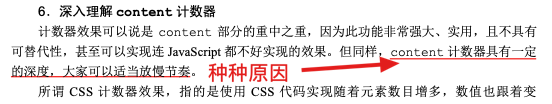

import { Table } from 'antd'
export const dataSource = [{key:1,name1:'1',name2:'i'},{key:2,name1:'2',name2:'ii'},{key:3,name1:'3',name2:'iii'},{key:4,name1:'4',name2:'iv'},{key:5,name1:'5',name2:'v'}]
export const columns = [{title:'小写罗马数字',dataIndex:'name1'},{title:'阿拉伯数字',dataIndex:'name2'}]
export const pagination = false

## Before

先来沉浸式体验一下小游戏<a target="_blank" href="https://codepen.io/finnhvman/pen/xXpzVN">Pure CSS Connect 4</a>

当我知道这是仅html+css实现时，我是不信的，下面是我从不信到相信的全过程。

## 1. type="reset"

先从简单的来，如何做到点击 <button className="reset-button" type="reset">New Game</button> 来重置游戏的呢 看一下html部分的代码

``` html
<form>
  <div class="board">...</div>
  <button type="reset">New Game</button>
</form>
```

type="reset"的标签在form中时，可以清除表单内容
> The \<input type="reset"> defines a reset button which resets all form values to its initial values

## 2. type="radio"

上面说重置游戏是通过清除表单内容实现的，那么整局游戏其实就是在填写表单么？  
答案是：是的，每个点击动作其实都是点击了一个type="radio"的input，将它的状态变为checked。

``` html
<input type="radio" name="slotX" tabindex="-1" required>
```

纵观整个html代码，会发现上面这句话占了9成，一共84个input框成就了这个游戏。  
但是在界面上一个也看不到，因为都被设置成了透明的。

``` css
/* Invisible inputs */
input {
  display: none;
  position: absolute;
  top: -90px;
  margin: 0;
  width: 60px;
  height: 450px;
  cursor: pointer;
  opacity: 0;	/* 透明*/
}
```

看到这段样式你可能会疑惑，这不仅设置成透明，连display都是none，根本就不存在于界面上，又怎么点击呢？我们来看紧随其后的一段样式

``` css
input:indeterminate {
  display: initial;
}
```

首先display: initial是让元素恢复到浏览器最初始时的display属性，input默认display是inline-block，但是我们设置了position: absolute，所以display是block。  
然后是:indeterminate
> 选择处于不确定状态的 input 元素。

对于单选框，当你没有选中也没有不选中时，他就处于indeterminate状态。  
所以初始时，所有input都是indeterminate状态，display值都是block。  
当点击某个input后，他的状态变为checked，display值为none。  
现在这84个input是不是很好理解了，界面上一共42个空位，每个空位都有可能填充红或者黄，所以一共有42*2 = 84 个input框供点击。  
还有一个问题，同一个空位填充了红就不能再填充黄是如何实现的呢？  
先看代码，下面是第一列的代码，可以看到一共6对，每对的name相同，我们都知道相同name的radio只能勾选一个，也就是说一旦勾选了一个，那么和它name相同的input的状态也就确定了，display值变为none。  
<input name="slot3" type="radio" />  name="one"(选我，别选我弟)  
<input name="slot3" type="radio" />  name="one"(选我，别选我哥)  
<input name="slot4" type="radio" />  name="another"(我跟上面俩哥儿们没啥子关系)

``` html
<div class="grid column">
  <input type="radio" name="slot11" tabindex="-1" required>
  <input type="radio" name="slot11" tabindex="-1" required>
  <div class="disc"></div>
  <input type="radio" name="slot12" tabindex="-1" required>
  <input type="radio" name="slot12" tabindex="-1" required>
  <div class="disc"></div>
  <input type="radio" name="slot13" tabindex="-1" required>
  <input type="radio" name="slot13" tabindex="-1" required>
  <div class="disc"></div>
  <input type="radio" name="slot14" tabindex="-1" required>
  <input type="radio" name="slot14" tabindex="-1" required>
  <div class="disc"></div>
  <input type="radio" name="slot15" tabindex="-1" required>
  <input type="radio" name="slot15" tabindex="-1" required>
  <div class="disc"></div>
  <input type="radio" name="slot16" tabindex="-1" required>
  // 后面的元素显示在上面，所以下面这个input这是这是第一列第一个可以点击到的input
  <input type="radio" name="slot16" tabindex="-1" required>
  <div class="disc"></div>
  ...
</div>
```

大家可以试验一下，当你在第一列下了第一个子，这时name="slot16"的两个input框都是display:none的状态

## 3. counter

content可以实现计数器效果，这部分内容在《CSS的世界》一书中也有详细的叙述，至于我为什么没有在我的<a target="_blank" href="https://www.whyyy.net/blog/css">css读后感系列</a>中写，也是有种种原因。



都是债啊，这不就得还了么。。。 

<Table dataSource={dataSource} columns={columns} pagination={pagination} />

- counter-reset： 重置计数器，有两个参数：name(必选，计数器名称)，start(可选，计数器初始值，默认为0)
- counter-increment： 计数器递增，参数为counter-reset的name(可以是多个)，后面跟数字，表示每次递增的数量
- counter方法：显示计数，有两个参数：name(必选，计数器名称)，style(可选，list-style-type支持的值，可以展示英文字母、罗马数字等)，这里就是使用了lower-roman，展示小写罗马数字

计数器的规则就是每当counter-increment生效一次，全局的计数器就递增(减)一次(本文应用到的比较简单，计数器的规则还有一些比较复杂的内容，争取后面写篇文章介绍一下吧，flag立在这里\<----)

``` css
.grid {
  display: inline-flex;
  flex-flow: column wrap;
  position: relative;
  min-width: 420px;
  height: 360px;
  counter-reset: player 1; /* 定义计数器player，初始值为1 - i*/
}

/* Tracking turns */
input:checked + .disc {
  counter-increment: player 2; /* 计数器player + 2 - iii*/
}
input:checked + input + .disc {
  counter-increment: player -2; /* 计数器player - 2 - i*/
}

.grid::after {
  content: counter(player, lower-roman); /* 展示计数器player的值，展示小写罗马字母*/
  display: inline-block;
  max-width: 840px;
  min-width: 420px;
  letter-spacing: 375px; // 字母间距
  font-family: monospace;
  font-size: 1px;
  overflow: hidden;
}
```

首先.grid中定义了计数器player，初始值是1，所以此时.grid::after的content是i，设置了min-width: 420px，宽度为420。  
当我下了第一颗子，出现了input:checked + .disc，它的counter-increment生效，计数器+2，所以此时grid::after的content是iii，设置了 letter-spacing:
375px，max-width: 840px，宽度为840。  
那么改变宽度的作用是什么呢？  
来看代码  
html部分

``` html
<div class="field">
  <div class="grid column">
    <input type="radio" name="slot11" tabindex="-1" required>
    <input type="radio" name="slot11" tabindex="-1" required>
    <div class="disc"></div>
    <div class="column">
      <input type="radio" name="slot21" tabindex="-1" required>
      <input type="radio" name="slot21" tabindex="-1" required>
      <div class="disc"></div>
        ...
```

css部分

``` css
.field {
    position: absolute;
    width: 420px;
    overflow: hidden;
    cursor: not-allowed;
    ...
}
.grid {
  position: relative;
  ...
}
input {
  position: absolute;
  ...
}
/* Inputs for red */
.column > input:nth-of-type(2n) {
  right: 360px;
}
.column > .column > input:nth-of-type(2n) {
  right: 300px;
}
...
.column > .column > .column > .column > .column > .column > input:nth-of-type(2n) {
  right: 60px;
}
.column > .column > .column > .column > .column > .column > .column > input:nth-of-type(2n) {
  right: 0;
}
/* Inputs for yellow */
.column > input:nth-of-type(2n+1) {
  left: 0;
}
.column > .column > input:nth-of-type(2n+1) {
  left: 60px;
}
...
.column > .column > .column > .column > .column > .column > input:nth-of-type(2n+1) {
  left: 300px;
}
.column > .column > .column > .column > .column > .column > .column > input:nth-of-type(2n+1) {
  left: 360px;
}
```

这边先介绍一下nth-of-type(N)，匹配父元素下使用同种标签的第N(N >= 1)个子元素。  
比如.class:nth-of-type(1)，.class所在标签为div，那么就会找.class父亲下的第1个div。

可以看到，奇数位的input是相对于左侧定位的，七列依次排列，而偶数位input是相对于grid右侧定位的，当grid宽度为420，偶数位input与奇数位的input重叠，而偶数位input在奇数位的input后面，所以当他们重合时，点击到的肯定是偶数位input；当点击一次后，grid宽度变为840，偶数位input整体右移420px，挪出了蓝框范围，此时点击到的都是奇数位的input。  
外部的\<div class="field">\</div>设置了overflow: hidden;，所以蓝框右边的input无法点击。

至此，Connect 4带有魔幻主义色彩的内容基本结束了，相信看到这儿的小伙伴也能写出Connect 4，Connect 8，Connect 16也不在话下。 最后再来讲讲css部分

## 4. css
### 4.1. hover时展示棋子
棋盘上所有的红子和黄子都是通过上面这个div来显示的
``` html
<div class="disc"></div>
```
hover时的样式
``` css
/* Red's turn */
input:hover + .disc {
  color: #ff010b;
  opacity: 1;
  transition: opacity 0.2s, top 0s;
}
/* Yellow's turn */
input:hover + input + .disc {
  color: #ffd918;
  opacity: 1;
  transition: opacity 0.2s, top 0s;
}
```
仅仅这样，棋子应该在对应的格子中，那么如何展示在棋盘上方呢？  
首先棋盘上方是留有空隙可以显示棋子的。  
``` css
.field {
    position: absolute;
    padding: 75px 0 0 0; // 上方有75px空隙
    width: 420px;
    height: 435px;
    overflow: hidden;
    cursor: not-allowed;
}
```
其次hover时设置了每个位置对应的top值。
``` css
/* Height and time of disc fall per row */
input:hover + .disc:nth-of-type(1),
input:hover + input + .disc:nth-of-type(1){
  top: -75px;
}
...
input:hover + .disc:nth-of-type(6n),
input:hover + input + .disc:nth-of-type(6n) {
  top: -375px;
}
```
### 4.2 棋子下落的动画
应该都看得出来是通过transition来实现的，这边我做了一个简易版的，可以围观一下 ----> <a target="_blank" href="https://www.whyyy.net/blog/css-example/#1-%E4%B8%8B%E8%90%BD%E7%9A%84%E5%8A%A8%E7%94%BB">动画示例</a>  
hover时棋子在棋盘上方，那么点击之后，状态变为checked，hover时的负top也就不复存在了，从负top到初始位置top的变化，通过transition来实现动画效果。  
cubic-bezier: 贝塞尔曲线，是控制变化的速度曲线，cubic-bezier(0.56, 0, 1, 1)近似于二次函数在第一象限的曲线，近似于ease-in。  
``` css
/* Height and time of disc fall per row */
input:checked + .disc:nth-of-type(1),
input:checked + input + .disc:nth-of-type(1){
  transition: top 0.14s cubic-bezier(0.56, 0, 1, 1);
}
input:checked + .disc:nth-of-type(2),
input:checked + input + .disc:nth-of-type(2){
  transition: top 0.19s cubic-bezier(0.56, 0, 1, 1);
}
input:checked + .disc:nth-of-type(3),
input:checked + input + .disc:nth-of-type(3) {
  transition: top 0.23s cubic-bezier(0.56, 0, 1, 1);
}
input:checked + .disc:nth-of-type(4),
input:checked + input + .disc:nth-of-type(4) {
  transition: top 0.26s cubic-bezier(0.56, 0, 1, 1);
}
input:checked + .disc:nth-of-type(5),
input:checked + input + .disc:nth-of-type(5){
  transition: top 0.29s cubic-bezier(0.56, 0, 1, 1);
}
input:checked + .disc:nth-of-type(6n),
input:checked + input + .disc:nth-of-type(6n) {
  transition: top 0.32s cubic-bezier(0.56, 0, 1, 1);
}
```
### 4.3 background
读到这里，两种颜色的棋子是如何交替展示的，想必大家都很清楚了吧，我再啰嗦点篇幅。  
每一对input，第一个是红，第二个是黄。  
``` css
input:checked + .disc {
  color: #ff010b;
  opacity: 1;
}
input:checked + input + .disc {
  color: #ffd918;
  opacity: 1;
}
```
这边想必大家会有个疑问，为啥设置color，棋子就变色了呢，正常不是应该是设置background-color么？我们来看一下disc的初始样式，这里面有个css3的关键字currentcolor，它的值就是当前标签color的值。这儿还有一个引人注目的方法radial-gradient，这里浅提一下。  
- radial-gradient：径向渐变函数，径向渐变指从一个点向四周的颜色渐变
- background-image: radial-gradient(shape size at position, start-color, ..., last-color);

最后的center/60px，分别对应了position和size两个属性，也就是  
background-position: center;  
background-size: 60px;
``` css
.disc {
    position: relative;
    top: 0;
    width: 60px;
    height: 60px;
    color: #fff;
    background: radial-gradient(circle, currentcolor 12px, #666 13px, currentcolor 14px, currentcolor 21px, #666 22px, transparent 23px, transparent) center/60px;
    opacity: 0;
    pointer-events: none;
    transition: opacity 0.2s, top 0s 0.2s, color 0s 0.2s;
}
```

### 4.4 判断胜负
哇，还有一个重点诶，如何判断胜(大家应该知道获胜规则吧，就是横、竖或者斜连成4个)负或者平局呢。
首先展示胜负平消息的div是这第八个.column
``` html
<!--Column 7 after-->
<div class="column"></div>
<style>
  .column::after {
    animation: outcome 1.5s;
    ...
  }
</style>
```
我们就看红方胜出以及平局的情况吧。  
首先竖列连成4个是最好判断的(next to input的，是.disc是红子，是input的是黄子)。
``` css
input:checked + .disc + input + input:checked + .disc + input + input:checked + .disc + input + input:checked ~ .column::after {
	content: "Red wins! :)";
}
```
接着是横排连成4个，跟竖列不同，每一排胜出的条件都不同，写个第三排(从上往下数)的吧。
``` css
input:nth-of-type(6):checked ~ .column > input:nth-of-type(6):checked ~ .column > input:nth-of-type(6):checked ~ .column > input:nth-of-type(6):checked ~ .column::after {
	content: "Red wins! :)";
}
```
最后是斜着连成4个，这就有45度和-45度两种情况，然后最上面的子可能在第一、二、三行，所以一共六种情况，下面我列了最上面的子在第一行时的选择器，大家可以在胜出后在控制台看自己的胜出方式到底是应用了哪种选择器。
``` css
input:nth-of-type(2):checked~ .column > input:nth-of-type(4):checked ~ .column > input:nth-of-type(6):checked ~ .column > input:nth-of-type(8):checked ~ .column::after {
	content: "Red wins! :)";
}
```
最后的最后是平局，平局也就是棋子填满时没有胜出方，此时所有的input的状态都是确定的，大家回忆一下我们input框，是否记得每个input都有required属性，也就是都是必填的，当所有input都填完后，表单校验通过，此时的表单可以通过:valid选择器选到(第一次知道还有这么个选择器...)。
``` css
form:valid .column > .column > .column > .column > .column > .column > .column > .column::after {
  	content: "It's a draw!";
}
```

### 4.5 flex-flow: column nowrap
最后再来讲讲棋盘是如何画出来的吧，先说说这个flex-flow: column nowrap，即  
flex-direction:  column;  
flex-wrap: nowrap;  
表示主轴垂直，换行。所以所有的disc是从上往下排列，高度排满之后向右换行继续从上往下排列，可以戳这里看看各种属性值下的排列<a target="_blank" href="https://www.whyyy.net/blog/css-example/#2-flex-flow">flex-flow</a>
``` css
.column {
  display: inline-flex;
  flex-flow: column wrap;
  height: 360px;
}
```

## 5. 总结
到这里，终于真的结束啦，居然还有一点意犹未尽之感🤷  
从第一次看代码的手足无措头皮发麻，到抽丝剥茧层层解析，哎～学习使人快乐丫。

## Reference

[1. CSS中关于background属性的具体分析](https://www.gxlcms.com/css-258730.html)  
[2. currentColor-CSS3超高校级好用CSS变量](https://www.zhangxinxu.com/wordpress/2014/10/currentcolor-css3-powerful-css-keyword/)  
[3. CSS counter计数器(content目录序号自动递增)详解](https://www.zhangxinxu.com/wordpress/2014/08/css-counters-automatic-number-content/)  
[4. CSS 之选择器（九）:valid 和:invalid](https://xie.infoq.cn/article/4678ac753cd4e3b20f6a260fd)  
[5. 实用的 CSS — 贝塞尔曲线(cubic-bezier)](http://joveyzheng.com/2016/03/16/css-cubic-bezier/)  
[6. 我的 Input框 不可能这么可爱](https://blog.csdn.net/weixin_37615279/article/details/100516311)  