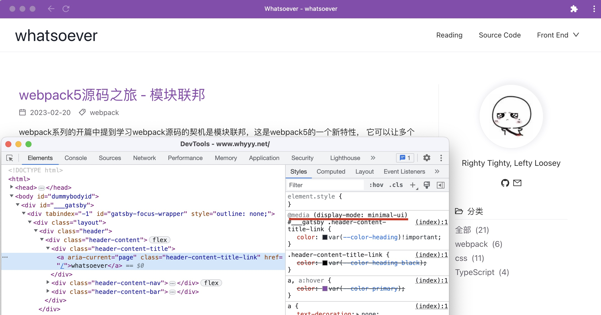
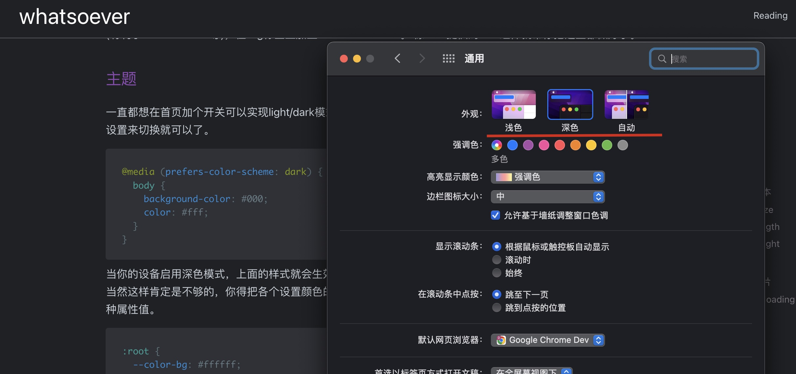

## Before

最近学习了一下<a href="https://web.dev/learn/design" target="_blank">Learn Responsive Design!</a>，介绍如何做响应式设计。  
搭建这个博客的时候也考虑了适配不同size的屏幕以及手机，最开始就是凭着感觉和经验去适配，或者看看别的网站是怎么做的，  
Learn Responsive Design!这篇文章系统性地介绍了响应式设计的各个方面，其中讲到的很多适配方法都让我有种"啊～原来还可以这么做"的感觉。

## why
为什么要做响应式设计？
在web设计之初，大家都是用电脑来浏览网页，且尺寸类型不多，将网页设计为某一固定宽度是可行的。
但后来显示器的尺寸越来越大，近年来，手机、平板电脑、智能电视等设备更是越来越普及普及，现在人们使用手机访问网页的比例甚至已经超过了电脑。   
网页的访问方式越来越多，如果希望网站能适配各种设配，获得更多的访问量，响应式设计是不可或缺的。  
了解了原因，接下来就来看看如何实现响应式。

## meta
首先如果你要使用响应式设计，请加上下面这段话，它告诉浏览器网站的宽度与设备相同(width=device-width)，不进行缩放(initial-scale=1)。
```html
<meta name="viewport" content="width=device-width, initial-scale=1">
```
还可以设置user-scalable=no，不允许用户缩放。

## Media Queries
提到响应式，第一反应就是@media，在它之前，没有任何方式能得知你的用户在用何种设备访问你的网页。  
下面这段代码应该是最常用的响应式写法了吧，根据不同的宽度，适配不同的样式。

```css
@media (max-width: 42rem) {
  body {...}
}
```

这种叫做media feature，放在括号里面，但其实紧跟着@media关键字后面的首先是media type，目前一共四种：

- all(默认) 所有设备
- print 打印机、打印预览
- screen 电脑屏幕，平板电脑，智能手机等
- speech 屏幕阅读器等发声设备

所以@media完整的语法应该是这样的(type可选，feature必填)：

```css
@media type and (feature) {...}
@media all and (orientation: landscape) {...}
@media all and (orientation: portrait) and (max-height: 65rem) {...}
```

必须同时满足type和feature，样式才生效。  
除了css，html同样也可以实现媒体查询(把对应的样式写在一个单独的文件里):
```html
<link rel="stylesheet" href="specific.css" media="type and (feature)">
```
当然还是尽量不要每种media query写一个单独的css文件，这样会增加http请求，影响性能。

### Media Features
media type的类型一直没有太多变化，但是media feature的数量一直在增加。

#### width/height
最常用的就是根据不同的宽度/高度，来设置不同的样式。
```css:title=media.scss
@media (max-width: 65rem) {
  .mdx-content-nav {
    display: none;
  }
}
```
比如在你当前阅读的这个页面([Responsive Design](/blog/css-responsive/#widthheight))，当宽度\<=65rem的时候，右侧的目录就会隐藏。  
左侧会展示一个图标，点击图标可以展开目录(本来没想做这个的，后来在手机上阅读时，发现没有目录的阅读体验不太好，但是好丑。。。)。

大多数网站都会有个固定的header，当你滚动下面的内容时，header始终在最上方。因为header通常是固定高度的，当用户的浏览器高度较小时，
header会占掉界面很大比例的空间，无妨让用户看到足够多的内容，所以当小于一定高度时，让header随着内容一起滚动是一个不错的选择。

```css
@media (max-height: 40rem) {
  .header {
    position: relative;
  }
}
```

此外像报纸杂志或者一些文章会有多栏布局，当小于某个值时展示单栏。当然，手机上基本不会有多栏的情况。
在我的博客中也没有做多栏的设计，而是选择限制最大宽度，居中展示，来避免一行文字过长。


#### aspect-ratio
aspect-ratio，根据你页面的宽高比来设置不同样式，和width/height稍有区别的点是，它不仅支持min-和max-， 还支持exact

```css
@media (aspect-ratio: 16/9) {...}
```

#### orientation
比aspect-ratio粒度粗一些的是orientation，它可以判断你的屏幕是竖向还是横向的

- orientation: portrait 竖向(aspect-ratio < 1)
- orientation: landscape 横向(aspect-ratio > 1)

```css
@media (orientation: portrait) {...}
```
像上面提到的多栏布局就更适合横向的界面，最好有足够的高度(根据你的内容来设置)，不然看完一列再滚回来看另一列，体验就不太好。

#### display-mode
在浏览器的地址栏的右部，你应该可以看到一个类似下载的logo，点击它会提示你安装应用，你可以将本博客作为一个app安装到桌面。
安装成功，打开你会发现它长得有点像浏览器，有后退、刷新等一些基础功能(minimal-ui)。这是通过在Web App Manifest文件中设置display属性来实现的。
在css中可以通过display-mode来判断当前页面是以什么样的方式展示，进而设置不同的样式。
```css
@media (display-mode: minimal-ui) {
  .header-content-title-link {
    color: #1a202c;
  }
}
```



此外还有一些属性，resolution判断分辨率，update判断刷新率，prefers-color-scheme(主题色), prefers-contrast(对比度)等判断用户的偏好设置等等。

## 国际化

如果你设计的网站是多语言的，那么你可能需要根据用户的语言来设置不同的样式。不同的语言可能会有不同的阅读顺序，不同的字体，各自的特点等等。
你需要根据你设计的语言类型，来进行适配。

### 逻辑属性

通常情况下我们的页面布局是从左至右，从上至下的，因为这是我们的一般阅读顺序，但还是是有很多国家地区的阅读顺序并不是这样，有从上至下，从右至左的。  
在<a href="https://www.whyyy.net/blog/css-flow/#22-writing-mode" target="_blank">css（一）文档流</a>的改变流向部分介绍过:  
direction可以改变替换元素或者 inline-block/inline-table 元素的水平呈现顺序，默认是ltr(从左到右)。  
writing-mode可以改变css世界的纵横规则。它的默认值是horizontal-tb，也就是文本流(inline)是水平方向(horizontal)的，元素(block)是从上往下(tb:top-bottom)堆叠的。
如果改成vertical-rl，就变成垂直方向的文本流，从右至左堆叠。写了个<a target="_blank" href="/blog/responsive">demo</a>，可以选择不同属性值看看效果。

当改变方向后，我们设置的左对齐(text-align: left)，margin-right等等可能都不再生效，或者不再是我们想要的效果。这样即使我们把布局顺序调整为响应式，能够根据不同国家的阅读顺序进行调整，
出来布局效果也会不尽如人意。那应该如何解决呢？

用过flex布局的小伙伴应该知道答案，flex布局中也有个direction属性flex-direction，它也支持你将布局从水平方向改为垂直方向，
在flex中你几乎找不到top、right、bottom和left的字样，只有start和end。当顺序是从右至左，start就是右，反之同理。  
所以不要使用方向属性，而是使用逻辑属性，用margin-inline-start替代margin-left；用margin-block-start替代margin-top。  
inline代表文本流的方向，block代表块的布局方向。
```css
.add-margin {
  /* Physical properties | English */
  margin-left: 0.25rem;
  margin-top: 0.5rem;
  margin-right: 0.75rem;
  margin-bottom: 1rem;
  /* Logical properties */
  margin-inline-start: 0.25rem;
  margin-block-start: 0.5rem;
  margin-inline-end: 0.75rem;
  margin-block-end: 1rem;
}
```
我在学到这里的时候对我的博客样式也做了全局替换，毕竟现在除了ie，大部分主流浏览器都支持这些属性。在替换的过程中发现，media features并不支持逻辑属性，
max-height不能被替换为max-block-size，一开始我还感觉很奇怪，但深想一下就明白了，媒体查询是用来判断设备的，宽就是宽，高就是高，都是真实存在的物理属性。

### 语言

在html标签中声明lang属性(语言)，这样有利于搜索引擎以及屏幕阅读器、语音助手等工具的识别。  
如果你想设计多语言的网站，那么有一些注意点：

- 对于一些常见长单词的语言，例如德语，尽量不要设计很窄的列，还可以考虑使用css的hyphens属性来自动添加连字符。
- 有些语言在字母上方会有注音符号，要注意适配line-height避免行重叠。
- 如果使用web font(网络字体)要注意改字体的字符集是否能覆盖你所有语言的字符。
- 尽量不使用带有文字的图片，否则你可能需要为每种语言都创建一张图片。将文字与图片分离，使用css将文字放到图片上。

## 宏观布局

宏观布局，即页面的整体布局。  
通常情况下，页面上会分为几个块，header、body、footer，从上至下排列，其中body又会分出几块，这些块可能是左右或者上下排列。  
当你的屏幕比较小，比如手机，那么展示一列通常是最好的选择，当你的屏幕比较大，你就可以采用左右或者左中右的方式进行布局。  
宏观布局通常不需要使用到媒体查询(Media Queries)，使用grid或者flex就可以自动达到你想要的效果。  
当然如果有一些特殊效果还是需要用到媒体查询，比如当屏幕较小时将一些内容收缩或者隐藏(例如本站首页右上角内容&博客页的导航栏)。

## 微观布局

微观布局，即页面中的组件的布局。  
刚才我们介绍了页面层面的布局，而页面中大大小小的组件内部也有自己的布局。  
同样的我们可以grid或者flex，或者使用Container Queries(到目前为止只有chrome 111+部分支持)。  
你不需要通过页面大小去设计组件内部的布局，直接可以根据组件的大小来进行布局。

```css
@container (min-width: 25em) {...}
```

## 响应式文本

### font-size

在一定程度上，网页上的文本天生就是响应式的，因为它会根据父元素的宽度自动进行换行。
但是有时候我们需要更多的控制，比如当屏幕比较小的时候，我们希望文本的字体变小，或者当屏幕比较大的时候，我们希望文本的字体变大。
因为通常是在较近距离观看小屏幕，较远距离观看大屏幕。
这时候我们就建议在设置各种字体大小时使用rem单位，rem是相对于根元素的字体大小的，这样我们可以通过改变根元素的字体大小来改变文本的大小。

```css 
h1 {
  font-size: 2rem;
}
@media (min-width: 30em) {
  html {
    font-size: 112.5%;
  }
}
```

这样当屏幕宽度大于30em时，根元素的字体大小就会变成16px(浏览器默认样式) * 1.125 = 18px，h1的字体大小就会从32px变为36px。  
但是使用这种方式会有一个非常明显的breakpoints，如果希望更加平滑的调整 可以使用vw单位，vw是相对于视口宽度的，即通过改变视口宽度来改变文本的大小。

```css  
html {
  font-size: calc(0.75rem + 1.5vw);
}
```

当然你可能不希望出现字体非常大或者非常小的情况，这时候就需要用到clamp函数了。

```css
html {
  font-size: clamp(0.75rem, 0.75rem + 0.3vw, 1.5rem);
}
```

这样就能将字体控制在0.75rem到1.5rem之间。

### line length

> Anything from 45 to 75 characters is widely regarded as a satisfactory line length for a single-column page set in a serifed text face in a text size.
> The 66-character line (counting both letters and spaces) is widely regarded as ideal. For multiple column work, a better average is 40 to 50 characters.

通常一行45-75个字符(包括空格)是比较合适的，66个字符最佳。应该没有人希望看一行文本从屏幕最左边一直到屏幕最右边吧，哈哈。  
css中没有line-length这么一个属性，但是我们可以通过设置max-width来达到这个效果。  
在国际化部分我们讲到说不是所有国家的阅读习惯都是从左至右的，如果是从上至下的，那么我们想控制的就是max-height了。  
这个时候可以用max-inline-size这个属性：
> max-inline-size 取决于其写入模式元素的块的水平或垂直最大尺寸。它对应于max-width或max-height取决于定义的值的属性writing-mode。

如果是水平方向的文本流，那么max-inline-size就相当于max-width。

```css
article {
  max-inline-size: 66ch;
}
```

同时单位记得不要写固定单位比如px，不同语言的文字所占px是不同的，可以使用ch，ch是相对于字体大小的，这样就可以根据字体大小自动调整每行的字符数量了。

### line height

line-height这个属性，我在<a href="https://www.whyyy.net/blog/css-line-height/#1-line-height%E4%B8%8Efont-size" target="_blank">
css（七）font-size与line-height与vertical-align</a>中介绍过，
它用来设置行高，也就是每一行的文本+行间距的高度，它跟文本大小应该是密切相关的。所以虽然它可以使用px作为单位，但是要做好响应式，请一定使用数字，避免行之间太过密集或者稀疏。

```css
p {
  line-height: 1.5;
}
```

### font
漂亮的字体肯定能为你的网站加分，现在网络上可选择的字体也越来越多，你可以使用@font-face来指定你的字体。
```css
@font-face {
  font-family: Roboto;
  src: url('/fonts/roboto-regular.woff2') format('woff2');
}
body {
  font-family: Roboto, sans-serif;
}
```
但是下载字体文件必然会影响网站的加载速度，你可以选择等字体加载完再显示文字，或者先展示系统字体，等网络字体加载完再替换。这两种方式都可能会带给用户不好的体验。  
你还可以设置一个时间阈值，当在小于这个阈值时间内加载完了网络字体，就展示网络字体，如果没有就展示系统字体。

## 响应式图片

网页中的文本会自动换行避免溢出，但是图片并不会，因为图片有固有尺寸。其它嵌入式的内容也是一样，比如video、iframe等。如果它比屏幕宽，就会溢出，出现横向滚动条。  
你可以使用max-inline-size(max-width)对它们进行限制。

```css
img {
  max-inline-size: 100%;
  block-size: auto;
}
```

block-size和max-inline-size一样，也是国际化布局的一个属性，它也取决于writing-mode，当文本流是水平方向，block-size就相当于height。  
所以它是用来保证图片的宽高比不变。

如果你知道图片的尺寸，那么最好在img标签中加上width和height属性，这样浏览器就能在图片加载出来之前为你留出空间，避免页面的抖动。

### image loading

```html

```

img标签中的loading属性可以告诉浏览器在什么时候加载图片，有三个值：eager、lazy、auto。  
lazy保证了只有当用户滚动到图片的时候才会加载图片，如果滚不到就不会加载，这样可以提高页面的加载速度。  
eager则是立即加载图片，auto由浏览器自己决定。  
你还可以通过fetchpriority="high"让浏览器提前加载图片，但是它会阻塞其它script或者字体的下载，所以不建议使用。

### srcset

有了max-inline-size属性，你的图片肯定不会溢出，但是当用户使用小屏幕的设备比如手机，网络带宽不高，那么加载一个很大的图片就会很慢，
这种情况可以通过设置srcset提供多个图片，让浏览器来选择合适的图片。

```html

```

> srcset用来声明一组图像源，浏览器根据我们使用描述符指定的条件来选择图像。描述符x表示图像的像素密度，描述符w表示图像的宽度；浏览器使用这些信息从列表中选择合适的图像。

300w就是300px，srcset属性是对于src的完善，你还是需要提供src属性，只是浏览器会用srcset中的图片来替换它。

使用w描述符时还必须包含sizes属性：

```html

```

根据浏览器视口的宽度来展示图片的不同宽度，比如在上述示例中，当浏览器视口宽度大于等于66em时，图片的宽度就占据视口的1/3，小于44em时，就占据视口的全部宽度。  
在css的background-image属性中有个image-set函数，它的作用和srcset类似。

```css
element {
  background-image: image-set(
    "small-image.png" 1x,
    "medium-image.png" 2x,
    "large-image.png" 3x
  );
}
```

最后还是要说一下alt属性，alt是img标签非常重要的属性，请一定加上，它对于screen reader以及搜索引擎都非常重要，哪怕是在没有值的时候也要加上它alt=''。  
你可能会疑惑css中background-image也可以用来展示图片，它就没有个alt属性非让你填值呀？  
这是因为HTML和css的分工不同，HTML是用来描述内容的，而css是用来描述样式的，你不应该使用img标签来展示一张纯装饰性的图片，而展示内容的图片就必须要考虑到图片加载失败，
或者无法被阅读到的情况，提供alt属性对图片内容进行文字描述是必要的。

srcset标签让浏览器根据我们的描述选择适当的图片，你并不能够确认浏览器会选择哪一张，如果你想百分百掌控展示的图片，那就需要用到picture标签。

### picture

如果说srcset属性是建立在src属性的基础上，那么picture元素就是建立在img元素的基础，它的内部必须有一个img标签存在。
不同点在于，srcset是对浏览器的建议，而picture则是对浏览器的指令，它会告诉浏览器，如果满足某个条件，就使用哪个图片。  

```html
<picture>
  <source srcset="image.avif" type="image/avif"> 
    // 如果浏览器无法渲然AVIF图片，就会忽略这个source标签
  <source srcset="image.webp" type="image/webp">
  <source srcset="large.png" media="(min-width: 75em)"> 
    // 当浏览器视口宽度大于75em时，就使用large.png
  <source srcset="medium.png" media="(min-width: 40em)">
  <source srcset="large.png 1x" media="(min-width: 75em)">
  <source srcset="medium.png 1x, large.png 2x" media="(min-width: 40em)">
    // 当浏览器视口宽度大于40em小于75em时，就使用medium.png，如果浏览器支持2x的图片，就使用large.png
  <source srcset="full.jpg" media="(min-width: 75em)" width="1200" height="500"> 
    // 设置width和height对图片进行裁剪
  <source srcset="regular.jpg" media="(min-width: 50em)" width="800" height="400">
  
</picture>
```

当picture内部有多个source标签时，浏览器会从上到下依次判断，如果满足条件就使用对应的图片，否则就使用img标签中的图片。  
source中也支持srcset属性，当这个source满足条件是，浏览器会选择srcset中更加合适的图片进行渲染。  
你还可以使用width和height对图片进行裁剪，实现在手机上展示竖向(宽高比更小)的图，在PC上展示横向的图。

通常情况下srcset+sizes就足够满足大部分场景了，如果需要更细粒度的控制，再考虑picture。

## icons

合适的icon能让你的界面有更高的可读性，它通常跟文字放在一起，需要同文字一起实现响应式。  
如果使用普通的图片(png - Portable Network Graphics)，那么实现起来会很复杂，但是如果使用svg(Scalable Vector Graphics)，就会很简单。
因为svg和文字一样也是默认响应式的。
使用svg可以让你轻松地改变icon的颜色，这在img中是无法做到的。

```css
.icon {
  font-size: 1.5em;
  fill: #f00;
}
```

你还可以把fill值设置为currentColor，这样就可以通过color属性来控制颜色。  
之前写过一个目前项目中使用icon的方案，可以参考一下: <a href="https://www.jianshu.com/p/d1766a71c9fe" target="_blank">如何展示一个icon</a>。

当界面足够大，icon+文字来描述一个功能是最佳选择，但是当界面比较小，不足以承载详细的文字描述时，就需要使用icon来代替文字了。
这种情况你必须考虑到icon的可读性，因为用户可能无法通过icon来理解功能。  
比如当前这个界面，当宽度小于50rem时，右上方的的文字就会变成一个menu icon，点击它能够下拉展开具体的文字信息。
考虑到技术博客的用户群体，这个icon的可读性应该还是比较强的，哈哈。  
上面提到html是用来描述内容的，当你将一个icon放在html中时，在svg的外层标签上使用aria-label来描述icon的含义(有利于screen reader等)，在svg标签上加上aria-hidden=true。
像antd提供的icon组件就帮你把这些都做好了。

## 主题

一直都想在首页加个开关可以实现light/dark模式的切换，读到theming这一节发现其实不做开关也行，只要根据系统的设置来切换就可以了。

```css
@media (prefers-color-scheme: dark) {
  body {
    background-color: #000;
    color: #fff;
  }
}
```
当你的设备启用深色模式，上面的样式就会生效。  
当然只像上面代码中这样肯定是不够的，你得把各个设置颜色的地方都加在这里，就会比较麻烦。这边有个比较好的实践，就是使用变量定义各种属性值。
```css
:root {
  --color-bg: #ffffff;
  --color-code-bg: #fdfaf6;
  --color-border: #f0f0f2;
  ...
}
@media (prefers-color-scheme: dark) {
  :root {
    --color-bg: #202124;
    --color-code-bg: #303136;
    --color-border: #585b63;
    ...
  }
}
h1 {
  color: var(--color-heading-black);
}
```
在设置属性时都用var来取到对应值，这样设置theme就只需要把各种颜色变量对应的具体颜色值改一下就可以了。



而对于图片这种无法设置颜色的内容，可以通过降低明度来适应dark mode
```css
@media (prefers-color-scheme: dark) {
  img {
    filter: brightness(.8) contrast(1.2);
  }
}
```
当然你也可以通过picture元素为不同主题设置不同的图片。

在display-mode一节中，我们提到了web app manifest里面的display属性来设置你的app在桌面上的显示模式。而对于颜色它可以设置theme_color和background_color。  
theme_color会影响到浏览器的地址栏和一些按钮的颜色，background_color会影响到浏览器的启动画面。

## 可访问性
上面我们分析了如何使得页面能在各种设备上正常显示，但是这只是一半，我们还需要考虑对于不同用户的可访问性。  

### 颜色
每个人对于颜色的分辨力都不同，在系统或者浏览器上都会有一些设置来模拟不同人眼中的颜色，
比如google中，你可以在控制台 - rendering - emulate vision deficiency中模拟不同的情况(mac上，可以在系统偏好设置 - 辅助功能 - 色彩滤镜中进行模拟)。
看一下你的页面在不同情况下的表现，进行相应的调整。

比如对于link，我们通常会给一个不同的颜色，但是如果你设置的颜色无法被用户分辨，那么这个颜色就没有意义了。所以不要只设置颜色，再进行加粗或者加上下划线等。  
再比如对于文字和背景色，要考虑两者的对比度是否足够，最好显示设置background-color，避免使用浏览器默认。

### 语义化标签
语义化标签能让用户更好地理解页面的结构，比如h1-h6，p，ul，ol，li等。尤其是对于screen readers和浏览器爬虫。
  
## 交互
对于可点击的内容，增大可点击区域，比如给按钮加上padding。  
对于输入框，加上type属性，比如email，number，tel等，这样在手机上就会调用对应的软键盘。
可在<a href="/blog/responsive" target="_blank">Responsive Design Demo</a>中进行尝试。

## 总结
要做好响应式设计需要考虑的内容非常多，可以看到光以及标题就写了十多个，还有一些内容没有提到，比如动画，比如折叠屏幕等等。  
但是做好响应式设计并不一定非要把所有点都设计进去，而是应该根据你的内容和受众群体来决定哪些需要做响应式设计。
将时间和精力放在最重要的点上，适当放弃一些不会造成太大影响的点，这样才能做出一个更好的产品。


## References

[1. Learn Responsive Design](https://web.dev/learn/design/)  
[2. New CSS Logical Properties!](https://elad.medium.com/new-css-logical-properties-bc6945311ce7)  
[3. 精读《国际化布局 - Logical Properties》](https://zhuanlan.zhihu.com/p/53809784/)  
[4. International Layouts w/ Intrinsic & Logical Properties](https://codepen.io/argyleink/pen/vYNwbgM)  
[5. 如何使用 CSS 逻辑属性来控制布局](https://www.weixiaolive.com/en/index.php/post/3702.html)