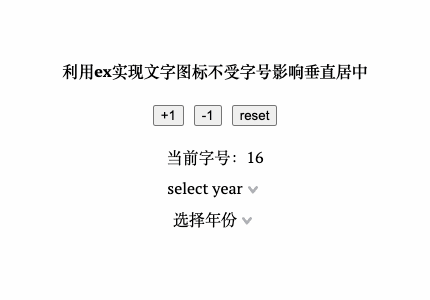
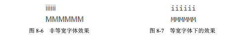
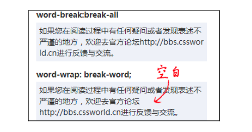
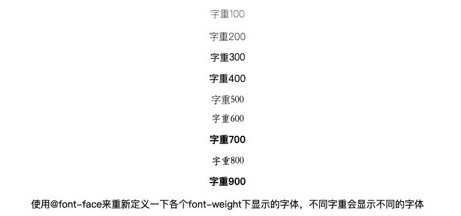

import { Table } from 'antd'
export const dataSource = [{key:1,name1:'text-indent',name2:'内联元素缩进'},{key:2,name1:'letter-spacing',name2:'字符间距'},{key:3,name1:'word-spacing',name2:'单词间距'},{key:4,name1:'text-transform',name2:'字符大小写'},{key:5,name1:':first-letter',name2:'选择第一个字符'},{key:6,name1:':first-line',name2:'选择第一行'}]
export const columns = [{title:'属性',dataIndex:'name1'},{title:'作用',dataIndex:'name2'}]
export const pagination = false

## 1. font-size
font-size字号，设置字体大小，很简单的一个属性。它的单位有很多，除了最常用的px，还有ex、em、rem等。
- ex  一个相对单位，指小写字母x的高度  
  内联元素默认是基线对齐的，而基线就是 x 的底部，而 1ex 就是一个 x 的高度。图标高度就是 1ex，同时背景图片居中，图标和文字就能垂直居中，且不受字体字号影响。    
  

  
``` css
display: inline-block;
width: 20px;
height: 1ex;
background: url("arrow.svg") no-repeat center/20px 20px;
```

- em  在传统排版中指一个字模的高度，注意是字模的高度，不是字符的高度。其一般由'M'的宽度决 定(因为宽高相同)，所以叫 em。  
  在 CSS 中，1em 的计算值等同于当前元素所在的 font-size 计算值
- rem  即 root em，顾名思义，就是根元素 em 大小。em 相对于当前元素，rem 相对于根元素(即html元素，默认font-size为16px)。
- ch 和 em、rem、ex 一样，是 CSS 中和字符相关的相对单位。和 ch 相关的字符是阿拉伯数字 0。1ch 表示一个 0 字符的宽度，它适合于等宽字体(Consolas、Monaco、monospace)一起使用。




## 2. 文字换行
with: auto的情况下  
连续英文和数字不会自动换行(超过父级容器宽度)  
汉字会自动换行  
- word-break:break-all    该换行就换行，中断单词什么的统统不考虑
- word-wrap:break-word  如果这一行文字有可以换行的点，如空格或 CJK(中文/日文/韩文)之类的，就不打英文单词或字符的主意了，在这些换行点换行，至于对不对齐、好不好看则不关心




## 3. font-weight
font-weight的属性值支持100~900 的整百数，其中400等他于normal，700等同于bold。  
实践中会有这样的情况，设置300、400、500并没有粗细变化，只有到700才会加粗，这其实是因为我们系统里面缺少对应粗细的字体，如果我们系统中安装了这个font-family全部自重的字体，那么所有数值都会有粗细变化。  

>也就是说，font-weight 要想真正发挥潜力，问题不在于 CSS 的支持，而在于是否存在对应的字体文件。

那么如果没有对应的字体，又想要多档字重效果该怎么做呢，这就需要用到@font-face

## 4. @font-face
我最近使用@font-face是在做[动态字体](https://www.jianshu.com/p/8ea227266b91)的时候，用来自定义字体，但是@font-face的作用不仅于此，它还可以实现字体重命名，默认字体样式设置等等。
我们就用@font-face来实现上面提到的font-weight的问题。



``` html
const fontWeights = [100, 200, 300, 400, 500, 600, 700, 800, 900];
...
<div className="font-weight-container" style={{ fontFamily: 'my' }}>
  {fontWeights.map(ele => (
    <p className="font-weight-normal" style={{ fontWeight: ele }}>{`字重${ele}`}</p>
  ))}
</div>

@font-face {
  font-family: 'my';
  font-weight: 100;
  src: local('FZShuTi');
}
@font-face {
  font-family: 'my';
  font-weight: 200;
  src: local('STXingkau');
}
@font-face {
  font-family: 'my';
  font-weight: 300;
  src: local('STXihei');
}
@font-face {
  font-family: 'my';
  font-weight: 400;
  src: local('STCaiyun');
}
@font-face {
  font-family: 'my';
  font-weight: 500;
  src: local('STSong');
}
@font-face {
  font-family: 'my';
  font-weight: 600;
  src: local('STFangsong');
}
@font-face {
  font-family: 'my';
  font-weight: 700;
  src: local('STHupo');
}
@font-face {
  font-family: 'my';
  font-weight: 800;
  src: local('STKaiti');
}
@font-face {
  font-family: 'my';
  font-weight: 900;
  src: local('FZShuTi');
}

```

## 5. 其它一些属性

<Table dataSource={dataSource} columns={columns} pagination={pagination} />

letter-spacing实现文字飞入效果  
```html
<div className="letter-spacing-container">
  <div className="letter-spacing-container-box">
    我是飞进来的嗷
  </div>
</div>

@keyframes textIn {
  0% {
    letter-spacing: -200px;
  }
  100% {
    letter-spacing: 0;
  }
}

.letter-spacing {
  .letter-spacing-container {
    text-align: center;
    .letter-spacing-container-box {
      width: 120px;
      text-align: left;
      margin: 0 auto;
      animation: textIn 1s both;
    }
  }
}
```