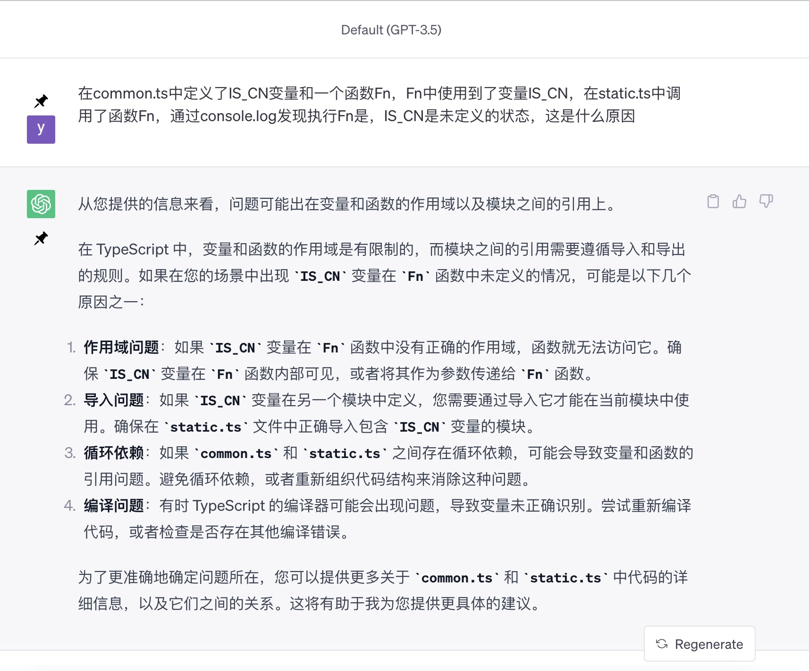

## Before
从一个bug开始，了解一下js的模块系统，主要是commonJS和ES module。

## 问题
今天遇到一个bug，代码我简化了一下如下，问题是url.ts中导出的url值始终为b，理论上当common.ts中的commonConst值为true时，url就会为a呀。  

我在commonFn中打印了commonConst发现值为undefined(补充一下，undefined只发生在最开始依赖模块执行的时候，当页面加载完成，再调用，得到的值就是正确的)。

```ts:title=common.ts
import { utilFn } from './util'
import { status } from './status'

console.log('3')
export const commonConst = status === 'a'

export function commonFn(a, b) {
  console.log('1')
  return commonConst ? a : b
}
```

```ts:title=url.ts
import { commonFn } from './common'

export const url = commonFn('a', 'b')
```

undefined？！也就是未定义，怎么可能呢，它明明就定义在上面。 

事后我咨询了一下我们前端大佬，他说遇到这种情况就是发生了循环引用。事发时我把情况告知了chatGPT(当然在这之前，还经过了一番呕心沥血地debugger)，得到了回答。



我一眼就相中了循环依赖这四个字。

经过一番排查，发现common.ts跟util.ts存在互相依赖。

```ts:title=util.ts
import { commonConst } from './common

console.log('2')
export function utilFn() {
  return commonConst ? 'a' : 'b'
}
```
通过打印查看了一下这几处的执行顺序，先进入了commonFn方法，然而此时common.ts文件并未执行完毕，而是执行到import util，
然后开始执行util.ts文件，当util.ts文件执行完毕后才继续执行common.ts。所以一开始执行commonFn方法时，commonConst还未定义。  

解决方法很简单，把循环依赖干掉，我选择把common.ts中用到util.ts的地方挪到util.ts中。  

总结一下，如果项目运行时有js/ts文件中某个变量报undefined，那基本就是这个文件跟其他文件发生循环依赖了，像上文这个例子是两个文件相互依赖，
也有可能多个文件循环依赖。

## 模块系统
目前最常见的两种模块格式，一个是commonJS，另一个是ES module。在ES6之前，服务器使用commonJS，浏览器使用AMD。
ES6实现了模块功能，而且实现得相当简单，理论上现在浏览器以及服务器都可以使用ES module作为模块解决方案。  
commonJS与ES module有三个重大差异
>CommonJS 模块输出的是一个值的拷贝，ES6 模块输出的是值的引用。  
CommonJS 模块是运行时加载，ES6 模块是编译时输出接口。    
CommonJS 模块的require()是同步加载模块，ES6 模块的import命令是异步加载，有一个独立的模块依赖的解析阶段。  

### commonJS
```ts
const a = require('./a')

module.exports = a
```

commonJS使用require()和module.exports语法。  
它在运行时加载模块，是同步的方式加载。所以用require()是不能加载ES module的。  
当执行到require时，如果是第一次require该模块，就会去执行对应的模块，然后在内存中生成一个对象。对象中id属性表示模块名，exports属性中是输出的内容。
后续再require这个模块，不会再次执行这个模块，而是直接到这个对象的exports中取值。  
commonJS模块输出的是值的拷贝，也就是说，一旦输出一个值，模块内部的变化就影响不到这个值
(假如模块输出一个变量以及更新变量的函数，在执行更新变量的函数前后，require这个模块获取到的变量值是不变的，因为require缓存了输出值)。  

因为commonJS加载模块是同步的方式，对服务端来说，等待的时间就是硬盘读取的时间，
但对浏览器来说，等待的时间取决于网速快慢，如果网速慢就会导致浏览器处于假死状态，所以不适合浏览器端。

### ES module
```ts
import a from './a'

export default a
```

ES module使用import和export语法。  
它在编译时执行。JavaScript引擎做静态分析时，遇到import指令，会生成一个只读引用。等到真正执行时，通过这个引用到被加载的模块中取值。
ES module输出的是值的引用，它不会缓存运行结果，而是动态地去模块中取值
(假如模块输出一个变量以及更新变量的函数，在执行更新变量的函数前后打印出的变量值是不同的)。

### 循环依赖
理论上如果有循环依赖，是会报错的，a加载b，b又加载a，递归加载程序就无法运行。但是循环依赖在commonJS和ES module中都不会报错。  

在commonJS中，如果发生了a依赖b，b又依赖a的情况。当执行到a依赖b时，会去执行b，然后执行到b依赖a时，因为a已经执行过了，所以直接从a模块的exports中取值，
但是因为a并没有执行完，所以取到的只有执行过的内容。当b执行完后，再继续执行a。
在c中引用a、b都能得到完全执行过后的内容，但b中获取到的a，永远是未执行完的a。

而在ES module中，已文章开头的问题为例，先执行了common.ts，发现它引用了util.ts，就会先执行util.ts，然后再执行common.ts。
执行util.ts过程中，认为common.ts已经输出了commonConst，不会再执行common.ts，但其实commonConst还未定义。

## import()
commonJS的require是动态加载的，ES module也提供了同样的能力，就是使用import()。
```ts
import(moduleName)
  .then((module) => {
    // 使用模块中的内容
  })
  .catch((error) => {
    // 处理错误
  });
```
它在运行时执行，是基于Promise的异步加载。

## Reference
[1. 了解一下ES module 和 Commonjs](https://zhuanlan.zhihu.com/p/632398808)  
[2. 从一个问题看模块循环依赖](https://juejin.cn/post/7077059417052545031)  
[3. Module 的语法](https://es6.ruanyifeng.com/#docs/module)  
[4. node中require的加载规则加载顺序](https://blog.csdn.net/weixin_41254345/article/details/111773721)  
[5. 彻底搞清楚javascript中的require、import和export](https://blog.csdn.net/houbin0912/article/details/108513051)  