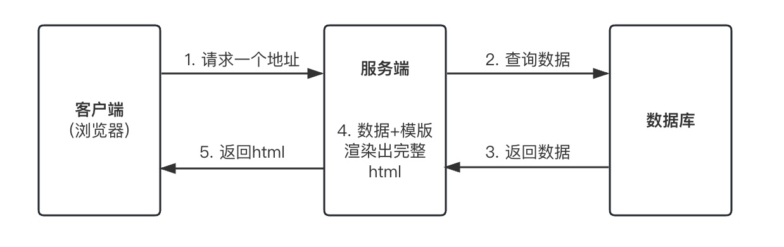
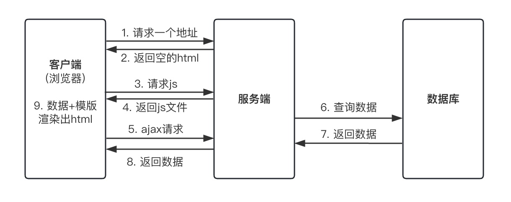

## Before
去年开始使用nuxt2，今年参与了一个nuxt2升级nuxt3的项目，对关于选择nuxt重构项目的背后原因，以及使用nuxt3开发过程中碰到的许多问题进行了探索和梳理
在这里完整的地记录一下。  
本文主要介绍一下什么是ssr，为什么要使用它、如何创建一个ssr应用以及nuxt3使用中碰到的一些重要点，最后再聊聊ssr的选取原则。

## 渲染模式
现在大部分的网页都是动态页面，也就是相同的一份模版填充上不同的数据，像笔者的博客网站，不是每篇文章都要写一个html页面，
而是在一个html模版上面添加不同的数据，这个过程称之为渲染。渲染既可以在客户端做，也可以在服务端完成。

### 服务端渲染
早期的web渲染其实都是在服务端完成的，浏览器请求回来的就是一个完整的html页面，模版+数据的渲染工作都交由服务器完成。  



这种方式的弊端很明显：
- 前后端耦合
- 对服务器压力大
- 用户体验不好(虽然首屏快，但是后续的页面跳转都需要重新请求html)

当AJAX技术出现，客户端可以动态获取数据，渲染过程也可以拿到客户端来做了。

### 客户端渲染
现在最常用的三大框架vue、react以及angular来开发的spa单页应用，这种应用它是客户端渲染(CSR)的，
浏览器先从服务器请求回来一个空白的html， 这个html中通常只有一个空的div元素以及一些script、link等标签。  
浏览器会加载这个html，当读到script标签时，浏览器就会向服务器请求对应的js资源。  
当浏览器收到服务器返回的js后，开始执行js代码。  
js代码中通过ajax向服务器请求数据，浏览器拿到服务端返回的数据后进行渲染，称之为客户端渲染。



这种渲染方式是为了解决传统服务端渲染对服务器压力大，占带宽的问题。但它自身也有一定的缺点：  
- 首屏加载速度慢
- 不利于SEO

这两点看了上面客户端渲染的整个过程应该就很好理解，首屏加载慢是因为浏览器要先加载的是一个空白的html，再请求js去渲染，在这期间页面都是空白的 所以首屏慢。
请求回来的是空白html所以搜索引擎也就爬取不到内容，无法进行索引，所以不利于SEO。

### 同构渲染
那么如何解决客户端渲染的这两个问题呢，答案就是使用服务端渲染，哈哈，历史不总是不断重演。    
当然不是回到最初的服务端渲染，而是结合服务端渲染+客户端渲染，也称之为同构渲染。我们现在说的ssr其实就是指这个同构渲染。  
为什么叫同构呢，就是同一份代码，既可以在客户端工作，也可以在服务端工作。  
首屏时由服务端执行js代码，构建完整html并返回，此时得到的页面是静态的，接着客户端在得到完整的html后加载并执行js，进行再次渲染得到具有交互性的界面。  
这样就解决了首屏慢以及不利于SEO的问题。  
> Making a static page interactive in the browser is called "Hydration."

## vue ssr
Vue.js是一个用于构建客户端应用的框架，但它也提供了服务端渲染的API来实现ssr。  
服务端会执行js渲染，客户端也同样会执行js进行渲染，那么客户端和服务端的应用实现就应该是一致的。下面是vue官方文档上的一个demo。  
先通过 npm init 创建package.json文件，并添加"type": "module"属性。安装vue以及express。
```json:title=package.json
{
  "name": "vue-ssr",
  ...
  "type": "module", // 保证node.js以ES modules模式运行
  "dependencies": {
    "express": "^4.18.2",
    "vue": "^3.3.4"
  }
}
```
创建vue应用部分的代码应当是通用的，通过vue提供的createSSRApp方法以SSR激活模式创建应用实例。  
```js:title=app.js
import { createSSRApp } from 'vue';

export function createApp() {
	return createSSRApp({
		data: () => ({ count: 1 }),
		template: `<button @click="count++">{{ count }}</button>`
	})
}
```
在客户端导入通用代码，创建应用并挂载。
```js:title=client.js
import { createApp } from './app.js';

createApp().mount('#app');
```
在服务端使用express来创建服务，监听3000端口，当访问根路径时，创建应用实例，
通过vue-server-renderer提供的renderToString方法将应用实例渲染成字符串放入html中。
demo中的button标签最后返回的字符串是\<button>1\</botton>。  

server.use(express.static('.')) 来托管客户端文件。  
添加加载客户端js的script。  
添加 Import Map 以支持在浏览器中使用 import * from 'vue'。
```js{16,20,28}:title=server.js
import express from 'express';
import { createApp } from './app.js';
import { renderToString } from 'vue/server-renderer';

const server = express();
server.get('/', (req, res) => {
	const app = createApp();
	renderToString(app).then((html) => {
		res.send(`<!DOCTYPE html>
      <html>
        <head>
          <title>Vue SSR</title>
              <script type="importmap">
                {
                  "imports": {
                    "vue": "https://unpkg.com/vue@3/dist/vue.esm-browser.js"
                  }
                }
              </script>
          <script type="module" src="./client.js"></script>
        </head>
        <body>
          <div id="app">${html}</div>
        </body>
      </html>`);
	})
})
server.use(express.static('.'));
server.listen(3000, () => {
	console.log('ready');
})
```
执行node server.js就可以在localhost:3000看到效果了。  
浏览器请求回来一个完整的html，然后加载client.js，我们使用createSSRApp，它会在激活模式下挂载应用。
> 在激活过程中，Vue 会创建一个与服务端完全相同的应用实例，然后将每个组件与它应该控制的 DOM 节点相匹配，并添加 DOM 事件监听器。

这样就实现了一个SSR应用，但是它离上生产还有很大的距离，需要再有很多的配置，那么通常我们使用成熟的框架来帮我们实现这些配置，比如nuxt。

## nuxt3
Ps：下文例子使用的nuxt版本(3.6.1)  
介绍一下nuxt3。它是一个集成了各种功能的框架，包括js框架vue.js、路由库vue-router、模块打包器webpack/vite以及服务器等等，
来帮助你创建web应用程序，让你能专注于业务代码的开发，一上来就可以开始写.vue文件，还有热更新以及开箱即用的ssr。

### auto-imports
初始化一个nuxt项目打开app.vue文件可能会有一个疑问，这个页面就只有template，里面一个\<NuxtWelcome />，也没有import，是怎么把这么多内容渲染出来的呢？  
答案就是自动引入。我们可以在.nuxt/components.d.ts文件中看到所有自动引入的组件，这些组件可以直接在.vue中使用，不需要import。  
components/、composables/(顶层)以及utils/(顶层)目录下导出的内容都是默认自动导入的。  

此外nuxt还允许从第三方包自动导入。这里以ant-design-vue为例，介绍一下如何在nuxt项目中使用这个库中的组件。  
首先它是一个vue的组件库，所以它支持使用vue.use的方式进行注册(这是通过vue.component方法全局注册组件)。
```ts:title=plugin/ant-design-vue.ts
import Antd from 'ant-design-vue';

export default defineNuxtPlugin((nuxtApp) => {
  nuxtApp.vueApp.use(Antd)
})
```
那如果是不支持vue的组件库，可以用nuxt提供的hooks来实现自动导入。可以写在nuxt modules中，也可以写在配置文件里
> Hooks are listeners to Nuxt events that are typically used in modules, but are also available in nuxt.config.

通过components:extend钩子，可以追加自动导入的组件。
```ts:title=nuxt.config.ts
import { kebabCase, pascalCase } from 'scule'

export default defineNuxtConfig({
  ...,
  hooks: {
    'components:extend'(components) {
      // console.log('components:extend', components)
      const exportName = 'Checkbox'
      const name = 'ACheckbox'
      components.push({
        export: exportName,
        chunkName: `components/${kebabCase(name)}`,
        filePath: 'ant-design-vue/es',
        global: false,
        kebabName: kebabCase(name),
        pascalName: pascalCase(name),
        prefetch: false,
        preload: false,
        mode: "all",
        shortPath: 'ant-design-vue/es',
        priority: 0,
      })
    },
  }
})
```
或者写在nuxt modules中
```ts
import { defineNuxtModule } from '@nuxt/kit'

export default defineNuxtModule({
  setup (options, nuxt) {
    nuxt.hook('components:extend', () => {...})
  }
})
```
此外nuxt kit包也封装了一些方法提供给你使用。
```ts:title=register.ts
import { addComponent, defineNuxtModule } from '@nuxt/kit'

export default defineNuxtModule({
  setup (options, nuxt) {
    addComponent({
      export: 'Checkbox',
      name: 'ACheckbox',
      filePath: 'ant-design-vue/es',
    })
  }
})
```
上面这部分代码你也可以写在非nuxt项目中，在nuxt项目中引用，只需要在nuxt项目配置文件中通过modules进行配置，就能够执行这部分代码。
```ts:title=nuxt.config.ts
import myUI from '@muUI/.../register.ts';
export default defineNuxtConfig({
  ...,
  modules: [
    'myUI',
  ],
})
```
启动后就能在components.d.ts文件中看到ACheckbox。  
```ts:title=.nuxt/components.d.ts
export const ACheckbox: typeof import("ant-design-vue/es")['Checkbox']
```
nuxt有很强大的钩子系统，从构建时到运行时，支持你在生命周期的各个节点进行功能扩展。

### useAsyncData
nuxt提供了几个数据获取的方法，通常使用useAsyncData就能实现需求了。  
```ts
const { data, refresh, pending } = useAsyncData(
  'uniqueKey',
  async () => {
    return await fetchData(params.value);
  },
  {
    watch: [params],
  }
);
```
它默认是从服务器上获取数据(server: true)，且是不阻塞的(lazy: false)。可以传入watch选项，当watch的值变化时，自动重新获取数据。  
useAsyncData返回请求到的数据data、是否仍在请求的状态pending以及刷新数据的方案fresh。当服务端请求出错时，可以在客户端使用fresh方法重新请求数据。

### nuxtApp
nuxtApp是nuxt运行时的应用上下文，它可以在composables、plugins以及components中通过useNuxtApp访问。
```ts
const nuxtApp = useNuxtApp();
```
在plugin中nuxtApp是唯一参数，你可以把一些需要在应用中使用到的全局变量，在plugin中挂载到nuxtApp上，这样就能在应用的任何地方通过useNuxtApp访问到。
```ts
export default defineNuxtPlugin((nuxtApp) => {
  // nuxtApp
})
```

以上部分是目前笔者在nuxt3的使用过程中遇到的比较tricky，需要细读一下文档或者看看源码才能理解或者实现的部分。

## ssr的选取
上面讲了ssr的优点，那么是否它就是我们开发应用程序的首选呢？当然并不是。它自身也有缺陷。  
首先就是对部署环境的要求更高了，需要有node.js的环境，而不像客户端渲染，只需要能部署静态资源的环境就可以。  
其次同构渲染结合了客户端和服务端，而这两个环境是有差异的，比如window对象只有在客户端才有，再比如会遇到服务端与客户端渲染出的内容不一致的情况。
在开发过程中必须要提前考虑进去。  
还有个性化缓存的问题，浏览器可以缓存每个用户个性化的内容，然而如果要把这部分内容缓存在服务端，那么需要的存储空间可能会非常之大。  
所以是否要使用同构渲染，必须要根据项目的实际情况来决定。如果你的网站是内容型的，需要SEO，那么ssr是首选。如果你的网站对内容到达时间 (time-to-content)
有很高的要求，那么也请选择ssr。否则客户端渲染就足够了。  

## Reference
[1. nuxt官网](https://nuxt.com/)  
[2. vue官网 - 服务端渲染 (SSR)](https://cn.vuejs.org/guide/scaling-up/ssr.html)  
[3. 从原理上实现Vue的ssr渲染](https://zhuanlan.zhihu.com/p/346674458)  
[4. Nuxt3-01-了解同构渲染(SSR)](https://www.bilibili.com/video/BV1pP4y127PF/?spm_id_from=333.788&vd_source=a0d4c30f37c92adbf6483ef06ed749ba)  
[5.（一文带你入门SSR）从传统服务端渲染到客户端渲染再到现代化的服务端渲染](https://juejin.cn/post/7082711258952105992)  
[6. 精读前后端渲染之争](https://github.com/camsong/blog/issues/8)