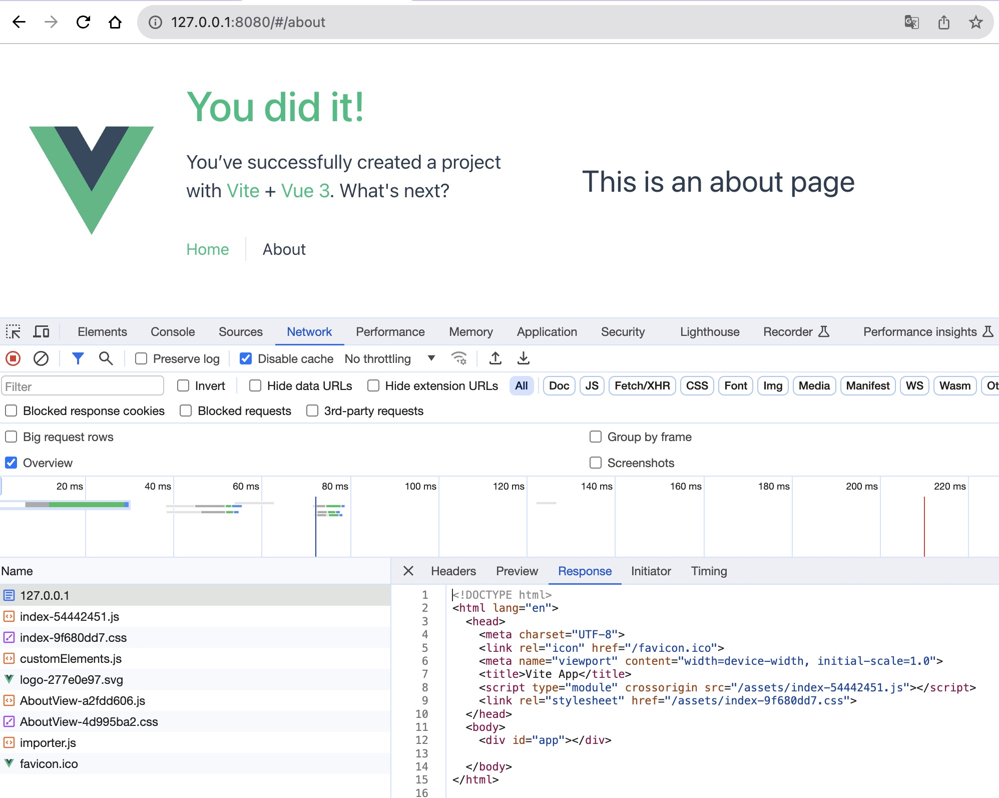

## Before
写了那么多年spa应用，知道它是单页应用，也知道啥是单页应用，但是还有很多深层问题一直没有探究到，直到某天踩进坑里。

## spa应用
什么叫spa，Single-page application，也就是单页应用。  
什么叫单页，就是整个网站只有一个html，展示不同内容都是通过js进行更新的。  

以一个nuxt3+vite搭建的项目为例(通过 npm create vue@latest 创建)：
它的路由有两个/和/about。  
执行build打包后的dist文件夹中，只有一个index.html，是没有about.html的，此外就是.js、.css等资源文件。  
这个html是打包工具(vite)自动生成的(里面只有一个根节点，一般是\<div id="app"/>)，里面通过script标签引入了打包出来的chunk文件，也就是.js和.css文件。 

进入dist文件夹，通过 http-server . 指令启动服务，访问localhost:8080，在network中可以看到浏览器会先请求根目录下的index.html，
得到返回后，加载script标签的资源就能把首页渲染出来。


## spa刷新后404
点击页面上的About跳转到/About界面，也能正常渲染出About界面。此时刷新页面会发现，404了。  
看network中，浏览器去请求了/about下的html文件，结果是404，很正常，因为确实没有这么一个html文件。
请求不到html，自然也就没有js，所以页面无法正常渲染。


## 路由history模式
那么为什么点击About跳转不会404呢？  
vue-router通过window.history.pushState改变当前浏览器的地址，但并没有刷新页面。内容的改变也完全是通过js实现的。  
打开控制台，点击About，查看network会发现，新请求了about相关的chunk文件。


## 解决方案
那么该如何解决这个问题呢。

### 重定向
因为404的根本原因是因为没有请求到对应的html，如果能请求到就万事大吉。  
所以可以配置一个服务，如果没有对应的html，就返回根路径下的index.html。  
通常可以通过nginx进行代理转发。
```
server {
  listen       80;
  server_name  localhost;

  location / {
      root   html;
      index  index.html;
      try_files $uri $uri/ /index.html;
  }
}
```
try_files：按顺序检查文件是否存在，返回第一个找到的文件。

### 路由hash模式
将路由模式配置成hash就不会出现这个问题。  
因为#及后面的内容虽然存在于浏览器地址中，但是并不会被包含在http请求中。所以在about界面，请求的仍是/下的index.html。



## 其他
一些其他的思考

### ssr应用
说spa必然会联想到<a target="_blank" href="/blog/fe-nuxt">ssr(Server-Side Rendering)</a>。  
ssr应用的所有页面刷新后都会得到一个html，它不像spa应用返回的是一个空的html，
而是一个完整的html，除却交互和一些只有客户端能实现的内容，与页面上看到的是基本一致的。


## Reference
[1. SPA（单页应用）](https://developer.mozilla.org/zh-CN/docs/Glossary/SPA)  
[2. SPA 路由history模式上线后刷新404](https://www.jianshu.com/p/1931aac90707)  