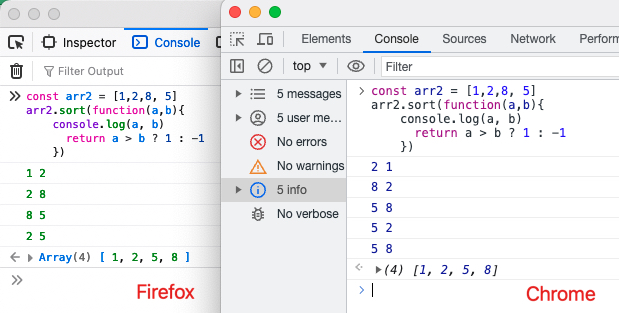

## 问题
今天遇到了一个在Firefox浏览器上出现的bug，有一个对象数组，需要按照其id是否存在与另一个数组中进行排序，在chrome上是正常的，
但在FireFox上就颠倒了。

```js
const sortedTopics = topcis
?.sort((a) => {
  if (currentTopics?.some?.((ele) => id === a.id)) {
    return -1
  }
  return 1
}) // id存在于currentTopics数组中的排在前面
.sort((t) => {
  return selectedTopics.includes(t.id) ? -1 : 1
}) // id存在于selectedTopics数组中的排在前面
```

先说我最后是怎么修复这个bug的，就是把第二个sort去掉(业务上确实不需要，selectedTopics始终是空数组)。
显然第二个sort在Firefox上的表现就是把第一个sort的输出倒置，为什么会这样呢？

因为在chrome中，sort的参数函数compareFn(a, b)返回值小于0时，会交换a,b位置，而在Firefox中，返回值大于0时，会交换a,b位置。  
所以上面代码中的第二个sort在Firefox浏览器中，参数函数的返回值永远为1，会一直交换位置，就把数组倒置了。

到这其实我狠疑惑，如果说两个浏览器的处理不一致，为什么第一个sort的结果在两个浏览器下都是正常的呢，写了一个sort观察了一下。
```js
const arr2 = [1, 2, 8, 5]
arr2.sort(function(a,b){
  console.log(a, b)
  return a > b ? 1 : -1
})
```
输出都是[1 ,2, 5, 8]，但是console的内容不一样。



在FireFox中参数函数compareFn(a, b)中的a就是前一个数，b是后一个数，而在chrome中是相反的，所以两者对于是否交换a、b的判断也是相反的，合情合理～  
从图中不仅可以看出a，b顺序不同，compareFn函数的执行次数也不同，Firefox中执行了4次，Chrome中执行了5次，
当然这并不能说明Firefox的排序更高效，当换一组数据时结果可能就是相反的，因为两者算法不同，对于不同长度不同初始有序度的数据，排序的效率也不同。

## 排序的稳定性
讲到这里，应该有小伙伴发现其实我对这个bug的处理还并不完善。此时Chrome和Firefox中sortedTopics的顺序还是不一致的。  
更确切的说，id存在于currentTopics数组中这些被放在前面的元素(后面都称为集合A，剩余的成为集合B)，顺序在两个浏览器中是完全相反的。
因为在Chrome中排序，是把集合A中的元素挪到了前面， 而Firefox则是把集合B中的元素挪到了后面。也就是虽然都是A在B前面，但是针对AB各自，两个浏览器下的顺序是完全相反的。
这显然不是我们想要的，我们通常都期望排序是稳定的，而现在Chrome下A集合的顺序和原始数据不一致，Firebox中B集合的顺序和原始数据不一致。  
如果想要两个浏览器都稳定，就需要同时判断a和b，并区分1 -1 0三种情况。a、b均存在于集合A或者集合B时，不交换位置。
```js
const sortedTopics = topcis
?.sort((a, b) => {
  const aInCurrent = currentTopics?.some((ele) => ele.entityId === a.entityId)
  const bInCurrent = currentTopics?.some((ele) => ele.entityId === b.entityId)
  if (aInCurrent && !bInCurrent) {
    return -1
  } else if (!aInCurrent && bInCurrent) {
    return 1
  }
  return 0
})
```
ECMAScript规范的要求，Array.sort()方法的排序结果必须是稳定的，各个浏览器也都遵循这一规范，所以sort的输出是否稳定，
就取决于你编写的compareFn(a, b)函数是否稳定。

## 排序算法
最后来讲讲sort的实现。Array.sort()方法的底层实现并不是由JavaScript引擎完成，而是由浏览器提供的内置排序算法完成的，不同的浏览器有他们各自的实现。
Chrome的V8引擎中使用的是快速排序，对于较短的数组（长度\<10）则降级为插入排序(在分治过程中递归出的子数组长度小于10时，也使用插入排序)。
Firefox的SpiderMonkey则使用的是归并排序。平均时间复杂度都是O(nlogn)。  

然而快速排序并不是稳定的算法，Chrome从版本70开始，使用称为<a target="blank" href="https://v8.dev/blog/array-sort">Timsort</a>的归并排序和插入排序的混合体。
> Array.prototype.sort was among the last builtins implemented in self-hosted JavaScript in V8. 
> Porting it offered us the opportunity to experiment with different algorithms and implementation strategies and 
> finally <a target="_blank" href="https://mathiasbynens.be/demo/sort-stability">make it stable</a> in V8 v7.0 / Chrome 70.

## Reference
[1. What is Array.prototype.sort() time complexity?](https://stackoverflow.com/questions/57763205/what-is-array-prototype-sort-time-complexity/57763259#57763259)  
[2. Getting things sorted in V8](https://v8.dev/blog/array-sort)  
[3. Array.prototype.sort()](https://developer.mozilla.org/zh-CN/docs/Web/JavaScript/Reference/Global_Objects/Array/sort)