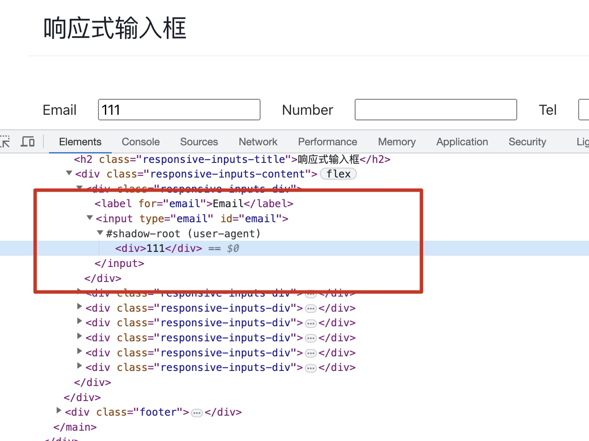

## Before

## 1. 微前端
> 微前端是一种多个团队通过独立发布功能的方式来共同构建现代化 web 应用的技术手段及方法策略。
> 通俗来说，就是在一个web应用中可以独立的运行另一个web应用

现在前端的应用越来越大，而前端技术又是日新月异，今天vue2，明天vue3，后天就是vue4，框架更新非常快，但是要在项目中进行升级却很难。  
有很多的历史包袱，很多不兼容，想用新技术代价很大。微前端可以在不改动当前项目的情况下，引入新的技术栈，新的框架，新的库。  
将旧的内容通过微前端引入，新的界面就可以使用新技术进行开发，之前的内容可以渐进地重构。  
另一种场景就是想直接接入别的项目的某些内容，也可以使用微前端。

## 2. 解决方案
微前端其实是一个概念，源自于微服务，目前已经有了很多比较成熟的解决方案。  
首先iframe就可以做到，它的作用就是把一个html页面嵌入到另一个html页面中去。
但是它缺点很多，比如路由状态刷新就没有了，加载时间长，通信困难，dom的割裂严重，弹框就只能在iframe内部弹。  
所以又开发出了很多其他的解决方案。比如之前用得比较多的qiankun，
它是基于single-spa的，single-spa本身就是一个微前端的框架，qiankun是在它的基础上做了一些优化，增加了一些能力，做了封装，让它使用起来更简洁一些，
但是缺点还是比较明显的，有一定的改造成本，webpack的配置、路由都需要做适配；样式隔离不彻底，会互相影响，需要做一些额外的处理。然后是不支持vite等一些esm的脚本。
那如果用了vite还要用qiankun，可能就需要使用一些额外的插件。  
最近又出了一个新框架叫做无界，用了一下感觉还不错。

## 3. 无界
使用前可以先看一下它的<a href="https://wujie-micro.github.io/doc/guide/" target="_blank">文档</a>，还是比较清晰的，然后它提供了一个demo，接了6个不同技术栈的子应用。
展示了它的一些能力，包括预加载、路由同步、通信等等。  
前面我们说iframe其实是可以实现微前端的，但是它有一些缺点，wujie的方案是基于iframe的，它继承了iframe的优点，然后在此基础上去解决iframe的缺点，实现了一个比较完美的方案。

## 4. 如何使用
因为我的主项目用的是vue2框架，所以可以直接安装wujie-vue2，不用主动装wujie，wujie-vue2里面会装。然后在入口文件(main.ts)里面注册。
然后在你需要接入的地方使用就可以了，通过这个wujie-vue2的封装，可以直接用组件的方式写。
name和url是必填的。name就相当于是个key，代表一个子应用，url就是子应用的路由。  

```ts:title=main.ts
import WujieVue from 'wujie-vue2'
 
Vue.use(WujieVue)
```

```html:title=app.vue
<WujieVue
  width="100%"
  height="calc(100vh - 64px)"
  :url="url"
  name="chain"
/>
```

这边有我踩的第一个坑，遇到一个chunkLoadError的报错，还记得之前学webpack的时候了解过，
异步加载的模块，webpack会打一个单独的chunk，看代码，这些报错的模块确实都是通过import()的形式加载进来的。
把这些模块引入由异步改成同步之后也确实就不报错了。但是后来看官网提供的demo，发现它引入组件也是用的import()异步的方式，但是却没有报错。
最后发现是因为一开始我没有给name赋值。
那为什么不给name会报这个loadChunkError的错误呢，我们先卖个关子，最后将原理部分的时候说。  

### 4.1. 速度优化
继续说如何使用，其实光上面这两部分还不够，因为子应用的资源和接口的请求都是在主应用的域名下发起的，所以会有跨域问题，需要做CORS设置。
在vue的配置文件里面加一下这个配置就可以了。devServer这个配置其实就是用了webpack-dev-server，启动一个本地服务，这个headers配置就是设置响应头。
这样就接入完成了，不超过10行代码，非常简单。
那跟demo比还是有差距的，想要速度快就需要做一些优化。
>子应用开启保活模式后，应用发生切换时整个子应用的状态可以保存下来不丢失，结合预执行模式可以获得类似ssr的打开体验。

预执行+保活约等于ssr，这个实操起来也非常简单。  
预加载就是在入口文件里面执行preloadApp这个方法，这是wujie暴露出来的一个方法。
它是通过requestidlecallback实现在浏览器空闲的时候将子应用所需静态资源加载到内存中。
如果再加上exec为true，可以实现预执行，也就是会执行子应用的代码，将子应用提前渲染出来。
速度有很大的提升，但是还是有接口请求的时间，如果想要更快，可以使用保活模式。将alive设置为true，就可以在应用发生切换时，将整个子应用的状态保存下来。
这样就可以实现类似ssr的打开体验，这就解决了iframe的一个缺点，打开慢，白屏时间长的问题。  

```ts:title=main.ts
import WujieVue from 'wujie-vue2'
 
Vue.use(WujieVue)
preloadApp({ name: 'chain', url: `${prefix}/chain`, exec: true, alive: true })
```

### 4.2. 路由状态
接下来解决第二个问题，路由状态刷新的问题。  
增加sync=true这个参数，开启这个参数后，无界会将子应用的路径(query+path+hash)，通过window.encodeURIComponent编码后，挂载在主应用url的查询参数上，参数名就是子应用name的值。
这样浏览器前进后退以及刷新都能正常展示。  

### 4.3. 通信
接着说通信，通信也是iframe的一大缺陷。无界提供了三种通信方式：  
第一种是props传参数的方式，子应用中通过window.$wujie的方式获取。  
第二种是window方式，获取全局的数据。

```ts
window.document.querySelector("iframe[name=chain]").contentWindow. // 主应用调用子应用全局数据
 
window.parent // 子应用调用主应用全局数据
```

第三种方式是去中心化的通信方式，通过wujie暴露出来的bus方法。本质上是一种发布订阅模式。  
通过bus.$on的方式监听事件，通过bus.$emit的方式触发事件。在子应用中通过window.$wujie?获取到bus。

```ts
import WujieVue from "wujie-vue";
const { bus } = WujieVue;
 
bus.$on("事件名字", function (arg1, arg2, ...) {}); // 主应用监听事件
 
window.$wujie?.bus.$emit("事件名字", arg1, arg2, ...); // 子应用发送事件
```

### 4.4. 运行模式
最后介绍一下无界中子应用的三种运行模式，分别是保活模式、单例模式和重建模式。
保活模式上面介绍了， 在此模式下子应用只会进行一次渲染，页面发生切换时承载子应用dom的webcomponent会保留在内存中，当子应用重新激活时无界会将内存中的webcomponent重新挂载到容器上。  
但是这个模式有一个问题，就是当主应用的路由改变，子应用内部的路由不会改变， 所以下次进来时还会停留在上次的状态。  
这个场景就是，当我菜单上有两个tab进入同一个子应用的不同界面，也就是name相同，但是url不同，
如果开启保活模式，那么进入第二个tab，展示的内容还是第一个的tab，不会刷新，因为子应用的路由不会改变。  
这种情况可以对子应用做一下生命周期改造，这样切换tab的时候会销毁实例，再切回来的时候会创建一个新的实例。

```ts
export const microMount = () => {
    let instance;
    window.__WUJIE_MOUNT = () => {
        instance = new Vue({ i18n, router, store, render: (h) => h(App) }).$mount('#app');
    };
    window.__WUJIE_UNMOUNT = () => {
        instance.$destroy();
    };
    window.__WUJIE.mount(); // 子应用的实例化是在异步函数中进行的，需要主动调用mount
};
 
if (!window.__app_instance_name_map__) {
    (async function() {
        await bootstrap();
        if (window.__POWERED_BY_WUJIE__) {
            microMount();
        } else {
            await mount();
        }
    })();
}
```

如果不做生命周期改造，就是重建模式，每次都会销毁iframe以及web component。


## 5. 基本原理
最后简单介绍一下原理，无界暴露出了几个方法，分别是setupApp，preloadApp，startupApp，destroyApp以及一个bus对象。  
因为preloadApp和startupApp的参数大部分都是一样的，所以它搞了一个setupApp来缓存参数，调用setupApp时候传的参数，在调用preload和startup的时候就不用再传一遍了，
它会直接帮你merge进去，只需要传name就可以了。启动这个子应用也就是startApp需要name，url以及el这个容器参数。  
wujie-vue2主要做的就是创建容器，执行startupApp，把分别是setupApp，preloadApp，destroyApp以及一个bus暴露出去，然后提供一个install方法，
等把它挂载到vue上，就执行这个vue.component注册组件，这样我们就可以直接用这个组件了。

```js
var wujieVueOptions = {
  ...
  mounted: function mounted() {
    var _this = this;
    bus.$onAll(this.handleEmit); // 监听所有事件
    this.execStartApp(); // 执行startApp启动子应用
    this.$watch(function () {
      return _this.name + _this.url; // 监听name和url的变化
    }, function () {
      return _this.execStartApp();
    });
  },
  beforeDestroy: function beforeDestroy() {
    bus.$offAll(this.handleEmit);
  },
  render: function render(c) {
    return c("div", {
      style: {
        width: this.width,
        height: this.height
      },
      ref: "wujie" // 创建容器
    });
  }
}
var WujieVue = Vue.extend(wujieVueOptions);
WujieVue.setupApp = setupApp;
WujieVue.preloadApp = preloadApp;
WujieVue.bus = bus;
WujieVue.destroyApp = destroyApp;
 
WujieVue.install = function (Vue) {
  Vue.component("WujieVue", WujieVue);
};
```

无界采用web component来实现页面的样式隔离。
它先创建了一个自定义元素wujie-app，然后在里面创建了一个shadow dom，子应用就渲染在里面。shadow dom内部的内容不会影响到它外面的任何内容。
其实shadow dom是非常常见的，我们经常用的input、video就是用shadow dom封装的内部结构。



样式隔离是用的web component，js隔离无界是用的iframe，iframe天然就是js隔离的。子应用的实例就运行在iframe中，跟主应用彻底解耦。  
这边我们继续说回我踩的第一个坑，就是那个chunkLoadError，为什么我不传name，子应用就没办法找到这些异步的chunk呢？
我们可以看一下无界对这些chunk做了什么。这些异步的chunk在请求回来之后是在主应用内部的，无界在渲染过程中，会把这些script append到iframe内部的head标签内。
然后在主应用中把这些script注释掉。但是没有name会导致无法把这些异步的script注进来，就导致了chunkLoadError。

子应用的实例是运行在iframe中，而界面dom是在主应用内部的web component中，那么iframe跟web component是如何关联起来的呢。  
无界使用proxy把iframe的document都代理到shadow dom也就是web component，将document的查询类接口：
getElementsByTagName、getElementsByClassName、getElementsByName、getElementById、querySelector、querySelectorAll、head、body全部代理到web component，
这样就把iframe跟web component连结起来了。

## Reference
[1. 微前端（无界）](https://juejin.cn/post/7212603829572911159#heading-11)  
[2. 基于 iframe 的全新微前端方案](https://posts.careerengine.us/p/61c7ecc2c5a7da1b812c247c)  
[3. 无界demo](https://wujie-micro.github.io/demo-main-vue/home)  
[3. 无界文档](https://wujie-micro.github.io/doc/guide/)  
[5. 究竟什么是Shadow DOM？](https://juejin.cn/post/7137112423613333541)