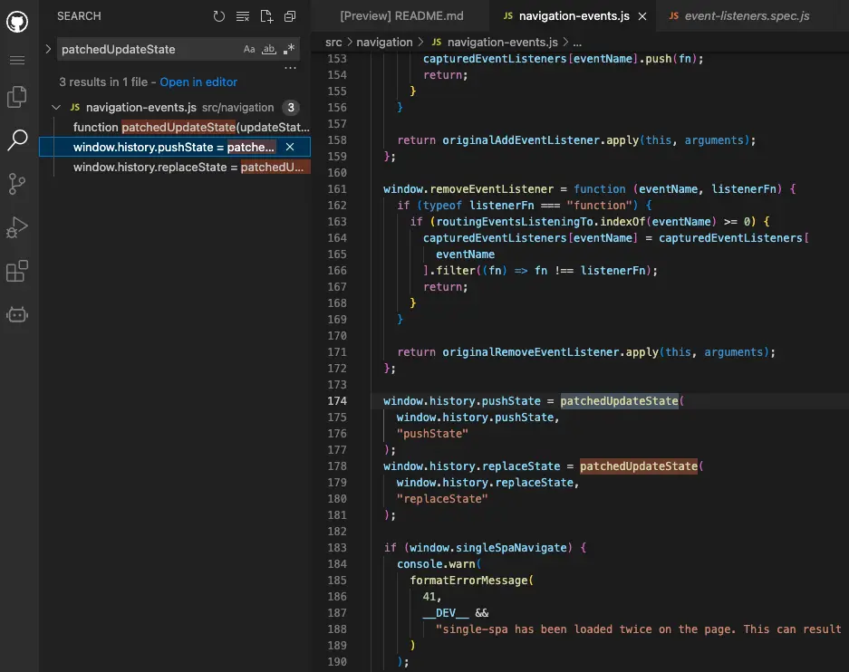

## Before
vue2的框架，引入了qiankun模块，遇到一个比较诡异路由问题，请教了大佬才得以解决，收获不少。

## 1. 问题

使用window.history.pushState修改url(urlA --> urlB)，但是之后url又莫名被改成了urlA
``` ts
import qs from 'qs'

export function removeUrlQuery($vm: Vue, queryKey: string) {
  const newQuery: { [key: string]: string } = qs.parse(window.location.search.substr(1, window.location.search.length))
  delete newQuery[queryKey]
  window.history.pushState('', document.title, `${window.location.pathname}?${qs.stringify(newQuery)}`)
  $vm.$delete($vm.$route.query, queryKey)
}
```

## 2. 解决之道
通过debugger发现在经过 window.history.pushState方法后路由确实更新为urlB
因为涉及路由变化，我在router.beforeEach中打了断点，发现进到这里时，路由已经由urlB变回了urlA，到这儿我就束手无策了，接下来是请教了大佬之后学会的，一起来看看吧。

### 2.1. Call Stack
打断点的时候要会看调用栈，知道当前方法是谁触发的。


右边就是调用栈，可以挨个点进去看(这边忽略了一些文件)。
可以看到倒数第三行就是在开头代码里面的修改路由的方法removeUrlQuery，之后就由single-spa接管了，那这个single-spa是什么呢，
正常路由变化不是应该直接由vue-router来触发beforeEach么。
点进去看一下，发现这个.min.js很难看明白，毕竟是压缩版的js，那如何能看到正常的js呢。

### 2.2. 打包的文件
我们在node_modules里面找到single-spa，先看package.json
``` json
{
  "name": "single-spa",
  "version": "5.9.3",
  "description": "The router for easy microfrontends",
  "main": "lib/umd/single-spa.min.js",
  "types": "typings/single-spa.d.ts",
  "module": "lib/esm/single-spa.min.js",
  "scripts": {
  ...
```
main字段配置了这个包的入口文件，不过这里还有一个module字段，定义了ESM规范的入口文件，它的优先级是比main高的，所以入口文件就是lib/esm/single-spa.min.js，
把这边改成lib/esm/single-spa.dev.js，重启项目，再debugger一次。


这次就能看到熟悉的正常代码了。
看右边倒数第5行，这是执行过removeUrlQuery之后进入的代码，对应着左边914行，那么为什么会执行到这一行呢。
这个时候就得看看single-spa源码了，to the github～  

### 2.3. 查看源码
找到这个版本的代码[5.9.3](https://github.com/single-spa/single-spa/tree/v5.9.3)，你可以git clone，也可以直接线上看。
在地址栏一级域名github后面加上[1s](https://github.com/single-spa/single-spa/tree/v5.9.3)，就可以在线VS Code打开代码(或者直接按.键)。
全局搜索一下patchedUpdateState(上图903行这个方法)这个方法，可以看到，这个库重写了pushState和replaceState方法，
所以执行pushState，它会走到patchedUpdateState这个方法返回的函数(下称这个函数为Fa)中。



我在Fa中打了断点，发现整个过程执行了两次Fa，一次是urlA变为urlB，第二次是urlB变为urlA，第一次的methodName为pushState，第二次是replaceState。
这个pushState很显然是我通过removeUrlQuery触发的，那么第二次的replaceState是哪个小(tu)可(zai)爱(zi)触发的呢？
我们再看一下第二次进入Fa时的调用栈，下上两个红线分别代表第一、二次进入Fa，我们来看看这个过程发生了什么。


往前追溯时vue-router的pushState --> replaceState，啊找到了，点过去会看到他的入参是urlA。显然路由就是在这个pushState被改回了urlA。
``` js
function replaceState (url) {
  pushState(url, true);
}
```
再往前追溯，看这个ensureURL，这时就得看vue-router源码，还是老方法打开源码(版本要确认好) 。发现replaceState的参数来自于current，这个current是什么得看这个this
``` js
HTML5History.prototype.ensureURL = function ensureURL (push) {
  if (getLocation(this.base) !== this.current.fullPath) {
    var current = cleanPath(this.base + this.current.fullPath);
    push ? pushState(current) : replaceState(current);
  }
};
```
找到HTML5History，可以看到把History赋给了HTML5History的__proto__，HTML5History可以访问到History的属性、方法等，
而History中的current是通过updateRoute方法进行赋值的，通过debugger发现在urlA变成urlB的过程中，并未调用updateRoute方法，
即current一直是urlA状态，直到beforeEach结束后才进入updateRoute方法。
``` js
var HTML5History = /*@__PURE__*/(function (History) {
	...    
    if ( History ) HTML5History.__proto__ = History;
    ...
    return HTML5History;
}(History)

History.prototype.updateRoute = function updateRoute(route) {
  this.current = route
  this.cb && this.cb(route)
}
```
继续看上图可以看到single-spa触发了vue-router的handleRoutingEvent方法，最终导致了pushState，那single-spa是如何触发handleRoutingEvent方法的呢
首先看vue-router代码会发现，它给popstate方法注册了handleRoutingEvent，而single-spa在callCapturedEventListeners中执行了popstate注册的所有方法，
其中eventArguments[0]是addEventListener注册事件的参数，它的type就是监听的事件名称也就是popstate
``` js
// vue-router
window.addEventListener('popstate', handleRoutingEvent);
```

``` js
// single-spa
export function callCapturedEventListeners(eventArguments) {
  if (eventArguments) {
    const eventType = eventArguments[0].type;
    if (routingEventsListeningTo.indexOf(eventType) >= 0) {
      capturedEventListeners[eventType].forEach((listener) => {
        try {
          // The error thrown by application event listener should not break single-spa down.
          // Just like https://github.com/single-spa/single-spa/blob/85f5042dff960e40936f3a5069d56fc9477fac04/src/navigation/reroute.js#L140-L146 did
          listener.apply(this, eventArguments);
        } catch (e) {
          setTimeout(() => {
            throw e;
          });
        }
      });
    }
  }
}
```

那single-spa又是如何执行到callCapturedEventListeners的呢，上面讲过它代理了pushState方法，你调用pushState就会走进它的patchUpdateState方法，
这个方法中通过window.dispatchEvent执行了一个自定义事件popstate，而window.addEventListener监听了popstate事件，
执行urlReroute(在调用栈中也可以看到这个方法)，一直执行到callCapturedEventListeners，urlReroute事件的参数也一直被传到callCapturedEventListeners中，
下面代码可以看到urlReroute方法中，参数通过arguments形式传入reroute的，所以变成了数组，所以上面要用eventArguments[0]
```  js
window.dispatchEvent(createPopStateEvent(window.history.state, methodName))

function urlReroute() {
  reroute([], arguments);
}

function createPopStateEvent(state, originalMethodName) {
  let evt;
  try {
    evt = new PopStateEvent("popstate", { state });
  } catch (err) {
    evt = document.createEvent("PopStateEvent");
    evt.initPopStateEvent("popstate", false, false, state);
  }
  evt.singleSpa = true;
  evt.singleSpaTrigger = originalMethodName;
  return evt;
}

if (isInBrowser) {
  // We will trigger an app change for any routing events.
  window.addEventListener("hashchange", urlReroute);
  window.addEventListener("popstate", urlReroute);
```
至此，url改变的整条路就都找到啦，来总结一下整条路径：
1. removeUrlQuery方法中执行了window.history.pushState
2. single-spa代理了pushState方法，执行了patchUpdateState方法
3. patchUpdateState方法中通过window.dispatchEvent执行了一个自定义事件popstate
4. single-spa中通过window.addEventListener监听了popstate事件，回调函数是urlReroute
5. 最后执行到callCapturedEventListeners中，执行了所有监听popstate事件的方法
6. vue-router中监听了popstate方法执行handleRoutingEvent，最终执行了pushState，将url又改回了urlA

### 2.4. 解决方案
结合项目具体的问题，只需要在router.beforeEach中判断增加判断，如果前后path相同则直接return即可。
```js
router.beforeEach(async (to, from, next) => {
  if (to.fullPath === from.fullPath && from.name === to.name) {
    return
  }
  ...
})
```

## 3. 总结
简单总结一下：

- 控制台调用栈的使用
- 修改包的入口文件
- 阅读源码(如果对微前端比较熟悉，就知道它会劫持iframe的history.pushState和history.replaceState)
- 常用api熟悉(dispatchEvent、PopStateEvent、addEventListener)
- this指向

如果这些都能够熟练掌握，相信下次debugger一定不会再束手无策啦～～  

## 4. 后记  
2023-06学习无界(微前端框架)的时候，又一次遇到了这个问题，项目中引入了single-spa，当使用无界的路由同步(sync)时，
浏览器前进后退无效，切换到其他路由时，路由上的query内容始终存在。
再一次debugger发现是同样的原因，single-spa中出发了所有监听popstate事件的方法，而无界中监听了popstate方法去实现路由同步(syncUrlToWindow)，
这就导致在正常切换路由并不需要执行路由同步时，无界仍执行了syncUrlToWindow，所以路由上的query无法改变。

## Reference
[1. package.json 中 你还不清楚的 browser，module，main 字段优先级](https://github.com/SunshowerC/blog/issues/8)  
[2. 微前端 | 5. single-spa 的生命周期和事件管理](https://zhuanlan.zhihu.com/p/144537631)  
[3. 无界 - 路由同步](https://wujie-micro.github.io/doc/guide/sync.html)