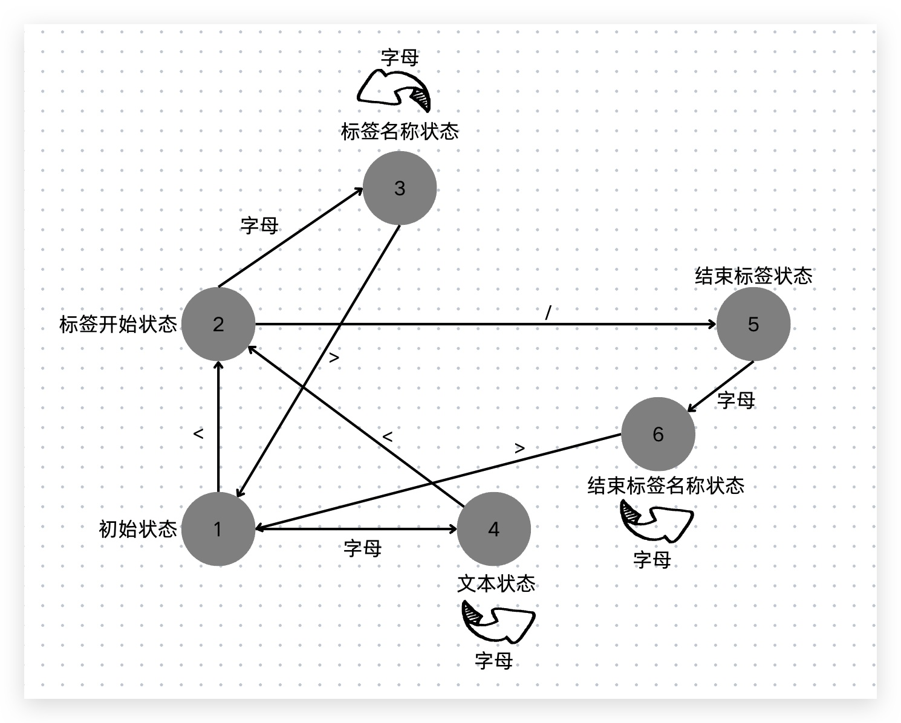

## Before
编译器说来很简单，它就是一段代码，作用是将源代码翻译成目标代码。  
为什么需要翻译呢，因为机器能阅读运行的代码往往晦涩难懂，而人们需要编写易于阅读和维护的代码，
那我们写出来的代码需要运行就需要用到编译器。  
Vue.js的模板还有jsx也需要经过编译器才能在浏览器上正常运行。  
完整的编译过程有很多步骤，包括词法分析、语法分析、语义分析、中间代码生成、优化、目标代码生成等等。  
对于Vue.js模板编译器，它的源代码就是组件的模板，目标代码是能够运行在浏览器上的JavaScript代码。  
源代码：
```html
<template>
    <div>
        <h1 :id="dynamicId">vue template</h1>
    </div>
</template>
```
目标代码：
```js
function render() {
    return {
        type: 'div',
        children: [
            {
                type: 'h1',
                props: {
                  id: this.dynamicId
                },
                children: 'vue template'
            }
        ]
    }
}
```
可以看出模板的目标代码就是渲染函数。

## 整体流程
编译器会先对模板进行词法分析和语法分析，得到模板AST。  
接着将模板AST转换成JavaScript AST。  
最后根据JavaScript AST生成JavaScript代码也就是渲染函数。

AST即abstract syntax tree，抽象语法树，模板AST也就是用来描述模板的抽象语法树。其结构如下：
```js
const ast = {
    type: 'Root',
    children: [
        {
            type: 'Element',
            tag: 'div',
            children: [
                {
                    type: 'Element',
                    tag: 'h1',
                    props: [
                        {
                            type: 'Direction',
                            name: 'if',
                            exp: {
                                type: 'Expression',
                                content: 'ok'
                            }
                        }
                    ],
                    children: 'vue template'
                }
            ]
        }
    ]
}
```
封装parse函数对模板字符串进行词法和语法分析，得到模板字符串templateAST。  

得到模板AST之后，我们就可以对它进行语义分析，也就是进行类型检查、上下文相关分析，比如：  
检查v-else指令是否存在对应的v-if指令，分析属性值是否是静态的，是否是常量等等。  

完善模板AST之后，封装transform函数将模板AST转化为JavaScript AST。  
什么是JavaScript AST呢，因为我们的最终目标是将模板转化为渲染函数，JavaScript AST其实就是设计来描述我们最终要生成的渲染函数。

最后我们封装generate函数，根据JavaScript AST来生成渲染函数。
```js
const template = `
<div>
    <h1 v-if="ok">vue template</h1>
</div>
`
const templateAST = parse(template)
const jsAST = transform(templateAST)
const code = generate(jsAST)
```
接下来我们逐一看这几个步骤的具体实现。

## 解析器parser
解析器parser的入参是模板字符串，它会逐一读取字符，根据一定的规则将其切个为一个个Token，例如对于如下模板：
```html
<p>vue</p>
```
解析器会把它切割为三个Token，分别是：开始标签\<p>、文本节点vue、结束标签\</p>。  
那么解析器是如何进行切割的呢，这里会用到有限状态自动机。  
听名字比较唬人，但其实很好理解。有限状态就是指状态个数是有限的，自动机就是指解析器会随着字符的输入，自动地在各个状态之间迁移。  



以上述模板字符串为例：  

状态机首先处于“初始状态”  
当读取到字符 \< ，状态机会进入到“标签开始状态”  
读取下一个字符 p ，状态机进入到“标签名称状态”  
读取到字符 > ，状态机回到“初始状态”，并记录“标签名称状态”下产生的标签名称p  
读取下一个字符 v ，进入“文本状态”  
继续读取后续字符直到遇到字符 \< ，状态机进入到“标签开始状态”，并记录下“文本状态”产生的文本内容vue  
读取到字符 \ ，状态机会进入到“结束标签状态”  
读取下一个字符 p ，状态机进入到“结束标签名称状态”  
读取最后一个字符 > ，状态机回到“初始状态”，并记录“结束标签名称状态”下产生的结束标签名称p  

经过这一系列的状态迁移，就能得到相应的Token。  
WHATWG发布的关于浏览器解析HTML的规范中，详细阐述了状态迁移，基于该规范，我们就能够很容易地编写对应代码进行有限状态自动机的实现。  

```js
const State = {
    initial: 1,
    tagOpen: 2,
    tagName: 3,
    text: 4,
    tagEnd: 5,
    tagEndName: 6
}
function isAlpha(char) {
    return char >= 'a' && char <= 'z' || char >= 'A' && char <= 'Z'
}
function tokenize(str) {
    let currentState = State.initial
    const chars = []
    const tokens = []
    
    while(str) {
        const char = str[0]
        switch (currentState) {
            case State.initial:
                if (char === '<') {
                    currentState = State.tagOpen
                    str = str.slice(1)
                } else if (isAlpha(char)) {
                    currentState = State.text
                    chars.push(char)
                    str = str.slice(1)
                }
                break
            case State.tagOpen:
            case State.tagName:
            case State.text:
            case State.tagEnd:
            case State.tagEndName:
        }
    }
    ...
    return tokens
}
```

首先定义所有状态，循环读取字符串。
当处于初始状态时，看图可以发现它存在两种情况，如果是 \< 就进入开始标签状态，如果是字母，就进入文本状态，并将字符缓存到chars数组中。
当处于其他状态时也是相同的处理逻辑。

具体代码可以看<a target="_blank" href="https://github.com/yyycc/vue-demo/blob/main/compiler/parser.js">parser.js</a>。

### AST
使用上一节完成的tokenize函数，我们根据模板，生成Token列表。
```js
const tokens = tokenize(`<div><p>Vue</p><p>Template</p></div>`)
// tokens如下
[
    {type: 'tag', name: 'div'},
    {type: 'tag', name: 'p'},
    {type: 'text', content: 'vue'},
    {type: 'tagEnd', name: 'p'},
    {type: 'tag', name: 'p'},
    {type: 'text', content: 'Template'},
    {type: 'tagEnd', name: 'p'},
    {type: 'tagEnd', name: 'div'},
]
```
得到Token列表后，就要来构建AST了。上面我们已经了解了AST的结构，它跟模板一样都是树形结构。  
我们创建一个栈elementStack用来维护元素间的父子关系，初始状态下它有一个Root根节点元素，
接着对Token列表进行扫描，每遇到一个开始标签节点，我们就构造一个Element类型的AST节点作为当前栈顶节点的子节点，并将其压入栈。
每遇到一个结束标签节点，我们就将当前栈顶的节点弹出，保证栈顶的节点始终是父节点的角色。
当遇到文本节点，就创建Text类型的AST节点作为当前栈顶节点的子节点。
直到所有token扫描完毕，AST的构建也就完成了。

```js
function parser(str) {
    const tokens = tokenize(str)
    const root = {
        type: 'Root',
        children: []
    }
    const elementStack = [root]
    while (tokens.length) {
        const parent = elementStack[elementStack.length - 1]
        const t = tokens[0]
        switch (t.type) {
            case 'tag':
                const elementNode = {
                    type: 'Element',
                    tag: t.name,
                    children: []
                }
                parent.children.push(elementNode)
                elementStack.push(elementNode)
                break
            case 'text':
                const textNode = {
                    type: 'Text',
                    content: t.content,
                }
                parent.children.push(textNode)
                break
            case 'tagEnd':
                elementStack.pop()
                break
        }
        tokens.shift()
    }
    return root
}
```

## 转换器transform
有了模板AST，接下来就需要转换器将其转化为JavaScript AST。

### AST的转换
为了对AST进行转换，我们需要能够访问AST的每一个节点，因为它是树形结构的，所以我们需要用深度优先遍历，来实现对AST中各个节点的访问。
```js
function traverseNode(ast) {
    const currentNode = ast
    const children = currentNode.children
    if (children) {
        for (let i = 0; i < children.length; i++) {
            traverseNode(children[i])
        }
    }
}
```
然后我们就能实现对特定节点的修改了。
```js
function traverseNode(ast) {
    const currentNode = ast
    if (currentNode.type === 'Text') {
        currentNode.content = currentNode.content.repeat(2)
    }
    const children = currentNode.children
    if (children) {
        for (let i = 0; i < children.length; i++) {
            traverseNode(children[i])
        }
    }
}
```
但是如果把所有的功能都堆积在traverseNode函数中，它会越来越臃肿，所以我们需要将对节点的访问和操作进行解耦。  
我们给traverseNode增加一个context参数，支持将需要执行的操作传入。
```js
function traverseNode(ast, context) {
    const currentNode = ast
    const transforms = context.nodeTransforms
    for (let i = 0; i < transforms.length; i++) {
        transforms[i](currentNode, context)
    }
    ...
}
function transform(ast) {
    const context = { nodeTransforms: [] }
    traverseNode(ast, context)
}
```
这个context可以看做是transform函数进行AST转化过程中的上下文数据，我们对接点进行替换和删除都需要用到它。  
我们为context扩展一些重要信息，包括当前正在转换的节点，当前节点的父节点以及当前节点在父节点的children中的位置索引。
```js
const context = {
    currentNode: null,
    childIndex: 0,
    parent: null,
    nodeTransforms: []
}
```
然后在traverseNode函数中对这些数据进行赋值:
```js
function traverseNode(ast, context) {
    const currentNode = ast
    context.currentNode = currentNode // 当前节点
    const transforms = context.nodeTransforms
    for (let i = 0; i < transforms.length; i++) {
        transforms[i](currentNode, context)
    }
    const children = currentNode.children
    if (children) {
        for (let i = 0; i < children.length; i++) {
            context.parent = currentNode // 设置父节点
            context.childIndex = i // 设置位置索引
            traverseNode(children[i], context)
        }
    }
}
```
有了这些上下文数据，我们就可以进行节点的替换和删除操作:
```js
const context = {
    ...,
    replaceNode(node) {
        if (context.parent?.children) {
            context.parent.children[context.childIndex] = node
            context.currentNode = node
        }
    },
    removeNode() {
        if (context.parent?.children) {
            context.parent.children.splice(context.childIndex, 1)
            context.currentNode = null
        }
    },
}
```

在转换AST节点过程中，往往需要根据子节点的情况来决定如何对当前节点进行转换，这就要求父节点的转换需要等到所有子节点全部转换完毕后再执行。  
观察上面的traverseNode函数我们会发现，他从根节点开始顺序执行，当一个节点被处理时，它的父节点已经处理完毕，无法回头重新处理了。
所以我们需要调整代码，增加节点访问的退出阶段，先退出子节点的访问，再退出父节点的访问，
这样当我们在退出阶段对当前访问节点进行处理，则必定能够保证其子节点已经全部处理完毕。  
我们规定转换函数可以返回另一个函数，该函数即作为退出阶段的回调函数。在进入阶段执行转换函数后注册其返回的回调函数，
在节点处理的最后阶段倒序执行注册了的回调函数。

具体代码可以看<a target="_blank" href="https://github.com/yyycc/vue-demo/blob/main/compiler/transformer.js">transformer.js</a>。

有了对AST转换的基本架构，我们就可以来实现将模板AST转化为JavaScript AST。
以下面这个模板为例
```html
<div><p>Vue</p><p>Template</p></div>
```
与其等价的渲染函数如下：
```js
function render() {
    return h('div', [h('p', 'Vue'), h('p', 'Template')])
}
```
它对应的JavaScript AST如下：
```js
const FunctionDeclNode = {
    type: 'FunctionDecl',
    id: {
        type: 'Identifier',
        name: 'render',
    },
    params: [],
    body: [
        {
            type: 'ReturnStatement',
            return: {
                type: 'CallExpression',
                callee: { type: 'Identifier', name: 'h'},
                arguments: [
                    {type: 'StringLiteral', value: 'div'},
                    {
                        type: 'ArrayExpression',
                        elements: [
                            {
                                type: 'CallExpression',
                                callee: { type: 'Identifier', name: 'h'},
                                arguments: [
                                    {type: 'StringLiteral', value: 'p'},
                                    {type: 'StringLiteral', value: 'vue'},
                                ]
                            },
                            {
                                type: 'CallExpression',
                                callee: { type: 'Identifier', name: 'h'},
                                arguments: [
                                    {type: 'StringLiteral', value: 'p'},
                                    {type: 'StringLiteral', value: 'template'},
                                ]
                            },
                        ]
                    }
                ]
            }
        }
    ]
}
```
每个节点都有type来表示节点类型，对于函数声明语句来说，类型是FunctionDecl，使用id来存储函数名称。  
函数名称是个标识符，所以id字段本身也是一个类型为Identifier的节点。函数的参数存在params数组中，body字段存储函数体。  
一个函数的函数体可能包含多个语句，所以使用数组进行描述。  
对于上面的渲染函数，它只有一个返回语句，我们使用类型为ReturnStatement的节点来描述。    
在渲染函数的返回值中，使用CallExpression节点来表示函数的调用，被调用函数callee也是一个标识符节点，参数arguments是个数组。  
第一个参数时字符串字面量，使用StringLiteral节点来表示，第二个参数是个数组，使用ArrayExpression节点来表示，得到最终的JavaScript AST。  

我们创建两个转换函数transformElement和transformText分别来处理标签节点和文本节点。
对于文本节点，我们创建StringLiteral节点，并将其存储在节点的jsNode下。  
对于标签节点，我们创建CallExpression节点，也就是h函数的调用，它的第一个参数是节点的tag，第二个参数取决于它的子节点个数。
如果只有一个子代节点，就直接将子节点下的jsNode传入，如果有多个子节点，
就需要创建ArrayExpression节点，该节点的elements值就是该节点下所有子节点的jsNode值。

需要注意的是标签节点的转换需要再退出阶段，确保所有子节点都转换完成。  
基于这两个转换函数，我们能够得到渲染函数render的返回值，还需要把描述render函数本身的函数声明语句节点附加上去，
所以还需要一个transformRoot函数，来实现对Root根节点的转换。这样就得到了完整的JavaScript AST。

完整代码查看<a target="_blank" href="https://github.com/yyycc/vue-demo/blob/main/compiler/transformer.js">transformer.js</a>。

## 生成器generate
得到了JavaScript AST，最后一步就是生成渲染函数的代码了。
生成代码本质上就是字符串的拼接，我们需要访问JavaScript AST中的节点，为每一种类型的节点生成对应的JavaScript代码。  
和转换器一样，我们也需要设置生成上下文对象。  
```js
function generate(node) {
    const context = {
        code: '',
        push(code) {
            context.code += code
        },
        currentIndent: 0,
        newLine() {
            context.code += '\n' + `  `.repeat(context.currentIndent)
        },
        indent() {
            context.currentIndent++
            context.newLine()
        },
        deIndent() {
            context.currentIndent--
            context.newLine()
        }
    }
    genCode(node, context)
    return context.code
}
```
我们在其中定义了code，也就是最终生成的代码，push方法用于代码拼接。  
还设置了currentIndent表示当前缩进量，以及indent和deIndent来实现换行和缩进。  

我们目前一共遇到了5中类型的代码节点，使用switch来匹配不同类型的节点，调用相应的生成函数即可。
```js
function genCode(node ,context) {
    switch (node.type) {
        case 'FunctionDecl':
            genFunctionDel(node, context)
            break
        case 'ReturnStatement':
            genReturnStatement(node, context)
            break
        case 'CallExpression':
            genCallExpression(node, context)
            break
        case 'StringLiteral':
            genStringLiteral(node, context)
            break
        case 'ArrayExpression':
            genArrayExpression(node, context)
            break
    }
}
```
那要实现对应的代码生成函数也非常简单，以FunctionDecl为例，我们最终要实现的效果是
```js
function render() {
    // 函数体
}
```
其中参数和函数体需要调用另外的生成函数进行生成：
```js
function genNodeList(nodes, context) {
    const {push} = context
    for (let i = 0; i < nodes.length; i++) {
        const node = nodes[i]
        genCode(node, context)
        if (i < nodes.length - 1) {
            push(', ')
        }
    }
}

function genFunctionDel(node, context) {
    const {push, indent, deIndent} = context
    push(`function ${node.id.name} (`)
    genNodeList(node.params, context)
    push(') {')
    indent()
    node.body.forEach(n => genCode(n, context))
    deIndent()
    push('}')
}
```
其他的生成函数也是相同的逻辑，最终我们就能得到渲染函数字符串。

完整代码查看<a target="_blank" href="https://github.com/yyycc/vue-demo/blob/main/compiler/generate.js">generate.js</a>。

## Reference