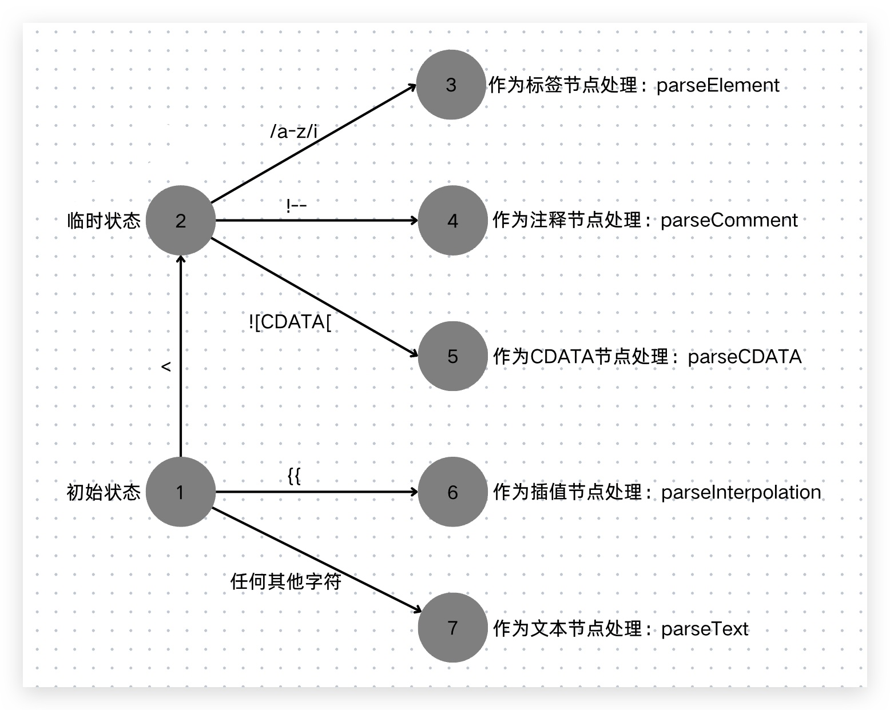
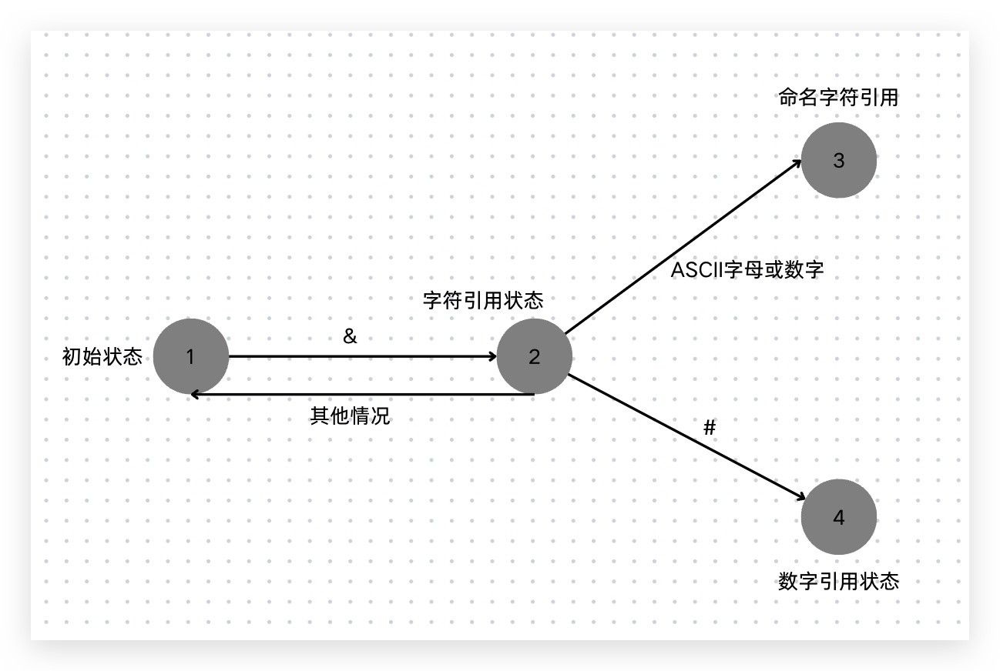

import { Table } from 'antd'
export const dataSource = [{key: 0, name0: 'DATA', name1: '能', name2: '是'}
    , {key: 1, name0: 'RCDATA', name1: '否', name2: '是'}
    , {key: 2, name0: 'RAWTEXT', name1: '否', name2: '否'}
    , {key: 3, name0: 'CDATA', name1: '否', name2: '否'}]
export const columns = [{title: '模式', dataIndex: 'name0'}
    , {title: '能否解析标签', dataIndex: 'name1'}
    , {title: '能否解析HTML实体', dataIndex: 'name2'}]
export const pagination = false

## Before
上一篇我们介绍了<a target="_blank" href="/blog/vue-compiler">vue的编译器</a>，
在其中初步讨论了解析器parser，它的作用是将模板字符串转化为模板AST。  
要实现一个完整的HTML解析器远比想象的要复杂的多，本篇就来详细介绍一下解析器的实现。

## 文本模式
解析器在解析文本过程中会进入一些特殊状态，在不同的特殊状态下，解析器对文本的解析行为会有所不同。  
解析器的初始模式是DATA模式，当解析器遇到一些特殊标签时，会切换模式，这些特殊标签如下：  
RCDATA模式：\<textArea>、\<title>  
RAWTEXT模式： \<style>、\<noframes>、\<iframe>、\<noscript>等  
CDATA模式：\<![CDATA\[  
上一篇实现的解析器就是在默认的DATA模式下，它遇到 \< 字符，会进入标签开始状态，也就是说该模式下，解析器能够解析标签元素。  
另外，DATA模式下当解析器遇到字符 & ，会切换到字符引用状态，能处理HTML字符实体。  
而不同状态下对标签元素和HTML字符实体的解析能力不同：

<Table dataSource={dataSource} columns={columns} pagination={pagination}/>

举个例子：textArea标签会让解析器进入RCDATA模式，这个模式下遇到字符 \< ，会将其当做文本字符处理，所以如下代码并不会生成div标签，只会展示\<div>asdf\</div>文本。
```html
<textArea>
    <div>asdf</div>
</textArea>
```
我们定义一个状态表来表示上述模式:
```js
const TextModes = {
    DATA: 'DATA',
    RCDATA: 'RCDATA',
    RAWTEXT: 'RAWTEXT',
    CDATA: 'CDATA'
}
```

## 递归下降
<a target="_blank" href="/blog/vue-compiler">上一篇</a>中实现编译器的方案是先对模板内容进行标记，得到Token列表，
然后遍历列表来构建模板AST，但其实鉴于模板和模板AST都是相同的树形结构，这两个过程可以同时进行。  
我们使用递归下降算法来实现解析器：

```js
function parse(str) {
    const context = {
        source: str,
        mode: TextModes.DATA
    }
    const nodes = parseChildren(context, [])
    return {
        type: 'Root',
        children: nodes
    }
}
```
定义上下文对象context用来维护解析的字符串以及文本模式，调用parseChildren来创建根节点Root的子节点。  
而这个核心方法parseChildren会被递归地调用来消费模板内容，返回解析后得到的子节点。  
它的第二个参数是由父代节点构成的节点栈，来维护层级结构，初始为空数组。  
parseChildren本质上也是一种状态机，它有多少种状态取决于子节点的类型数量，我们讨论以下几种：
1. 标签节点：\<div>
2. 文本插值节点：\{\{ val }}
3. 普通文本节点
4. 注释节点：\<!-->
5. CDATA节点：\<

根据上图我们就可以来实现parseChildren方法。

```js
function parseChildren(context, ancestors) {
    let nodes = []
    const {source, mode} = context
    while(!isEnd(context, ancestors)) {
        let node
        if (mode === TextModes.DATA || mode === TextModes.RCDATA) {
            // 只有DATA模式支持标签解析
            if (mode === TextModes.DATA && source[0] === '<') {
                if (source[1] === '!') {
                    if (source.startsWith('<!--')) {
                        node = parseComment(context, ancestors)
                    } else if (source.startsWith('<![CDATA[')) {
                        node = parseCDATA(context, ancestors)
                    }
                } else if (source[1] === '/') {
                    // 抛出错误
                    console.error('无效的结束标签')
                } else if (/[a-z]/i.test(source[1])) {
                    node = parseElement(context, ancestors)
                }
            } else if (source.startsWith('{{')) {
                node = parseInterpolation(context, ancestors)
            }
        }
        if (!node) {
            node = parseText(context)
        }
        nodes.push(node)
    }
    return nodes
}
```

只有DATA和RCDATA模式下支持文本插值节点，只有DATA模式下支持标签节点，其它模式均作为文本处理。  
上面这段代码就是对整个状态迁移过程的描述。  
接下来我们以下面这段模板代码为例，来理解一下整个递归下降的过程。
```js
const template = `<div>
    <p>text</p>
    <p>text2</p>
</div>`
```
这边还有一点需要注意的，我们在解析模板的时候不能忽视掉空白字符，包括换行符(\\n)、回车符(\\r)、空格(' ')、制表符(\\t)以及换页符(\\f)。  
以下我们使用+来替代换行符，-来替代空格：
```js
const template = `<div>+--<p>text</p>+--<p>text2</p>+</div>`
```
我们以这段模版为输入来执行解析过程。

执行parseChildren开启一个状态机，解析器一开始处于DATA模式，遇到第一个字符 \< ，且第二个字符能够匹配正则\/\[a-z]\/i，于是执行parseElement函数。  
parseElement函数主要做三件事情：解析开始标签、解析子节点、解析结束标签，用伪代码表示如下：
```js
function parseComment(context, ancestors) {
    const element = parseTag(context)
    // 递归调用parseChildren解析子节点
    element.children = parseChildren(context, ancestors)
    parseEndTag(context)
    return element
}
```
parseTag用于解析开始标签，包括开始标签上的属性和指令，它执行完毕后会消费字符串中的\<div>，剩余模板内容变为：
```js
const template = `+--<p>text</p>+--<p>text2</p>+</div>`
```
递归地调用parseChildren来解析子节点，在这个过程中parseChildren函数会消费字符串: +--\<p>text\<\/p>+--\<p>text2\<\/p>+，剩余模板内容变为：
```js
const template = `</div>`
```
parseEndTag用于解析结束标签，消费剩余模板内容即可。  
这样上述模板就处理完了，状态机停止运行，但是要注意到为了处理子节点，我们递归的调用了parseChildren函数，这意味着一个新的状态机开始运行，我们称之为“状态机2”，
它处理的模板内容为：
```js
const template = `+--<p>text</p>+--<p>text2</p>+`
```
遇到的第一个字符是换行符(我们这边用+表示了)，于是调用parseText解析文本节点，一直到字符 \< 之前，都视作文本节点的内容，
也就是说parseText会消费模板内容+--，产生一个文本节点，在parseText函数执行完成后，剩余的模板内容变为：
```js
const template = `<p>text</p>+--<p>text2</p>+`
```
接着parseChildren函数继续执行，读到字符 \< 于是执行parseElement函数，这一步跟上面的parseElement函数执行一样，这次会消费掉模板内容：\<p>text\<\/p>，
再调用parseText函数消费+--，再调用parseElement函数消费掉\<p>text2\<\/p>，再调用parseText函数消费+，至此，模板解析完毕，“状态机2”停止运行。  
那么很显然在“状态机2”运行期间，我们两次调用parseElement函数，在parseElement函数内部调用parseChildren函数处理子节点，这就意味着又开启了两个新的状态机。  
随着标签嵌套层次的增加，新的状态机会随着parseChildren函数呗递归调用而不断创建，这是“递归”。  
上级parseChildren函数调用用于构造上级模板AST节点，而被递归调用的下级parseChildren函数用于构造下级模板AST节点，最终构造出一颗树形结构的模板AST，这是“下降”。  
所以称之为递归下降算法。

## 状态机的开始与停止
我们调用parseChildren就会开启一个状态机，那么状态机合适停止呢？也就是上面代码中的while循环何时结束呢？  
当解析器遇到开始标签，会将该标签压入父级节点栈，也就是parseChildren的第二个参数，同时开启一个新的状态机。
当解析器遇到结束标签，并且父级节点栈中存在于该标签同名的标签，则停止当前正在运行的状态机，同时弹出当前父级节点栈栈顶元素。所以我们可以写出isEnd函数的代码：
```js
function isEnd(context, ancestors) {
    if (!context.source) return true
    const parent = ancestors[ancestors.length - 1]
    if (parent && context.source.startsWith(`</${parent.tag}>`)) {
        return true
    }
}
```
上述代码中我们取得父级节点栈栈顶节点去匹配结束标签，这样可行，但是会有瑕疵，比如遇到如下模板：
```html
<div><span></div></span>
```
这是一段有问题的模板，以我们当前的实现来解析：
“状态机1”遇到\<div>，调用parseElement开启“状态机2”，“状态机2”遇到\<span>调用parseElement开启“状态机3”，
“状态机3”遇到\<\div>结束标签，由于此时栈顶节点是\<p>，所以会抛出错误“无效的结束标签”。  
然而有一种更加合理的解释，就是\<div>\<span>\<\/div>中的span标签缺少了闭合标签。要实现这种解释，我们就需要调整isEnd函数的逻辑，
只要父级节点栈中存在与当前结束标签同名的节点，就停止状态机。
```js
function isEnd(context, ancestors) {
    if (!context.source) return true
    for (let i = 0; i < ancestors.length; i++) {
        if (context.source.startsWith(`</${ancestors[i].tag}>`)) {
            return true
        }  
    }
}
```
这样当“状态机3”遇到\<\div>结束标签，因为栈中有div节点，则停止状态机3，
而“状态机2”在调用parseElement解析函数时，发现\<span>缺少闭合标签，则抛出错误“span 缺少闭合标签”。

## 解析标签
了解了整个解析过程，下面我们来看标签节点的解析，也就是parseElement函数的实现。  
因为开始标签和结束标签格式非常相似，我们统一使用parseTag函数进行解析，并通过第二个参数来指定具体的处理类型。  
为了实现对模板内容的消费，我们先增加两个工具函数，一个用来消费模板，更新模板内容，另一个匹配空白字符来进行消费。
```js
function parse(str) {
    const context = {
        advancedBy(num) {
            context.source = context.source.slice(num)
        },
        advanceSpaces() {
            const match = /^[\t\r\f\n ]+/.exec(context.source)
            context.advancedBy(match[0].length)
        }
    }
    ...
}
```
有了这两个工具函数，我们就可以来实现parseTag函数。
```js
const startTagReg = /^<([a-z][^\r\f\n\t />]*)/i
const endTagReg = /^<\/([a-z][^\r\f\n\t />]*)/i
function parseTag(context, type = 'start') {
    const {advancedBy, advanceSpaces} = context
    const match = type === 'start'
        ? startTagReg.exec(context.source)
        : endTagReg.exec(context.source)
    const tag = match[1]
    advancedBy(match[0].length)
    advanceSpaces()
    const isSelfClosing = context.source.startsWith('/>') // 是否自闭和
    advancedBy(isSelfClosing ? 2: 1)
    return {
        type: 'Element',
        tag,
        props: [],
        children: [],
        isSelfClosing
    }
}
```
两个正则表达式分别用来匹配开始标签和结束标签，match数组的第二个元素就是标签名，第一个元素是\<\[标签名]。  
我们消费第一个元素的长度，然后消费其后所有的空白符。  
接着判断是否是自闭和标签，如果是则消费/>，否则就消费>。  
最后返回一个标签节点，parseElement函数根据parseTag返回的标签节点类型来完成文本模式的切换，切换规则在开篇的文本模式中介绍过。  
```js
function parseElement(context, ancestors) {
    const element = parseTag(context)
    if (element.isSelfClosing) {
        return element
    }
    const {tag} = element
    if (tag === 'title' || tag === 'textArea') {
        context.mode = TextModes.RCDATA
    } else if (/style|noframes|iframes|xmp|noembed|noscript/.test(tag)) {
        context.mode = TextModes.RAWTEXT
    } else {
        context.mode = TextModes.DATA
    }
    ancestors.push(element)
    element.children = parseChildren(context, ancestors)
    ancestors.pop()
    if (context.source.startsWith('</')) {
        parseTag(context, 'end')
    } else {
        console.error(`${element.tag} 标签缺少闭合标签`)
    }
    return element
}
```
完成模式切换后，将标签节点push到父级节点栈中，然后递归调用parseChildren，将其生成的元素赋值给当前元素的children属性，再将父级节点栈顶元素弹出。  
接着判断模板内容是否以\</开头，是则匹配结束标签，不是则抛出“缺少闭合标签”的错误，最后将生成好的标签节点返回。  
至此标签节点解析就完成了，当然目前忽略了节点的属性和指令，我们下一节来完善。

## 解析属性
parseTag函数会消费整个开始标签，所以它需要有能力来处理开始标签中的属性与指令，例如如下代码：
```html
<div id="foo" v-show="display"/>
```
上面模板中存在一个id属性和一个v-show指令，我们在parseTag函数中增加一个parseAttributes解析函数，来处理属性和指令。  
显然我们需要等消费完“\<div ”这一部分后来执行parseAttributes，所以它处理的内容是 id="foo" v-show="display"/>，
不断消费这部分内容，直到遇到标签的结束部分，也就是 > 或者 /> 为止。

parseAttributes解析函数消费模板内容其实就是在不断解析属性名、等号、属性值的过程，所以我们需要解析属性名称和属性值的两个正则。
```js
const attributeNameReg = /^[^\r\f\n\t />][^\r\f\n\t />=]+/
const attributeValueReg = /^[^\r\f\n\t >]+/
```
属性名称的正则就是匹配以非空白字符、非/、非>开头的，以非空白字符非/、非>、非=结尾的这部分内容。  
而属性值，如果没有被引号包裹，就是匹配非空白字符、非>的这部分内容。如果被引号包裹，那就是两个引号之间的这部分内容，可能是单引号或者双引号。  
整个解析的过程中需要注意空白字符的消费，等号前后，属性之间都可能会有空白字符。

具体代码可以看<a target="_blank" href="https://github.com/yyycc/vue-demo/blob/main/parser/parser.js">parser.js</a>。

## 解析文本
讨论完了标签，我们来看文本的解析，以如下代码为例：
```js
const template = `<div>Text</div>`
```
经过上面的分析，我们可以知道，当通过parseElement中的parseTag处理完开始标签部分后，会调用parseChildren来开启新的状态机，处理后续模板内容。  
我们来回顾一下状态迁移过程：

当前处于初始状态，读取到的第一个字符是T，调用parseText处理文本内容。  
parseText的实现也非常简单，就是读取全部的文本，返回文本节点。全部的文本也就是从第一个字符开始直到遇到插值符\{\{，或者 \< 。
```js
function parseText(context) {
    const {advancedBy, advanceSpaces} = context
    let endIndex = context.source.length
    let ltIndex = context.source.indexOf('<')
    const delimiterIndex = context.source.indexOf('{{')
    if (ltIndex > -1) {
        endIndex = Math.min(endIndex, ltIndex)
    }
    if (delimiterIndex > -1) {
        endIndex = Math.min(endIndex, delimiterIndex)
    }
    const content = context.source.slice(0, endIndex)
    advancedBy(content.length)
    return {
        type: 'Text',
        content // 待解码
    }
}
```
文本节点的解析非常简单，复杂点在于对解析后的文本内容进行HTML实体的解码工作。

## 解析HTML实体
HTML实体是一段以字符&开始的文本，它用来描述HTML中的保留字符和一些难以通过普通键盘输入的字符，以及一些不可见的字符。  
比如，在HTML中字符 \< 具有特殊的含义，如果希望以普通文本出现，就需要通过实体来表达：
```html
<div>A&lt;B</div> // A<B
```
HTML实体有两类，一类叫做命名字符引用，另一类叫做数字字符引用，数字字符引用以&#开头，他们都以;结尾。  
但是在web诞生的初期，因为HTML实体数量比较少，所以允许省略尾分号，但随着实体数量越来越多，出现了包含的情况。
比如&lt和&ltcc都是合法的实体，因此WHATWG明确规定如果不为实体加分号，就会产生解析错误。
但考虑到历史原因，现代浏览器都能够解析早期规范中定义的那些可以省略尾分号的HTML实体。

那么Vue.js模板为什么需要对文本节点进行HTML实体解析呢？  
我们要知道文本节点所包含的HTML实体是不会被浏览器解析的，因为模板中的文本节点最终将通过如el.textContext等文本操作的方式设置到页面。
而这样设置的文本内容是不会经过HTML实体解码的，&lt就会展示为字符串&lt，所以vue需要在解析阶段对文本节点中存在的HTML实体进行解码。  
下面是简化版的状态迁移流程图：



嘉定当前状态机处于初始的DATA模式，当遇到字符 & ，则进入字符引用状态，若下一个字符为ASCII字母或者数字，则进入命名字符引用状态，
如果是字符 # ，则进入数字字符引用状态。  

当状态机进入命名字符引用状态，解析器将开始执行匹配流程进行文本解析，
比如a&ltb就会被解析成a\<b，a&ltcc会被解析为a\<cc，而a\&ltcc;会被解析为a⪦。  
为什么会有这样的解析结果呢，上面我们提到了历史原因导致HTML实体可能不以;结尾，这种情况下，解析规则为“最短原则”，因为&lt要短于&ltcc，
所以最终将&lt作为合法的字符引用来渲染，而cc作为普通字符串渲染。当存在分号的时候，就执行完整匹配，所以a\&ltcc;会被渲染为a⪦。  
此外，如果普通文本作为属性值，会有不同的解析规则：
```html
<a href="foo.com?a=1&lt=2">foo.com?a=1&lt=2</a>
```
文本子节点中的&lt会被解析为 \< ，而属性值中的&lt会原封不动的展示。WHATWG中有完整定义，对于属性值中的字符引用，
如果最后一个匹配的字符不是分号，并且该匹配的字符的下一个字符是等于号、ASCII字符或数字，则该匹配项作为普通文本被解析。  

要实现上述规则，我们设计一张命名字符引用表。
```js
const nameCharacterReferences = {
    "gt": ">",
    "gt;": ">",
    "lt": "<",
    "lt;": "<",
    "ltcc;": "⪦"
}
```
命名字符引用数量非常多，我们取其中一部分展示。以文本 a&ltccbbb 为例进行解析。  
首先字符&前面部分是普通文本，从&开始的部分才需要被解码。  
第一步：计算出命名字符引用表中实体名称的最大长度，观察nameCharacterReferences对象，可以看出名称的最大长度为5。  
第二步：根据最大长度来截取字符串ltccbbb，得到ltccb。  
第三步：用截取后的字符串作为键名，去引用表中查询，由于nameCharacterReferences中不存在键值为ltccb的项，因此不匹配。  
第四部：当发现不匹配时，将最大长度减1，并重新执行第二步，直到找到匹配项，也就是lt。  
所以上述文本会被解码为a\<ccbbb。  

当遇到的第二个字符是 # ，也就进入到数字字符引用状态，如果接下去的字符是x，就是以十六进制表示的数字字符引用，否则就是以十进制表示的数字字符引用。  
数字字符引用的格式为 前缀(&# or &#x)+Unicode码点，提取到码点后只需要调用 String.fromCodePoint 函数就能解码出对应的字符。  
但在真正解码前，还需要对码点的值就行合法性检查，WHATWG规范中，有明确的定义，这里不赘述了。  
了解了整个解析过程，我们就可以在代码层面进行实现。

具体代码可以看<a target="_blank" href="https://github.com/yyycc/vue-demo/blob/main/parser/decodeHTML.js">decodeHTML.js</a>。

有了解码函数，我们就可以在解析文本节点时使用它对文本内容进行解码了。

## 解析插值与注释
解析器遇到文本插值的起始界定符\{\{时，就会调用parseInterpolation来解析插值内容。  
解析插值只需要将文本插值起始界定符与结束界定符之间的内容提取出来，调用HTML解码函数，得到插值表达式。

解析注释的思路也非常相似，当遇到\<!--时，就会调用parseComment来解析注释内容。  
解析注释内容只需要将\<!--与-->之间的内容提取出来即可。

具体代码可以看<a target="_blank" href="https://github.com/yyycc/vue-demo/blob/main/parser/parser.js">parser.js</a>。