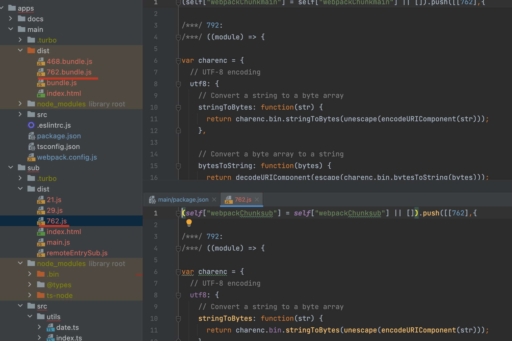

## Before
webpack系列的开篇<a href="/blog/webpack/" target="_blank">webpack5源码之旅</a>中提到学习webpack源码的契机是模块联邦，这是webpack5的一个新特性， 
它可以让多个独立的构建组成一个整体应用，这些构建之间没有依赖相互独立，可以各自开发部署。  
我们就来看看模块联邦到底是如何实现的，同时复习一下之前学习的编译流程。  
示例代码存放在<a target="_blank" href="https://github.com/whatsoeverYY/turborepo">github仓库中</a>。

## 概念
模块联邦有两个新的概念：remote和host。  
remote暴露自身模块供host使用, host消费remote。  
remote和host都是通过webpack打包产生的，也就是一个webpack构建。
一个webpack构建既可以是remote也可以是host，看你如何配置和使用。
下面是host以及remote的配置示例
```js:title=webpack.config.js(host)
module.exports = {
  plugins: [
    new ModuleFederationPlugin({
      name: 'main',
      remotes: {
          'sub': 'sub@http://localhost:8080/remoteEntrySub.js'
      },
      shared: ['lodash', 'md5']
    }),
  ],
}
```
```js:title=webpack.config.js(remote)
module.exports = {
  plugins: [
    new ModuleFederationPlugin({
      name: 'sub',
      filename: 'remoteEntrySub.js',
      exposes: {
        './time': './src/utils/time.ts',
        './date': './src/utils/date.ts'
      },
      shared: ['lodash', 'md5']
    }),
  ],
}
```
ModuleFederationPlugin的参数中有几个属性：remotes、exposes、shared，下面我们从源码中来分析这几个属性的作用。

## ModuleFederationPlugin
```js{5,10,15,20,24-25}:title=lib/container/ModuleFederationPlugin.js
apply(compiler) {
  ...
  compiler.hooks.afterPlugins.tap("ModuleFederationPlugin", () => {
    if (
      options.exposes &&
      (Array.isArray(options.exposes)
        ? options.exposes.length > 0
        : Object.keys(options.exposes).length > 0)
    ) {
      new ContainerPlugin({
        ...
      }).apply(compiler);
    }
    if (
      options.remotes &&
      (Array.isArray(options.remotes)
        ? options.remotes.length > 0
        : Object.keys(options.remotes).length > 0)
    ) {
      new ContainerReferencePlugin({
        ...
      }).apply(compiler);
    }
    if (options.shared) {
      new SharePlugin({
        ...
      }).apply(compiler);
    }
  });
}
```
它监听了afterPlugins钩子，这个钩子在WebpackOptionsApply的process方法中触发(可以看<a href="/blog/webpack-initial/#创建compiler/" target="_black">webpack5 源码之旅 - 初始化#创建Compiler</a>部分)。  
来看回调函数，其中有几个关键词，首先是exposes，如果配置了exposes，就注册ContainerPlugin插件，
如果配置了remotes，就注册ContainerReferencePlugin，如果配置了shared就注册SharePlugin。  
配置exposes就表示暴露自身模块，也就是remote，配置remotes就表示要消费远程模块，也就是host，至于share，它用来实现模块共享。

### ContainerPlugin
来看ContainerPlugin的apply方法:
```js{4}:title=lib/container/ContainerPlugin.js
compiler.hooks.make.tapAsync(PLUGIN_NAME, (compilation, callback) => {
  const dep = new ContainerEntryDependency(name, exposes, shareScope);
  dep.loc = { name };
  compilation.addEntry(
    compilation.options.context,
    dep,
    {
      name,
      filename,
      runtime,
      library
    },
    error => {
      if (error) return callback(error);
      callback();
    }
  );
});
```
ContainerPlugin监听了make钩子，做个简单的回忆，make钩子是webpack整个编译流程第二阶段也就是构建阶段的入口，
我们在介绍<a href="/blog/webpack-make/#entry/" target="_blank">构建</a>阶段时讲到其中一个监听了make钩子的插件是EntryPlugin，
然后从EntryDependency开始递归处理所有依赖，构建模块。  
回到ContainerPlugin，看这里的代码应该会有似曾相识的感觉，创建ContainerEntryDependency，然后同样进入compilation的addEntry方法，后续的流程也是基本一致的。  
最后生成chunk的规则是每个expose生成一个chunk，所以像示例中的exposes，输出文件中就会多两个js文件，[time].js以及[date].js。
```js:title=lib/container/ContainerPlugin.js
compiler.hooks.thisCompilation.tap(
  PLUGIN_NAME,
  (compilation, { normalModuleFactory }) => {
    compilation.dependencyFactories.set(
      ContainerEntryDependency,
      new ContainerEntryModuleFactory()
    );

    compilation.dependencyFactories.set(
      ContainerExposedDependency,
      normalModuleFactory
    );
  }
);

```
ContainerPlugin还监听了thisCompilation，在这里将\*\*Dependencies 和对应的\*\*ModuleFactory放进dependencyFactories中(同样在<a href="/blog/webpack-make/#entry/" target="_blank">构建</a>部分讲到过的哈),
从而可以在后续factorizeModule阶段用获取到的\*\*moduleFactory，然后去创建相应的\*\*Module。

### ContainerReferencePlugin
配置了remotes就会注册ContainerReferencePlugin插件。  
在介绍这个插件之前须得先介绍一下作为host如何使用remote。  
远程模块不属于当前的构建，它的加载是作为一个异步操作被放置在远程模块和入口之间的下一个chunk的加载操作中，所以有chunk加载才能实现使用远程模块的功能。  
那么如何能有加载chunk的过程呢，就是通过import()引入模块。
所以你需要在入口文件中调用import("./sub/fed.js")，在js文件中去调用远程模块，比如要调用示例中的远程模块:
```js:title=src/sub/fed.js
import { getTheDaysOfTheYear } from 'sub/time'
```
来看ContainerReferencePlugin的apply方法:

```js{15}:title=lib/container/ContainerReferencePlugin.js
normalModuleFactory.hooks.factorize.tap(
  "ContainerReferencePlugin",
  data => {
    ...
		for (const [key, config] of remotes) {
		  ...
		}
    if (!data.request.includes("!")) {
      for (const [key, config] of remotes) {
        if (
          data.request.startsWith(`${key}`) &&
          (data.request.length === key.length ||
            data.request.charCodeAt(key.length) === slashCode)
        ) {
          return new RemoteModule(
            data.request,
            config.external.map((external, i) =>
              external.startsWith("internal ")
                ? external.slice(9)
                : `webpack/container/reference/${key}${
                    i ? `/fallback-${i}` : ""
                  }`
            ),
            `.${data.request.slice(key.length)}`,
            config.shareScope
          );
        }
      }
    }
  }
);
```
监听了normalModuleFactory的factorize钩子(通常情况会创建NormalModule)，当处理到对远程模块的调用时，
就会创建RemoteModule，然后和正常的构建阶段一样接着走下面的流程。  

## 生成的chunk
看完了remotes和exposes两个参数做的事情，我们来统计一下host和remote最终分别会打出多少个chunk。  

### remote
remote会配置exposes参数，那么每个exposes(如果是数组就是数组的length，如果是对象就是对象key的数量)都会生成一个对应的js。  
此外还有一个remote文件(remoteEntrySub.js)，它的作用是定义一个全局变量(如示例中，就是sub)，用于加载具体的模块(time、date)。  
入口文件及其递归找到的所有模块会生成一个js。  
一共4个js文件。


### host
host会配置remotes参数，用来找到remote暴露出来的remote文件(remoteEntrySub1.js)。  
首先还是入口文件生成的一个js，然后还有我们前面提到的使用远程模块必须通过import()方式，这种方式会打出一个chunk，
所有一共会生成2个js。


## 生成的文件
接下来我们通过打包出来的js，看看host是如何使用远程模块的。最好在配置里加上下面这一段，不然打出来的代码可读性比较低。
```js:title=webpack.config.js
module.exports = {
  optimization: {
      minimize: false
  }
}
```
通过yarn build，然后在各自的dist文件下通过http-server启动(这部分没有加share)。先来看看效果：
首先是remote，加载了main.js以及remoteEntrySub.js。


再看host，加载了bundle.js(其实就是main.js，只不过在配置文件中主动配置了filename)、remoteEntrySub.js、
468.bundle.js(import()引入模块打的chunk)以及29.js。  


显然remoteEntrySub.js以及29.js都是调用的远程模块。  
接下来从生成的文件内容来分析一下，使用远程模块的功能是如何实现的。

### remote - remoteEntrySub.js
首先来看看这个最显眼的remote文件，很明显它的名字就是我们配置的filename。
```js:title=remoteEntrySub.js
var sub;
(() => {
  ...
  var __webpack_exports__ = {};
  (() => {
    var exports = __webpack_exports__;
    var moduleMap = {
      "./time": () => {
        return __webpack_require__.e(29).then(() => (() => ((__webpack_require__(29)))));
      },
      "./date": () => {
        return __webpack_require__.e(21).then(() => (() => ((__webpack_require__(21)))));
      }
    };
    var get = (module, getScope) => {
      ...
    };
    var init = (shareScope, initScope) => {
      ...
    };
    __webpack_require__.d(exports, {
      get: () => (get),
      init: () => (init)
    });
  })();

  sub1 = __webpack_exports__;
})
```
__webpack_require__.o(obj， prop)的作用是判断prop是否是obj的自有属性(不会去查原型链)。  
__webpack_require__.d(exports, definition)的作用简单来说就是把definition对象的key value放进exports中。  
所以全局变量sub的值就是\{get:..., init: ...}。
```js:title=remoteEntrySub.js
var get = (module, getScope) => {
	__webpack_require__.R = getScope;
	getScope = (
		__webpack_require__.o(moduleMap, module)
			? moduleMap[module]()
			: Promise.resolve().then(() => {
				throw new Error('Module "' + module + '" does not exist in container.');
			})
	);
	__webpack_require__.R = undefined;
	return getScope;
};
```
先来看一下get方法，它的作用就是来获取导出的模块。
```js
sub.get('./time')
```


通过这种方式能返回一个Promise，也就是moduleMap的'./time'方法执行后的返回值。  
__webpack_require__.e(chunkId)的作用遍历__webpack_require__.f的key，执行__webpack_require__.f[key](chunkId, promises)。
```js:title=remoteEntrySub.js
__webpack_require__.f.j = (chunkId, promises) => {
  ...
  var url = __webpack_require__.p + __webpack_require__.u(chunkId);
  ...
 __webpack_require__.l(url, loadingEnded, "chunk-" + chunkId, chunkId);
  ...
};
```
__webpack_require__.l(url, done, key, chunkId)的作用是去请求url。  
当前文件中只有一个j属性，__webpack_require__.f.j，它的作用就是去请求[chunkId].js，所以__webpack_require__.e(418)就是去请求29.js，
29.js的内容就是导出time模块。  
__webpack_require__(moduleId)的作用就是执行moduleId对应的模块(__webpack_modules__[moduleId])，返回module.exports。


### host - bundle.js
我们知道了remote的作用就是创建一个全局变量，里面提供get函数来获取它暴露出的模块，那我们来看host是如何使用的。
```js:title=bundle.js
__webpack_require__.e(/* import() */ 468).then(__webpack_require__.bind(__webpack_require__, 468))
```
首先执行__webpack_require__.e，传入的chunkId是468，上面我们讲过host会生成两个chunk，一个主chunk也就是bundle.js，还有一个通过import()引入模块的chunk，
这个468就是后者，它去调用远程模块提供的方法。  
在bundle.js中__webpack_require__.f的key除了j还有remotes。j的功能就是去下载468.bundle.js，我们来看remotes。

```js:title=bundle.js
...
var handleFunction = (fn, arg1, arg2, d, next, first) => {
	try {
		var promise = fn(arg1, arg2);
		if(promise && promise.then) {
			var p = promise.then((result) => (next(result, d)), onError);
			if(first) promises.push(data.p = p); else return p;
		} else {
			return next(promise, d, first);
		}
	} catch(error) {
		onError(error);
	}
}
var onExternal = (external, _, first) => (external ? handleFunction(__webpack_require__.I, data[0], 0, external, onInitialized, first) : onError());
var onInitialized = (_, external, first) => (handleFunction(external.get, data[1], getScope, 0, onFactory, first));
var onFactory = (factory) => {
	data.p = 1;
	__webpack_require__.m[id] = (module) => {
		module.exports = factory();
	}
};
handleFunction(__webpack_require__, data[2], 0, 0, onExternal, 1);
...
```
这边data是个数组，值为['default', './time', '456'] (这部分的逻辑比较简单，不贴具体代码了)。  
针对data的三个值执行了三次handleFunction:
第一次执行__webpack_require__('456', 0)。它是去执行moduleId对应的模块(__webpack_modules__[moduleId])，这个__webpack_modules__['456']在bundle.js开头进行了定义:
```js:title=bundle.js
var __webpack_modules__ = ({
  456:
  ((module, __unused_webpack_exports, __webpack_require__) => {
    "use strict";
    var __webpack_error__ = new Error();
    module.exports = new Promise((resolve, reject) => {
      if(typeof sub1 !== "undefined") return resolve();
      __webpack_require__.l("http://localhost:8081/remoteEntrySub1.js", (event) => {
        if(typeof sub1 !== "undefined") return resolve();
        var errorType = event && (event.type === 'load' ? 'missing' : event.type);
        var realSrc = event && event.target && event.target.src;
        __webpack_error__.message = 'Loading script failed.\n(' + errorType + ': ' + realSrc + ')';
        __webpack_error__.name = 'ScriptExternalLoadError';
        __webpack_error__.type = errorType;
        __webpack_error__.request = realSrc;
        reject(__webpack_error__);
      }, "sub1");
    }).then(() => (sub1));
  })
});
```
这里就是在请求remoteEntrySub.js，这个module.exports最后就等于sub。  
继续看handleFunction，__webpack_require__('456', 0).then的返回是作为next(第五个入参)的第一个参数，
接下来执行onExternal，它的第一个入参external就是sub。  
第二次执行__webpack_require__.I('default', 0)，它与share相关，在后面share部分介绍。  
第三次执行sub.get('./time', getScope).then的返回() => ((__webpack_require__(29)))。  
最后执行onFactory，它的入参就是上一步的返回值，把它放入__webpack_require__.m[453]中(这个453的逻辑也比较简单，没有在文章中具体说明，是代码中定义的一个值)。

### host - 468.bundle.js
```js:title=468.bundle.js 
...
var sub_time__WEBPACK_IMPORTED_MODULE_0__ = __webpack_require__(453);
...
```
在468.bundle.js中执行__webpack_require__(453)，也就是执行__webpack_require__.m[453]，返回time模块的导出内容。

## share
最后来说一下share，share的作用是共享模块。也就是当本地项目和远程项目都需要用到同一个模块时，我们利用share配置实现共享，
如果模块一致且版本一致，那么就不会加载远程的模块，而是直接使用本地的模块。  
先来看一下效果(上面的代码是不包含share功能的，下面的代码是增加了share功能的，具体增加了md5部分的代码以及配置中的share):  
当我在host以及remote项目中都使用md5，但是没有使用share功能时，host的bundle.js中多了md5的代码；remote的29.js中，多了md5的代码。  
这就导致了md5的代码会被加载两次。


接下来我加上share配置，host的bundle.js中没有md5的代码，remote的29.js中也没有md5的代码。而是各自多打包出了一个chunk，这个chunk就是md5的代码。  



当host使用的远程模块也使用了md5，且版本相同，那么不会去加载远程的726.js，而是直接只用本地的726.bundle.js，这就是模块共享。  
下面我们从代码层面来分析一下。

### SharePlugin
share功能通过consume和provide两个部分来实现。
```js:title=lib/sharing/Shareplugin.js
apply(compiler) {
  new ConsumeSharedPlugin({
    shareScope: this._shareScope,
    consumes: this._consumes
  }).apply(compiler);
  new ProvideSharedPlugin({
    shareScope: this._shareScope,
    provides: this._provides
  }).apply(compiler);
}
```
ConsumeSharedPlugin和ContainerReferencePlugin类似，都是通过监听normalModuleFactory的factory钩子，
当处理到share时(会通过prefix进行判断)，就会创建ConsumeSharedModule。

```js{11}:title=lib/sharing/ProvideSharePlugin.js
compiler.hooks.finishMake.tapPromise("ProvideSharedPlugin", compilation => {
			const resolvedProvideMap = compilationData.get(compilation);
			if (!resolvedProvideMap) return Promise.resolve();
			return Promise.all(
				Array.from(
					resolvedProvideMap,
					([resource, { config, version }]) =>
						new Promise((resolve, reject) => {
							compilation.addInclude(
								compiler.context,
								new ProvideSharedDependency(
									config.shareScope,
									config.shareKey,
									version || false,
									resource,
									config.eager
								),
                ...
							);
						})
				)
			).then(() => {});
		});
```
ProvideSharePlugin监听finishMake钩子，创建ProvideSharedDependency，跟EntryDependency一样走一遍构建流程，
也就是说会多打出一个chunk，这个chunk的内容就是share的模块。在host以及remote都是这套流程。  
也就是说本来这个模块会跟着我的入口文件一起被打包到主chunk中，但是配置了share后，它就会打出一个单独的chunk。

### 生成的代码
```js:title=remoteEntrySub.js
var sub1;
(() => {
  ...
  var __webpack_exports__ = {};
  (() => {
    ...
    var init = (shareScope, initScope) => {
      if (!__webpack_require__.S) return;
      var name = "default"
      var oldScope = __webpack_require__.S[name];
      if(oldScope && oldScope !== shareScope) throw new Error("Container initialization failed as it has already been initialized with a different share scope");
      __webpack_require__.S[name] = shareScope;
      return __webpack_require__.I(name, initScope);
    };
    __webpack_require__.d(exports, {
      get: () => (get),
      init: () => (init)
    });
  })();

  sub1 = __webpack_exports__;
})
```
在全局变量sub中，除了get方法，还有一个init方法，这个方法会把传入的shareScope存入__webpack_require__.S。  
__webpack_require__.S用来存储share模块，存储的时机就是第二次执行handleFunction(上面我们跳过的那一步)，也就是__webpack_require__.I('default', 0)。
__webpack_require__.I('default', 0)的作用就是去加载对应的js文件(726.bundle.js)，并且调用initExternal去执行init方法，把模块传进去。  
init方法执行了__webpack_require__.I(name, initScope)，它在加载对应的js前会判断__webpack_require__.S是否已经存在了相同名称相同版本的模块，
如果存在，就不会再去下载远程的js，如果不存在，再去加载远程的js(726.js)。这就实现了模块共享的效果。  
现实场景中，本地和远程通常都会有vue或者react、axios、lodash等等相同的模块，使用share就能大大降低加载的js文件的大小。

## Reference
[1. Webpack5模块联邦源码探究](https://juejin.cn/post/6919512947245088776)  
[2. Module federation 原理研究](https://blog.towavephone.com/module-federation-principle-research/)
