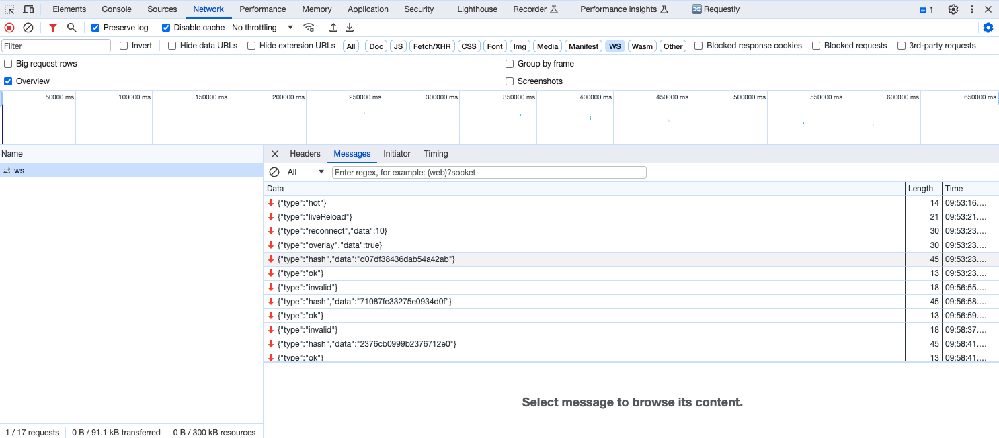

## Before
热更新是开发过程中必不可少的功能，想象一下开发一个表单，好不容易填完了所有信息，提交发现逻辑错误，改完代码发现页面刷新了，要挨个重填一次，
直接原地qushi，而有了热更新，页面的状态就都能保留，极大地提升开发效率。  
用了这么多年热更新，是时候来理一理它的原理了。  

## 环境
搭了一个最简单的能热更新的<a href='https://github.com/yyycc/hmr-demo' target='_blank'>环境</a>。
```js:title=index.js
if (module.hot) {
  module.hot.accept('./hello.js', function () {
    div.innerHTML = hello();
  });
}
```
index.js文件中如果没有这段代码，更新hello.js文件后，页面自动刷新，展示更新后的内容，
如果加上这段代码，更新hello.js文件后，页面不刷新，但是界面的内容会更新。
（可以通过在input框中输入内容来判断是否刷新了页面。）

## 问题
我们先将热更新拆解为几个部分，逐个分析。  
首先是监听文件修改，那么是谁监听，监听到修改后做了什么？  
其次是谁？如何通知到浏览器？  
最后浏览器做了什么？  

先简单解答一下每个问题：  
首先是webpack监听到文件修改后，进行编译，打包出新的文件，得到新的hash。  
其次是webpack-dev-server通过websocket通知浏览器，告诉浏览器新的hash。  
浏览器收到通知后，请求新的文件，拿到新的文件后，更新页面。  

## 文件监听
webpack是如何实现监听文件修改的呢？答案是使用了node的fs.watch方法。  
```js:title=watch.js
const fs = require("fs");

function watchTest() {
  const filepath = '/Users/ever/Documents/learning/env/node/'
	const watcher = fs.watch(filepath);
	watcher.on('change', (type, filename) => {
		console.log('changed', type, filename);
	})
}

watchTest()
```
执行watch.js，当修改了filepath目录下的某个文件后，控制台就会输出对应的文件名称。  

webpack在监听到文件变化后，最终会走到Watching.js中对文件重新进行编译打包，然后输出到内存中。
```js:title=webpack/lib/Watching.js
this.compiler.hooks.watchRun.callAsync(this.compiler, err => {
  if (err) return this._done(err);
  const onCompiled = (err, compilation) => {
    ...
  };
  this.compiler.compile(onCompiled);
});
```
读过webpack源码的小伙伴应该会对这段代码很熟悉吧，在一次正常的编译流程中，会在run钩子中执行Compiler的compile方法，
创建Compilation，开启整个编译过程。忘记了可以看
<a src='https://www.whyyy.net/blog/webpack-initial/' target='_blank'>webpack5源码之旅 - 初始化</a>复习一下。

## 将文件打包到内存中
通过webpack-dev-server启动后，会发现项目目录下并没有生成新的文件，但是访问页面我们能发现它请求到了bundle.js文件，那么这个文件在哪儿呢？  
答案是在内存中。  
webpack-dev-server中使用了webpack-dev-middleware作为一个打包器，它内部使用了memfs将文件放入内存。使用express启动服务器读取内存中的文件。  
下面写了一个简单的例子，执行node代码，访问localhost:4000，就能看到页面，在network中可以看到请求了bundle.js文件。  
```js
const express = require('express')
const app= express()
const fs = require('memfs')

const port = 4000

fs.writeFileSync('/bundle.js', '"use strict";eval("const div = document.createElement(\'div\');div.innerHTML = \'hello\';document.body.appendChild(div);")')

app.get('/', (req, res) => {
	res.send('<!DOCTYPE html><html lang="en"><head><meta charset="UTF-8"><title>Document</title></head><body><div>nice</div><input /><script src="/bundle.js"></script></body></html>')
})
app.get('/bundle.js', (req, res) => {
	const fileRes = fs.readFileSync('/bundle.js', 'utf8');
	res.send(fileRes)
})
app.listen(port, () => {
	console.log('4000 started')
})
```

## 通知浏览器
服务器与浏览器之间通过websocket建立长连接。当重新编译完成，服务端就会发送新的hash给浏览器。  



```js:title=webpack/lib/Watching.js
_done(err, compilation) {
  ...
  this.compiler.hooks.done.callAsync(/** @type {Stats} */ (stats), err => {
    ...
  });
}
```
```js:title=webpack-dev-server/lib/servers/Server.js
this.compiler.hooks.done.tap(
  "webpack-dev-server",
  (stats) => {
    if (this.webSocketServer) {
      this.sendStats(this.webSocketServer.clients, this.getStats(stats));
    }
    this.stats = stats;
  }
);
sendStats(clients, stats, force) {
  ...
  this.currentHash = stats.hash;
  this.sendMessage(clients, "hash", stats.hash);
  ...
    this.sendMessage(clients, "ok");
}
```

## websocket
如何建立websocket连接呢？  
分两部分，服务端和客户端。服务端使用node+ws，客户端使用浏览器提供的WebSocket。  
```js:title=server.js
const Websocket = require('ws');

const implementation = new Websocket.Server({path: '/ws', port: '3000'});

implementation.on('connection', (client) => {
	console.log('connection');
	client.on('message', (msg) => {
		console.log('received', msg);
	})
})
```
执行server.js就能启动ws

```js:title=client.js
const client = new WebSocket('ws://localhost:3000/ws');

client.onopen = () => {
	console.log('open')
	client.send('connected');
}

client.onmessage = (msg) => {
	console.log('msg', msg)
}
```
可以在控制台直接执行client.js中的代码，建立ws连接，发送消息。

## HMR
当收到ok消息后，会调用reloadApp，如果配置了热更新，就会调用 webpack/hot/emitter 将最新 hash 值发送给 webpack
```js:title=webpack-dev-server/client/utils/reloadApp.js
import hotEmitter from "webpack/hot/emitter.js";

function reloadApp(_ref, status) {
  var hot = _ref.hot, liveReload = _ref.liveReload;
  ...
  var currentHash = status.currentHash, previousHash = status.previousHash;
  ...
  var allowToHot = search.indexOf("webpack-dev-server-hot=false") === -1;
  if (hot && allowToHot) {
    log.info("App hot update...");
    hotEmitter.emit("webpackHotUpdate", status.currentHash);
    ...
  }
  ...
}
```

```js:title=webpack/hot/dev-server.js
hotEmitter.on("webpackHotUpdate", function (currentHash) {
  lastHash = currentHash;
  if (!upToDate() && module.hot.status() === "idle") {
    log("info", "[HMR] Checking for updates on the server...");
    check();
  }
});
var check = function check() {
  module.hot
    .check(true)
    .then(function (updatedModules) {
      ...
    })
    .catch(function (err) {
      ...
    });
};
```
调用module.hot.check方法，这部分代码被打包在bundle.js中。 
module是bundle.js中定义的有一个全局变量
```js:title=bundle.js
__webpack_require__.i.push(function (options) {
	var module = options.module;
	...
	module.hot = createModuleHotObject(options.id, module);
});
function createModuleHotObject(moduleId, me) {
  /******/
  var _main = currentChildModule !== moduleId;
  /******/
  var hot = {
      ...
      active: true,
      accept: function(dep, callback, errorHandler) {
        ...
        hot._acceptedDependencies[dep] = callback || function() {}
      },
      check: hotCheck,
      apply: hotApply,
      ...
  };
  ...
  return hot;
}
```
module.hot.check也就是hotCheck方法：
```js:title=bundle.js
function hotCheck(applyOnUpdate) {
  ...
  return setStatus("check")
  .then(__webpack_require__.hmrM)
  .then(function(update) {
      ...
      return setStatus("prepare").then(function() {
            return Promise.all(
              Object.keys(__webpack_require__.hmrC).reduce(function (
              			promises,
              			key
              		) {
              			__webpack_require__.hmrC[key](
              					update.c,
              					update.r,
              					update.m,
              					promises,
              					currentUpdateApplyHandlers,
              					updatedModules
              				);
              			return promises;
              		},
              	[])
          ).then(function() {
              return waitForBlockingPromises(function() {
                  ...
                  return internalApply(applyOnUpdate);
              });
          });
      });
  });
}
__webpack_require__.hmrC.jsonp = function(
  chunkIds,
  removedChunks,
  removedModules,
  promises,
  applyHandlers,
  updatedModulesList,
) {
    applyHandlers.push(applyHandler);
    ...
    chunkIds.forEach(function(chunkId) {
        if (
        __webpack_require__.o(installedChunks, chunkId) &&
        installedChunks[chunkId] !== undefined
        ) {
            promises.push(loadUpdateChunk(chunkId, updatedModulesList));
        }
    });
}
;
```
\_\_webpack_require\_\_.hmrM中fetch到新的\[newHash].hot-update.json文件；
执行__webpack_require__.hmrC.jsonP，传入.json文件中返回的key，通过jsonp方式得到\[key].\[newHash].hot-update.js，并执行。
```js:title=[key].[newHash].hot-update.js
"hello.js": ((__unused_webpack_module, __webpack_exports__, __webpack_require__) => {
  eval("下面部分是eval中转成可执行的代码")
})
__webpack_require__.r(__webpack_exports__);
/* harmony export */
__webpack_require__.d(__webpack_exports__, {
  /* harmony export */
  "default": () => (__WEBPACK_DEFAULT_EXPORT__)
  /* harmony export */
});
const hello = () => {
  return 'hello world nice to meet you-2'
}
/* harmony default export */
const __WEBPACK_DEFAULT_EXPORT__ = (hello);
```
将模块代码更新，下次调用的时候就能调新的代码了

```js:title=bundle.js
function internalApply(options) {
  ...
  var results = currentUpdateApplyHandlers.map(function(handler) {
      return handler(options);
  });
  results.forEach(function(result) {
      if (result.apply) {
          var modules = result.apply(reportError);
          ...
      }
  });
  ...
}
apply: function(reportError) {
    ...
    // call accept handlers
    for (var outdatedModuleId in outdatedDependencies) {
        if (__webpack_require__.o(outdatedDependencies, outdatedModuleId)) {
            var module = __webpack_require__.c[outdatedModuleId];
            if (module) {
                ...
                for (var j = 0; j < moduleOutdatedDependencies.length; j++) {
                    var dependency = moduleOutdatedDependencies[j];
                    var acceptCallback = module.hot._acceptedDependencies[dependency];
                    callbacks.push(acceptCallback);
                }
                for (var k = 0; k < callbacks.length; k++) {
                    /******/
                    try {
                        callbacks[k].call(null, moduleOutdatedDependencies);
                    }
                    ...
                }
            }
        }
    }
    ...
}
``` 
最后执行apply方法，执行module.hot._acceptedDependencies中的回调函数，这个回调函数就是我们在业务代码中定义的回调函数。  

## 业务端配置
上面已经替换为新的模块代码了，但是业务端并不知道，所以需要调用module.hot.accept方法，添加模块更新后的处理函数。  
在业务代码中定义需要热更新的模块以及回调函数：
```js:index.js
if (module.hot) {
  module.hot.accept('./hello.js', function () {
    div.innerHTML = hello();
  });
}
```
./hello.js作为key，回调函数作为value存放在hot._acceptedDependencies中。  
当然开发时不可能每个文件里面都去写module.hot.accept，一般框架都会帮你把这部分代码一起打包到js中。

## 总结
对整个热更新流程做一个简单的总结：  

通过fs.watch监听文件修改，在回调函数中进行再次编译，将新的模块js代码写入内存中，同时生成一个新的hash。  
启动阶段，webpack-dev-server会建立一个ws服务。客户端连接ws服务的代码被一起打包在输出js中，在访问界面后执行(可以在network中查看到)。  
服务端通过ws将新的hash值发送给客户端（浏览器），最后发送一个ok消息，客户端收到ok消息，执行reloadApp方法。  
reloadApp中通过webpack/hot/emitter将新的hash告知webpack，webpack中执行module.hot.check方法，这些也都打包在输出js中。  
执行check方法，fetch到\[hash\].json文件得到一个key，在通过jsonp方式请求\[key\].\[hash\].js并执行。这样modules中的模块就是更新后的代码。  
后续会通过被修改module的key，在module.hot._acceptedDependencies找到回调函数并执行，从而完成对界面的更新。  
而这对key、value是通过module.hot.accept方法进行存储的，一般框架都会把这段代码打包进输出js中，如果没有使用框架，
那么就需要手动在需要热更新的模块中添加这段调用module.hot.accept方法的代码。


## Reference
[1. 简单聊聊前端开发中的热更新原理](https://segmentfault.com/a/1190000018077961)  
[2. 面试官：说说webpack的热更新是如何做到的？原理是什么？](https://vue3js.cn/interview/webpack/HMR.html#%E4%BA%8C%E3%80%81%E5%AE%9E%E7%8E%B0%E5%8E%9F%E7%90%86)  
[3. Webpack HMR 原理解析](https://zhuanlan.zhihu.com/p/30669007)  
[4. 搞懂webpack热更新原理](https://github.com/careteenL/webpack-hmr)  
[5. 4-5 使用自动刷新](https://webpack.wuhaolin.cn/4%E4%BC%98%E5%8C%96/4-5%E4%BD%BF%E7%94%A8%E8%87%AA%E5%8A%A8%E5%88%B7%E6%96%B0.html)  
[6. 基于Node.js实现WebSocket 服务器](https://www.cnblogs.com/peterYong/p/14954937.html)  
[7. 10-Vite 中的 HMR 热更新](https://www.bilibili.com/video/BV1bg411x7Ln/?spm_id_from=333.337.search-card.all.click&vd_source=a0d4c30f37c92adbf6483ef06ed749ba)
[8. Webpack 原理系列十：HMR 原理全解析](https://juejin.cn/post/7021729340945596424)