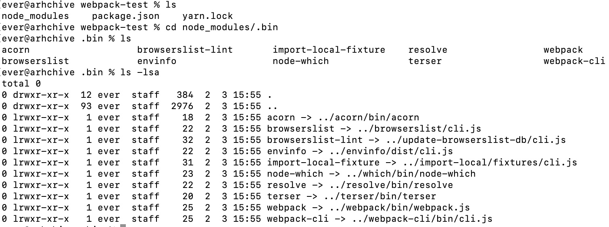

## Before

在使用webpack的很长一段时间里，它对我来说基本是无感的。接触最多的可能就是webpack.config.js，需要某个功能了，了解一下相关配置添加进去。  
它一直以来does such a good job以至于我对它一无所知。  
去年底的时候我接触了一个概念叫做模块联邦，它是webpack5的新特性。很有意思的一个东西，我也写了demo去尝试看看它是如何工作的。  
这也直接导致后来安排前端分享任务的时候，被提供了webpack编译原理这个主题。从此走上了阅读webpack源码的不归路。  
非常艰辛的一段旅程，but totally worth it. 它终于不再是一个黑匣子一般的存在了。  
虽然阅读的过程万分艰难，鉴于它使用了发布订阅模式、各种异步和回调，前n(n>=10)次看的时候就像在走迷宫，不知道从何处来，也不知该往何处去。  
但只要你坚持走下去，总能拨开云雾见青天的。

## webpack

在分析源码之前，先简单介绍一下webpack。

- 它是做什么的
- 使用它的理由是什么
- 如何使用

> webpack is a static module bundler for modern JavaScript applications.

这是官网的一段话，webpack是一个用于现代JavaScript应用程序的一种静态模块打包工具。  
其中有几个关键词：现代、模块和打包。

首先为什么是现代？  
因为古代没有电脑，哈哈。。。  
因为过去只使用Js、HTML和css的应用不需要打包，它们不大而且都能被浏览器读懂，直接放到服务器上就ok了。  
但是现代不同，三剑客不足以走天下了，前端应用程序也越来越大，我们有了各种框架，有sass、less，有ts等等提升开发效率和质量的语言，这些语言没法被浏览器理解，
需要转译成浏览器理解的代码，才能正常运行。此外，我们还有代码压缩、混淆等等优化需求。而这些复杂的事情都可以交由webpack来做。

第二个词是模块，这个词大家应该都很熟悉，现在有了比较成熟的模块化方案，不必把所有变量写到window下，担心命名冲突的问题；不必再引一堆script，担心顺序错误的问题。 
时至今日，主流浏览器已基本全部支持ES6 Module。  
在webpack的世界里，万物皆模块，js、css以及图片等等都会生成**Module对象。

最后一个词打包(bundle)，webpack会从入口开始寻找到所有依赖，打成一个或多个bundle。  
所以webpack工作是需要输入和输出的，你需要告诉它入口(以及一些配置)，他会输出给你一些bundle(通常生成一个dist目录)。

## how to use

最后说一下如何使用webpack(这边介绍的使用不基于任何框架，如果使用一些脚手架搭建，基本就可以忽略webpack了)。  
webpack依赖node，所以先安装node，不同版本的webpack依赖的node版本也不同，比如webpack5就需要node>=10.13.0，这个通常可以会在webpack的package.json文件中写明。  
webpack4开始将webpack-cli从webpack中分离出来，所以我们两个都需要安装一下。

```shell
npm init -y    # 初始化项目，生成package.json文件
yarn add webpack webpack-cli -D
```

生成的package.json如下

```json
{
  "name": "webpack-test",
  "version": "1.0.0",
  "description": "",
  "main": "index.js",
  "scripts": {
    "test": "echo \"Error: no test specified\" && exit 1"
  },
  "keywords": [],
  "author": "",
  "license": "ISC",
  "devDependencies": {
    "webpack": "^5.75.0",
    "webpack-cli": "^5.0.1"
  }
}
```

安装好之后可以在./node_module/.bin目录下看到webpack和webpack-cli两个指令。  
当我们安装的包在package.json中定义了bin字段，那么安装时，npm会在./node_module/.bin目录下创建软连接指向定义的文件。

所以我们可以通过执行下面的指令进行打包

```shell
./node_modules/.bin/webpack
```

会有报错，提示你创建./src/index.js，因为webpack打包需要一个入口文件，如果不手动配置，默认的入口文件就是./src/index.js。  
加上之后再打包就能看到生成的dist目录了。

## summary

webpack简介就写到这边，后面就正式开始源码阅读了。 webpack版本是5.75.0。  
[1. webpack5源码之旅 - webpack-cli](/blog/webpack-cli)  
[1. webpack5源码之旅 - 先导](/blog/webpack-before)  

## Reference

[1. webpack官网](https://webpack.js.org/)  