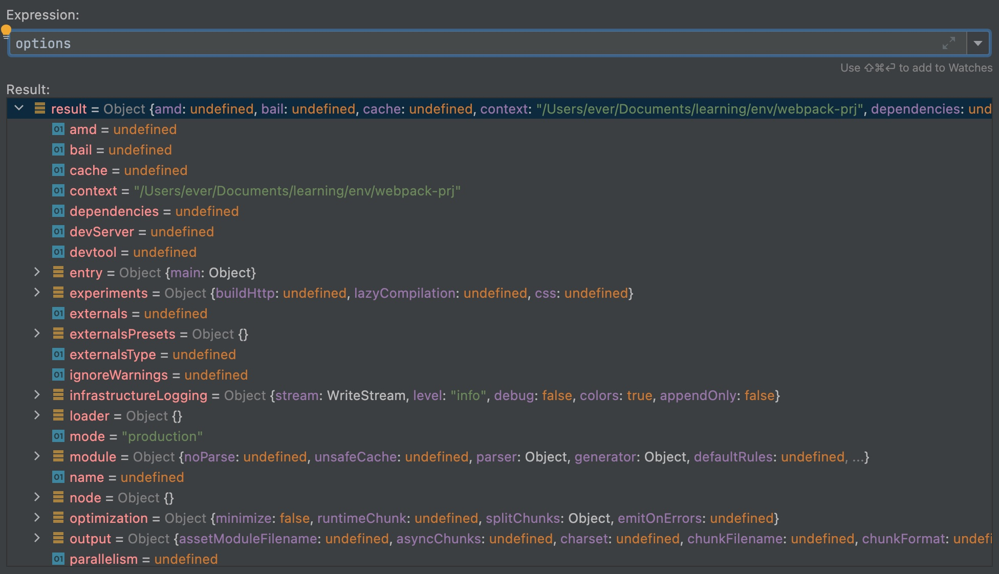
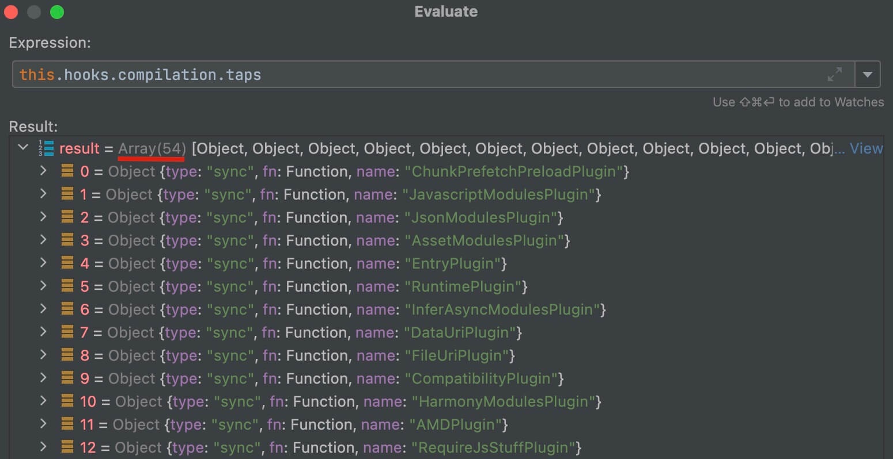

import { Table } from 'antd'
export const columns = [{title:'hook挂载对象',dataIndex:'name0'},{title:'hook',dataIndex:'name1'},{title:'hook执行文件',dataIndex:'name2'},{title:'注册该hook的插件(举例)',dataIndex:'name3'},{title:'钩子类型(默认SyncHook)',dataIndex:'name4'}]
export const dataSource = [{key:0,name0:'compiler',name1:'environment',name2:'webpack.js',name3:'',name4:''},{key:1,name0:'compiler',name1:'afterEnvironment',name2:'webpack.js',name3:'WatchIgnorePlugin',name4:''},{key:2,name0:'compiler',name1:'entryOption',name2:'WebpackOptionsApply.js',name3:'EntryOptionPlugin',name4:'SyncBailHook'},{key:3,name0:'compiler',name1:'afterPlugins',name2:'WebpackOptionsApply.js',name3:'ModuleFederationPlugin',name4:''},{key:4,name0:'compiler',name1:'afterResolvers',name2:'WebpackOptionsApply.js',name3:'',name4:''},{key:5,name0:'compiler',name1:'initialize',name2:'webpack.js',name3:'',name4:''},{key:6,name0:'compiler',name1:'beforeRun',name2:'Compiler.js',name3:'NodeEnvironmentPlugin',name4:'AsyncSeriesHook'},{key:7,name0:'compiler',name1:'run',name2:'Compiler.js',name3:'',name4:'AsyncSeriesHook'},{key:8,name0:'compiler',name1:'normalModuleFactory',name2:'Compiler.js',name3:'IgnorePlugin',name4:''},{key:9,name0:'compiler',name1:'contextModuleFactory',name2:'Compiler.js',name3:'IgnorePlugin',name4:''},
{key:10,name0:'创建normalModuleFactory和contextModuleFactory',colSpan:4},{key:12,name0:'compiler',name1:'beforeCompile',name2:'Compiler.js',name3:'DllReferencePlugin',name4:'AsyncSeriesHook'},{key:13,name0:'compiler',name1:'compile',name2:'Compiler.js',name3:'DllReferencePlugin',name4:''},{key:14,name0:'创建Compilation'},{key:15,name0:'compiler',name1:'thisCompilation',name2:'Compiler.js',name3:'...',name4:''},{key:16,name0:'compiler',name1:'compilation',name2:'Compiler.js',name3:'...EntryPlugin',name4:''},{key:17,name0:'compiler',name1:'make',name2:'Compiler.js',name3:'EntryPlugin',name4:'AsyncParallelHook'}]
export const pagination = false

## Before

上一节<a href="/blog/webpack-before" target="_blank">webpack5源码之旅 - 先导</a>介绍了一些编译过程会遇到的概念，例如compiler、compilation、plugin等等，
那么这一节我们就从compiler开始看看这些词到底扮演了什么样的角色。

## 创建Compiler 

```js:title=lib/webpack.js
(options, callback) => {
  const create = () => {
    let compiler;
    if (Array.isArray(options)) {
    } else {
      const webpackOptions = /** @type {WebpackOptions} */ (options);
      /** @type {Compiler} */
      compiler = createCompiler(webpackOptions);
    }
    return { compiler, watch, watchOptions };
  };
  if (callback) {
    try {
      const { compiler, watch, watchOptions } = create();
      ...
  }
}
```
上回说到require('webpack')最终得到的是(options, callback) => {}这个方法，那么现在我们就来执行这个方法(上述代码只保留了主线部分)。  
首先就是传入options参数去创建Compiler：
```js:title=lib/webpack.js
const createCompiler = rawOptions => {
	const options = getNormalizedWebpackOptions(rawOptions);
	applyWebpackOptionsBaseDefaults(options);
	const compiler = new Compiler(options.context, options);
	new NodeEnvironmentPlugin({
		infrastructureLogging: options.infrastructureLogging
	}).apply(compiler);
	if (Array.isArray(options.plugins)) {
		for (const plugin of options.plugins) {
			if (typeof plugin === "function") {
				plugin.call(compiler, compiler);
			} else {
				plugin.apply(compiler);
			}
		}
	}
	applyWebpackOptionsDefaults(options);
	compiler.hooks.environment.call();
	compiler.hooks.afterEnvironment.call();
	new WebpackOptionsApply().process(options, compiler);
	compiler.hooks.initialize.call();
	return compiler;
};
```
传入的rawOptions就是经过cli处理后的参数，首先通过getNormalizedWebpackOptions以及applyWebpackOptionsBaseDefaults方法，给没有设置的配置属性加上默认值，
处理后的options会多出来很多很多的属性，这些属性都是可以在配置文件里面配置的。 



```js
this.hooks = Object.freeze({
  /** @type {SyncHook<[]>} */
  initialize: new SyncHook([]),

  /** @type {SyncBailHook<[Compilation], boolean>} */
  shouldEmit: new SyncBailHook(["compilation"]),
  ...
})
```
接着就是创建compiler，这边我们先简单看一下Compiler的构造函数，里面有一个this.hooks对象，初始化了各种钩子，这些钩子会在不同生命周期被触发。  
有了compiler对象就可以往上面挂载插件了。  
首先挂载了NodeEnvironmentPlugin，然后遍历配置中的plugins，执行每个plugin的apply方法，这些apply方法都是往compiler.hooks.**上挂载，等钩子被触发时，就去实现对应功能。    
接下来的applyWebpackOptionsDefaults方法还是给配置加默认值的。
然后执行environment和afterEnvironment两个钩子，这时所有监听了这两个钩子的插件都会触发对应的事件。  
WebpackOptionsApply的process方法是根据options中的配置去注册对应的插件(webpack内置的插件)。  
最后执行initialize钩子。

## 创建Compilation

createCompiler结束后，执行compiler.run():
```js:title=lib/Compiler.js
run(callback) {
  ...
  const run = () => {
    this.hooks.beforeRun.callAsync(this, err => {
      if (err) return finalCallback(err);

      this.hooks.run.callAsync(this, err => {
        if (err) return finalCallback(err);

        this.readRecords(err => {
          if (err) return finalCallback(err);

          this.compile(onCompiled);
        });
      });
    });
  };
  ...
  run()
}
```
在run方法中，首先执行beforeRun钩子，前面createCompiler中注册的NodeEnvironmentPlugin就监听了这个钩子，这时就会走进对应的回调方法中。
```js:title=lib/node/NodeEnvironmentPlugin.js
compiler.hooks.beforeRun.tap("NodeEnvironmentPlugin", compiler => {
  if (compiler.inputFileSystem === inputFileSystem) {
    compiler.fsStartTime = Date.now();
    inputFileSystem.purge();
  }
});
```
等所有注册事件执行完就会进入beforeRun.callAsync的第二个参数callback方法中，执行run钩子，
最后执行this.compile(它传入的回调函数onCompiled会在最终的seal阶段执行)：
```js:title=lib/Compiler.js
compile(callback) {
  const params = this.newCompilationParams();
  this.hooks.beforeCompile.callAsync(params, err => {
    ...
    this.hooks.compile.call(params);
    const compilation = this.newCompilation(params);
    ...
    this.hooks.make.callAsync(compilation, err => {
      ...
    });
  });
}
```
compile方法首先生成params，这是后面创建Compilation所需的参数。  
```js:title=lib/Compiler.js
newCompilationParams() {
  const params = {
    normalModuleFactory: this.createNormalModuleFactory(),
    contextModuleFactory: this.createContextModuleFactory()
  };
  return params;
}
```
params中有两个属性normalModuleFactory和contextModuleFactory，一个用以生成normalModule，另一个用以生成contextModule。  
一般的模块都是normalModule，contextModule是针对通过require.context引入的模块的。  
执行beforeCompile钩子，接着传入params执行createCompilation方法。
```js:title=lib/Compiler.js
createCompilation(params) {
  this._cleanupLastCompilation();
  return (this._lastCompilation = new Compilation(this, params));
}

newCompilation(params) {
  const compilation = this.createCompilation(params);
  compilation.name = this.name;
  compilation.records = this.records;
  this.hooks.thisCompilation.call(compilation, params);
  this.hooks.compilation.call(compilation, params);
  return compilation;
}
```
首先执行了thisCompilation和compilation两个钩子，监听这两个钩子的插件非常之多，都是内置插件，用以实现各种功能。



接着就是执行new Compilation，我们也先去简单看一下Compilation的构造函数，同Compiler相似，它也有this.hooks对象，里面初始化了很多钩子。  
还有几个AsyncQueue(webpack5新增内容)，这用在后面的构建阶段，我们先简单看一下，留个印象。  

### AsyncQueue
创建了5个AsyncQueue，分别是factorizeQueue、addModuleQueue、buildQueue、processDependenciesQueue以及rebuildQueue，分别用于
解析模块生成对应Module，添加module到ModuleGraph中，编译模块得到模块的依赖，处理模块内的依赖以及重构建。  
其中前4个会在构建阶段递归执行，直到处理完所有的依赖。

创建好Compilation，一切准备工作都完成了，接下去就是执行make钩子，而make钩子也标志着编译正式进入第二阶段 -- 构建，从entry开始寻找依赖构建模块。  

## 钩子
最后总结一下初始化阶段执行的钩子
<Table dataSource={dataSource} columns={columns} pagination={pagination} />

## Reference
[1. webpack5 源码详解 - 初始化](https://github.com/Hazlank/blog/issues/16)
