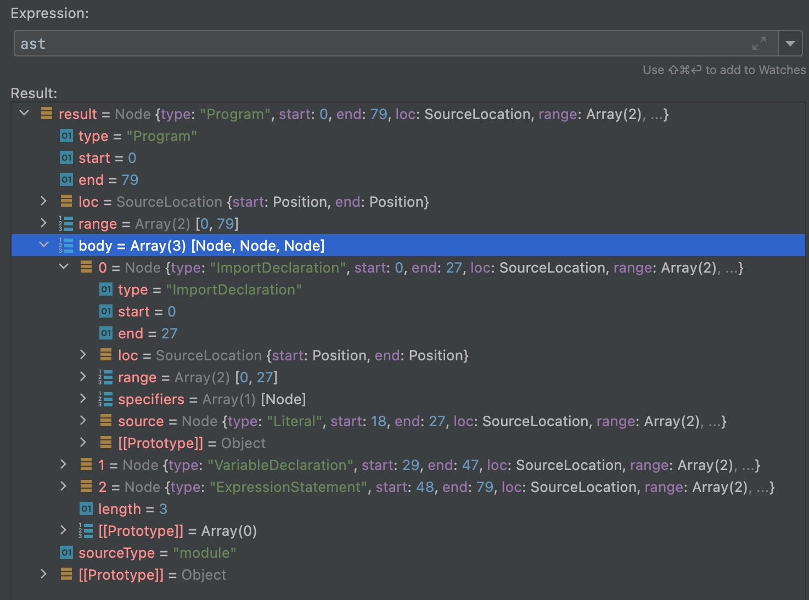

## Before
上一节<a href="/blog/webpack-initial/" target="_blank">webpack5 源码之旅 - 初始化</a>中介绍了webpack编译的第一部分初始化阶段，
这个部分创建了compiler、compilation、NormalModuleFactory，将插件注册到了生命周期的各个节点中，为下一阶段做好了准备工作。  
那么这一节我们就从make钩子开始看看整个构建阶段都做了什么。

## Entry
上一节最后的表格中记录了监听make的有EntryPlugin。
```js:title=lib/Compiler.js
this.hooks.make.callAsync(compilation, err => {```})
```

```js:title=lib/EntryPlugin.js
const { entry, options, context } = this;
const dep = EntryPlugin.createDependency(entry, options);

compiler.hooks.make.tapAsync("EntryPlugin", (compilation, callback) => {
  compilation.addEntry(context, dep, options, err => {
    callback(err);
  });
});
```
在注册make钩子的回调函数中调用了compilation的addEntry方法处理入口模块(也就是我们配置的entry，默认是src下的index.js文件)。  
其中一个参数dep，是全过程的第一个依赖也就是入口依赖EntryDependency，其中记录了文件地址等信息，它的type为entry，后续还会有其它类型的依赖。

接下来我们就跟着addEntry方法进入到compilation中:   
addEntry中调用_addEntryItem方法，_addEntryItem中执行addEntry钩子，然后调用addModuleTree。

```js:title=lib/Compilation.js
addModuleTree({ context, dependency, contextInfo }, callback) {
  ...
  const Dep = /** @type {DepConstructor} */ (dependency.constructor);
  const moduleFactory = this.dependencyFactories.get(Dep);
  ...

  this.handleModuleCreation(
    {
      factory: moduleFactory,
      dependencies: [dependency],
      originModule: null,
      contextInfo,
      context
    },
    (err, result) => {
    ...
    }
  );
}
```
this.dependencyFactories中存储了各种类型的Dependency(key)对应的ModuleFactory(value)，比如EntryDependency对应的就是NormalModuleFactory，  
而像AMDRequireContextDependency对应的就是ContextModuleFactory。  
这些关系都是各种插件在compilation以及thisCompilation钩子执行是注入的，比如EntryPlugin:
```js:title=lib/EntryPlugin.js
compiler.hooks.compilation.tap(
  "EntryPlugin",
  (compilation, { normalModuleFactory }) => {
    compilation.dependencyFactories.set(
      EntryDependency,
      normalModuleFactory
    );
  }
);
```
有了factory和dependency，就可以创建module了。

## Module

从handleModuleCreation方法正式开始模块处理，第一次执行这个方法是从Entry(EntryDependency)过来的，后续每个模块找到的每个依赖(**Dependency)都会再次进入到这个方法。  
```js{15,27}:title=lib/Compilation.js
handleModuleCreation(
  {
    factory,
    dependencies,
    originModule,
    contextInfo,
    context,
    recursive = true,
    connectOrigin = recursive
  },
  callback
) {
  const moduleGraph = this.moduleGraph;
  const currentProfile = this.profile ? new ModuleProfile() : undefined;
  this.factorizeModule(
    {
      currentProfile,
      factory,
      dependencies,
      factoryResult: true,
      originModule,
      contextInfo,
      context
    },
    (err, factoryResult) => {
      ...
      this.addModule(newModule, (err, module) => {...
    }
  );
}
```
moduleGraph用于保存依赖，模块之间的引用信息等，用以后续的分析。

### factorizeModule
执行factorizeModule:
```js:title=lib/Compilation.js
this.factorizeQueue = new AsyncQueue({
  name: "factorize",
  parent: this.addModuleQueue,
  processor: this._factorizeModule.bind(this)
});

Compilation.prototype.factorizeModule = (
	function (options, callback) {
		this.factorizeQueue.add(options, callback);
	}
);
```
其实就是执行this.factorizeQueue.add，factorizeQueue是一个AsyncQueue，
在<a href="/blog/webpack-initial/#asyncqueue/" target="_blank">初始化 - 创建compilation - asyncqueue</a>部分简单介绍过，
构建阶段会用到factorizeQueue、addModuleQueue、buildQueue、processDependenciesQueue4个AsyncQueue，
它们的作用分别是解析生成对应Module，添加module到ModuleGraph中，编译模块得到模块的依赖，处理模块内的依赖。  
执行AsyncQueue的add方法(this.factorizeQueue.add)后会执行传入的processor方法(this._factorizeModule.bind(this))，
processor执行完毕后会调用callback方法(factorizeModule的第二个参数)。  

以上是主流程的执行顺序，AsyncQueue还在其中做了很多事情，主要实现一个类似线程池的功能来调度异步任务。

回到主流程，执行factorizeQueue的processor也就是_factorizeModule:
```js{14}:title=lib/Compilation.js
_factorizeModule(
  {
    currentProfile,
    factory,
    dependencies,
    originModule,
    factoryResult,
    contextInfo,
    context
  },
  callback
) {
  ...
  factory.create(
    {
      contextInfo: {
        ...
      },
      resolveOptions: originModule ? originModule.resolveOptions : undefined,
      context: context...
      dependencies: dependencies
    },
    (err, result) => {
      ...
    }
  );
}
```
在_factorizeModule中执行factory.create，这个factory就是NormalModuleFactory。  
执行create()方法 --> beforeResolve钩子 --> factorize钩子(执行该钩子的注册事件) --> resolve钩子 --> afterResolve钩子 -->
afterResolve钩子 --> createModule钩子 --> createdModule = new NormalModule() --> 执行回调函数将createdModule返回。  
通过AsyncQueue最后会执行调用factorizeModule时传入的第二个参数callback方法，在这里执行addModule。  
总结一下factorizeModule的主要作用就是根据传入的依赖，创建对应的Module。

### addModule
```js:title=lib/Compilation.js
this.addModule(newModule, (err, module) => {
  ...
  this._handleModuleBuildAndDependencies(
    originModule,
    module,
    recursive,
    callback
  );
});
```
执行addModule，同理也就是执行_addModule:
```js:title=lib/Compilation.js
_addModule(module, callback) {
  ...
  this._modulesCache.get(identifier, null, (err, cacheModule) => {
    ...
    this._modules.set(identifier, module);
    this.modules.add(module);
    if (this._backCompat)
      ModuleGraph.setModuleGraphForModule(module, this.moduleGraph);
    if (currentProfile !== undefined) {
      currentProfile.markIntegrationEnd();
    }
    callback(null, module);
  });
}
```
将创建好的module放进modules数组中，将module作为key，this.moduleGraph作为value，放进map(moduleGraphForModuleMap)中，执行回调函数。  
执行_handleModuleBuildAndDependencies --> 执行buildModule
```js:title=lib/Compilation.js
_handleModuleBuildAndDependencies(originModule, module, recursive, callback) {
  ...
  this.buildModule(module, err => {
    ...
    this.processModuleDependencies(module, err => {
      if (err) {
        return callback(err);
      }
      callback(null, module);
    });
  });
}
```
总结一下addModule的主要作用就是收集module，将模块之间的依赖关系放进ModuleGraph中。
### buildModule
还是同理，通过AsyncQueue的调度，执行_buildModule:
```js{13}:title=lib/NormalModule.js
_buildModule(module, callback) {
  ...
  module.needBuild(
    {
      compilation: this,
      fileSystemInfo: this.fileSystemInfo,
      valueCacheVersions: this.valueCacheVersions
    },
    (err, needBuild) => {
      ...
      this.hooks.buildModule.call(module);
      this.builtModules.add(module);
      module.build(
        this.options,
        this,
        this.resolverFactory.get("normal", module.resolveOptions),
        this.inputFileSystem,
        err => {
          ...
        }
      );
    }
  );
}
```
这里的module就是NormalModule，执行了它的needBuild方法，接着进入回调函数执行module.build，也就是NormalModule的build方法。
```js:title=lib/NormalModule.js
build(options, compilation, resolver, fs, callback) {
  ...
  return this._doBuild(options, compilation, resolver, fs, hooks, err => {...});
}
```
然后执行NormalModule的_doBuild方法:
```js{25}:title=lib/NormalModule.js
_doBuild(options, compilation, resolver, fs, hooks, callback) {
  ...
  const processResult = (err, result) => {
    ...
    this._source = this.createSource(
      options.context,
      this.binary ? asBuffer(source) : asString(source),
      sourceMap,
      compilation.compiler.root
    );
    if (this._sourceSizes !== undefined) this._sourceSizes.clear();
    this._ast =
      typeof extraInfo === "object" &&
      extraInfo !== null &&
      extraInfo.webpackAST !== undefined
        ? extraInfo.webpackAST
        : null;
    return callback();
  };
  ...
  try {
    hooks.beforeLoaders.call(this.loaders, this, loaderContext);
  }
  ...
  runLoaders(
    {
      resource: this.resource,
      loaders: this.loaders,
      context: loaderContext,
      processResource: (loaderContext, resourcePath, callback) => {
        ...
      }
    },
    (err, result) => {
      ...
      processResult(err, result.result);
    }
  );
}
```
runLoaders来自loader-runner，这是webpack用于运行Loaders的库。非js的文件都需要通过loader处理成js，作为result传给回调函数，执行processResult。  
在processResult中执行callback也就是执行_doBuild时传入的callback:
```js{8}:title=lib/NormalModule.js
build(options, compilation, resolver, fs, callback) {
  ...
  return this._doBuild(options, compilation, resolver, fs, hooks, err => {
    ...
    let result;
    try {
      const source = this._source.source();
      result = this.parser.parse(this._ast || source, {
        source,
        current: this,
        module: this,
        compilation: compilation,
        options: options
      });
    }...
    handleParseResult(result);
  });
}
```
parser是在resolve阶段生成的，因为当前模块是js资源所以生成的是JavascriptParser，传入源代码，转化为AST。  
```js{10}:title=lib/javascript/JavascriptParser.js
parse(source, state) {
  let ast;
  let comments;
  ...
  if (typeof source === "object") {
    ast = /** @type {ProgramNode} */ (source);
    comments = source.comments;
  } else {
    comments = [];
    ast = JavascriptParser._parse(source, {
      sourceType: this.sourceType,
      onComment: comments,
      onInsertedSemicolon: pos => semicolons.add(pos)
    });
  }
  ...
  if (this.hooks.program.call(ast, comments) === undefined) {
    this.detectMode(ast.body);
    this.preWalkStatements(ast.body);
    this.prevStatement = undefined;
    this.blockPreWalkStatements(ast.body);
    this.prevStatement = undefined;
    this.walkStatements(ast.body);
  }
  ...
  return state;
}
```
JavascriptParser._parse函数用于解析js，在函数里会用acorn作为parser，然后转换成AST(抽象语法树)。  
```js:title=src/index.js
import { a } from './sub/a'
const name = 'cyy'
console.log('hello', name, a())
```



源码对应的AST结构如图，可以看到ast.bodyzh中有各种type的节点。接下去会用preWalkStatements、blockPreWalkStatements、walkStatements去遍历处理ast.body，
分析依赖，最终将一般的依赖放进module.dependencies，动态的依赖(import()等方式引入)放进module.block中。  
处理完成后回到_buildModule中module.build的回调函数，然后再回buildModule的callback中执行processModuleDependencies。

总结一下buildModule主要的任务就是先用loader处理非js文件，再用parser将js转为AST，遍历AST找到所有依赖放进Module的dependencies或者blocks中。

### processModuleDependencies
```js:title=lib/Compilaton.js
_processModuleDependencies(module, callback) {
  ...
  try {
    const queue = [module];
    do {
      const block = queue.pop();
      if (block.dependencies) {
        currentBlock = block;
        let i = 0;
        for (const dep of block.dependencies) processDependency(dep, i++);
      }
      if (block.blocks) {
        for (const b of block.blocks) queue.push(b);
      }
    } while (queue.length !== 0);
  }...
  if (--inProgressSorting === 0) onDependenciesSorted();
}
```
通过buildModule我们得到了模块的所有依赖，_processModuleDependencies首先去遍历module.dependencies进行处理，然后遍历module.blocks，
针对每个block再遍历其中的dependencies。 

这里讲一下dependencies和blocks:  
上面的代码中可以看出dependencies和blocks都是Module的属性，Module的继承自DependenciesBlock，在它的构造函数中可以看到这两个属性。
```js:lib/DependenciesBlock.js
class DependenciesBlock {
	constructor() {
		/** @type {Dependency[]} */
		this.dependencies = [];
		/** @type {AsyncDependenciesBlock[]} */
		this.blocks = [];
		/** @type {DependenciesBlock} */
		this.parent = undefined;
	}
	...
}
```
一个是Dependency，另一个是AsyncDependenciesBlock也就是异步依赖，通过import()或是require.ensure方式引入的依赖都会被放进blocks中。

回到主流程，遍历依赖后用processDependency方法处理，主要作用就是根据import前后位置进行排序，然后将相同模块的几个依赖放在一起。  
最后调用onDependenciesSorted，遍历排序好的dependencies，执行handleModuleCreation方法。  
handleModuleCreation这个名字是不是相当眼熟，本文Module部分的第一步就是执行这个方法，只不过当时是从EntryDependency走过去的，而现在是从模块内部依赖走到的。  
接下去就是重复上述步骤直到解析完所有依赖后回到最初调用handleModuleCreation的地方进入它的callback，这样一步步往回走各个方法的callback，
最终回到Compiler.js的make钩子。  

到这里构建阶段就基本完成啦。

## Summary
构建阶段的主要目的就是处理模块，webpack将它分成了4个步骤。这四个步骤都通过AsyncQueue进行管理。
- factorize会将dependency转为module，并再其中记录对应的loader和parser。
- addModule会设置模块对应的ModuleGraph，其中包含了模块的外部依赖信息，导出信息等。
- buildModule通过loader将非js资源转成js，通过parser将源码转为AST，遍历AST分析出依赖放入module的依赖对象中。
- processModuleDependencies会处理所有收集的依赖，然后继续从factorize开始处理依赖。  
最终就实现了从Entry开始递归处理所有的模块。最后附上一张构建阶段的流程图


## Reference
[1. webpack5 源码详解 - 编译模块](https://zhuanlan.zhihu.com/p/503926190)  
[2. webpack系列之五module生成2](https://juejin.cn/post/6844903833445859335)
